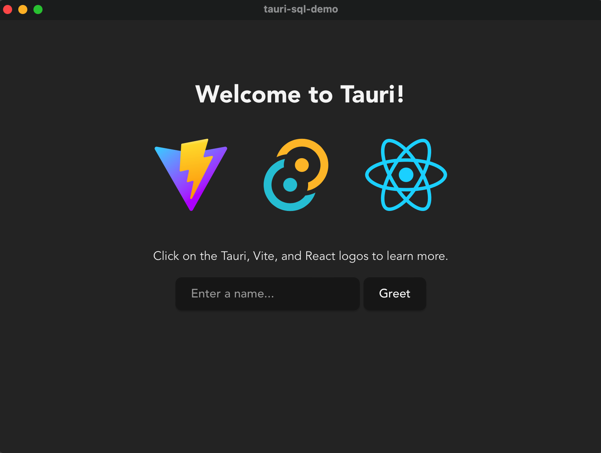
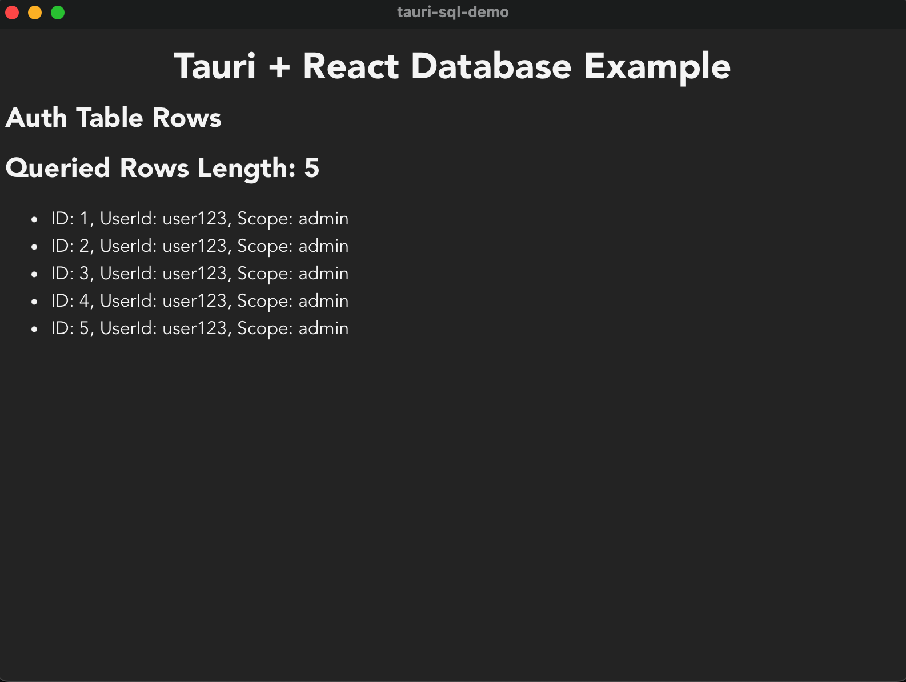

# Tauri配置数据库，使用tauri-plugin-sql插件实现数据持久化存储和获取

Tauri是Electron的有利竞争对手，Tauri使用Rust作为后端开发可以适配任意前端框架。
详细介绍可以访问[Tauri官网](https://tauri.app/)。本文我们使用React作为前端开发框架，
实现一个简单案例，演示在Tauri中如何配置数据库访问。

## 本次实验的软件版本如下
- Rust: 1.77.0
- Node: v20.9.0
- Vite: 5.0.0
- pnpm: 8.15.6
- React: 18.2.0
- Tauri-plugin-sql: v1


## 创建项目

首先，我们先创建项目，创建项目有很多方式:
- 可以使用Rust的包管理工具`cargo`
- 或者使用Node.js的包管理工具`npm`、`yarn`、`pnpm`，
- 或者也可以使用Shell或Windows的PowerShell使用脚本创建
- 也可以使用Bun的包管理工具`bunx`

但在创建项目之前，我们首先要安装Rust的编译器，因为Tauri的后端代码以及整个项目要使用
Rust编译器进行编译。虽然不一定需要编写Rust代码，但是一定需要Rust的编译器编译整个项目。

1. Linux或MacOS操作系统安装方式如下：
```shell
curl --proto '=https' --tlsv1.2 -sSf https://sh.rustup.rs | sh
```

2. Windows操作系统可以直接下载`rustup-init`可执行文件，[参考](https://forge.rust-lang.org/infra/other-installation-methods.html)，
寻找对应平台的软件下载链接。

在本文中由于我们使用React作为Tauri的前端开发框架，所以我们使用Node.js的方式创建项目。
对比`npm`,`yarn`,`pnpm`，`pnpm`会表现的更好，所以我们采用`pnpm`来创建我们的示例项目。

这里如果没有安装Node.js，可以[参考](https://nodejs.org/en/download)，先下载后安装。

Node安装成功后，自带`npm`，如要要安装`pnpm`，使用以下命令：
```shell
npm i -g pnpm
```

创建Tauri项目命令如下:
```shell
npm create tauri-app
# 或
pnpm create tauri-app
```

创建命令执行后，首先需要输入项目工程名，然后根据提示选择自己喜欢的选项即可。

项目创建成功后目录如下:
```shell
$ tree tauri-sql-demo
tauri-sql-demo
├── README.md
├── index.html
├── package.json
├── public
│   ├── tauri.svg
│   └── vite.svg
├── src
│   ├── App.css
│   ├── App.tsx
│   ├── assets
│   │   └── react.svg
│   ├── main.tsx
│   ├── styles.css
│   └── vite-env.d.ts
├── src-tauri
│   ├── Cargo.toml
│   ├── build.rs
│   ├── icons
│   │   ├── 128x128.png
│   │   ├── 128x128@2x.png
│   │   ├── 32x32.png
│   │   ├── Square107x107Logo.png
│   │   ├── Square142x142Logo.png
│   │   ├── Square150x150Logo.png
│   │   ├── Square284x284Logo.png
│   │   ├── Square30x30Logo.png
│   │   ├── Square310x310Logo.png
│   │   ├── Square44x44Logo.png
│   │   ├── Square71x71Logo.png
│   │   ├── Square89x89Logo.png
│   │   ├── StoreLogo.png
│   │   ├── icon.icns
│   │   ├── icon.ico
│   │   └── icon.png
│   ├── src
│   │   └── main.rs
│   └── tauri.conf.json
├── tsconfig.json
├── tsconfig.node.json
└── vite.config.ts
```

其中:
- `src`是我们的前端代码目录，即跟我们平时使用的React代码目录相同，使用tauri-app创建方式，
并且使用React的前端框架，会默认使用Vite来构建前端代码。
- `src-tauri`: 是Tauri的后端代码目录，是Rust项目工程组织代码，使用的是`cargo`做项目管理
- `src-tauri/tauri-config.json`: 是用来配置前后端的协作，通信，后端API开放等功能

总而言之，相比于React项目，使用React的Tauri项目比纯React项目多了个`src-tauri`目录，其余内容就是一个
完整的React项目。

## 构建和运行初始化项目

初始化完项目，安装完依赖，我们先构建运行一下初始化项目，这样可以检查环境是否正常。

具体操作步骤如下：
1. 进入到项目根目录
2. 安装依赖
3. 使用`tauri-cli`构建项目

命令如下:
```shell
cd tauri-sql-demo
pnpm install
pnpm tauri dev
```

运行成功后如下图:


## 安装`tauri-plugin-sql`插件

初始化项目运行成功后，来开始我们的重头戏，配置Tauri的数据库访问。

这里首先要说明一点，在Tauri官网中默认配置`tauri-plugin-sql`是用的2.0的beta版本，
我们使用`tauri-app`创建的项目使用的是Tauri 1.x版本。所以我们在安装插件的时候需要指定`v1`版本。

配置`tauri-plugin-sql`分为两步:
1. 安装核心插件，在`Cargo.toml`中添加插件配置
```toml title="src-tauri/Cargo.toml"
[dependencies.tauri-plugin-sql]
git = "https://github.com/tauri-apps/plugins-workspace"
branch = "v1"
features = ["sqlite"] # or "postgres", or "mysql"
```
其中:
- `git`: 指定了使用Github的方式安装插件
- `branch`: 指定软件版本，这里我们使用`v1`
- `features`: 在Rust中`features`类似条件编译，我们选择`sqlite`则指定了我们是使用了`sqlite`数据库的插件

2. 安装JavaScript客户端绑定
```shell
pnpm add https://github.com/tauri-apps/tauri-plugin-sql#v1
# or
npm add https://github.com/tauri-apps/tauri-plugin-sql#v1
# or
yarn add https://github.com/tauri-apps/tauri-plugin-sql#v1
```
安装JavaScript 客户端API，使用JS的方式访问`tauri-plugin-sql`插件中功能，便于与我们的前端项目
结合。

## 配置`tauri-plugin-sql`插件

1. 注册`tauri-plugin-sql`插件
```rust {3} title="src-tauri/src/main.rs"
fn main() {
    tauri::Builder::default()
        // highlight-next-line
        .plugin(tauri_plugin_sql::Builder::default().build())
        .run(tauri::generate_context!())
        .expect("error while running tauri application");
}
```
这里，在Rust的main函数中，使用`plugin`方法注册`tauri-plugin-sql`插件

## 使用JavaScript或TypeScript访问数据库

我们使用一个单独的文件封装数据库的连接，数据库的增删改查。

代码如下:
```ts title="src/dbop.ts"
import Database from "tauri-plugin-sql-api";


// 初始化数据库连接
async function initDb() {
  // sqlite数据库，路径相对于tauri::api::path::BaseDirectory::App
  const db = await Database.load(
    "sqlite:example.db"
  );
  return db;
}

// 创建表
export async function createAuthTable() {
  const db = await initDb();
  await db.execute(`
    CREATE TABLE IF NOT EXISTS auth (
      id INTEGER PRIMARY KEY AUTOINCREMENT,
      userId TEXT NOT NULL,
      scope TEXT NOT NULL
    )
  `);
}

// 插入数据
export async function insertAuth(userId: string, scope: string) {
  const db = await initDb();
  await db.execute(`
    INSERT INTO auth (userId, scope) VALUES (?, ?)
  `, [userId, scope]);
}

// 查询数据
export async function queryAuth() {
  const db = await initDb();
  return await db.select("SELECT * FROM auth");
}

// 更新数据
export async function updateAuth(id: number, userId: string, scope: string) {
  const db = await initDb();
  await db.execute(`
    UPDATE auth SET userId = ?, scope = ? WHERE id = ?
  `, [userId, scope, id]);
}

// 删除数据
export async function deleteAuth(id: number) {
  const db = await initDb();
  await db.execute(`
    DELETE FROM auth WHERE id = ?
  `, [id]);
}
```

首先，我们从`tauri-plugin-sql-api`中导入`Database`对象，
关于数据库的操作我们都要依赖这个`Database`对象

由于`tauri-plugin-sql`都是支持异步并发操作，所以我们创建的函数都是异步函数，
函数分别是:
- `initDb`: 创建数据库连接，这里我们指定SQLite的文件名为`example.db`，返回创建成功后的数据库`db`实例
- `createAuthTable`: 创建`Auth`数据库表
- `insertAuth`: 插入数据，接收两个参数
- `queryAuth`: 查询`Auth`表数据
- `updateAuth`: 更新`Auth`表数据，接收三个参数
- `deleteAuth`: 删除`Auth`表数据，接收`id`参数

## 配置Tauri文件访问权限
在本案例中，我们使用SQLite数据库，`tauri-plugin-sql`插件，底层是依赖`sqlx`库来操作数据库。
在连接SQLite数据库时，如果`example.db`数据库文件不存在，`sqlx`则会自动创建example.db文件，
那么就需要有文件访问功能开启，否则不能正确创建example.db文件，会导致数据库不能正确创建，导致最终
案例失败。如果这里使用的是MySQL或者Postgres则不需要配置这里。

具体操作如下，我们需要在`src-tauri/tauri.config.json`中开启`fs`权限
```json {15-17} title="src-tauri/tauri.conf.json"
{
  "build": {
    "beforeDevCommand": "pnpm dev",
    "beforeBuildCommand": "pnpm build",
    "devPath": "http://localhost:1420",
    "distDir": "../dist"
  },
  "package": {
    "productName": "tauri-sql-demo",
    "version": "0.0.0"
  },
  "tauri": {
    "allowlist": {
      "all": false,
      // highlight-start
      "fs": {
        "all": true
      },
      // highlight-end
      "shell": {
        "all": false,
        "open": true
      }
    },
    "windows": [
      {
        "title": "tauri-sql-demo",
        "width": 800,
        "height": 600
      }
    ],
    "security": {
      "csp": null
    },
    "bundle": {
      "active": true,
      "targets": "all",
      "identifier": "com.tauri.dev",
      "icon": [
        "icons/32x32.png",
        "icons/128x128.png",
        "icons/128x128@2x.png",
        "icons/icon.icns",
        "icons/icon.ico"
      ]
    }
  }
}
```

## 在前端中调用数据库操作

```tsx title="src/App.tsx"
import { useState, useEffect } from "react";
import { createAuthTable, insertAuth, queryAuth } from './dbop';

function App() {
  const [rows, setRows] = useState([]);
  useEffect(() => {
    async function setupDb() {
      await createAuthTable();
      await insertAuth('user123', 'admin');
      const queriedRows = await queryAuth();
      console.log(`Queried Rows Length: ${queriedRows.length}`);
      setRows(queriedRows);
    }

    setupDb();
  }, []);

  return (
    <div className='App'>
      <h1>Tauri + React Database Example</h1>
      <div>
        <h2>Auth Table Rows</h2>
        <h2>Queried Rows Length: {rows.length}</h2>
        <ul>
          {
            rows.map((row, index) => (
              <li key={index}>
                ID: {row.id}, UserId: {row.userId}, Scope: {row.scope}
              </li>
            ))
          }
        </ul>
      </div>
    </div>
  )
}

export default App;
```

首先，我们导入我们的数据库操作；
然后使用`useState`存储数据库的查询结果，存放在`rows`变量中；
最后，遍历查询出来的的结果做展示，如下图：



## 案例地址

[Tauri-SQL-Plugin-Demo](https://github.com/yuxuetr/tauri-sql-demo)
