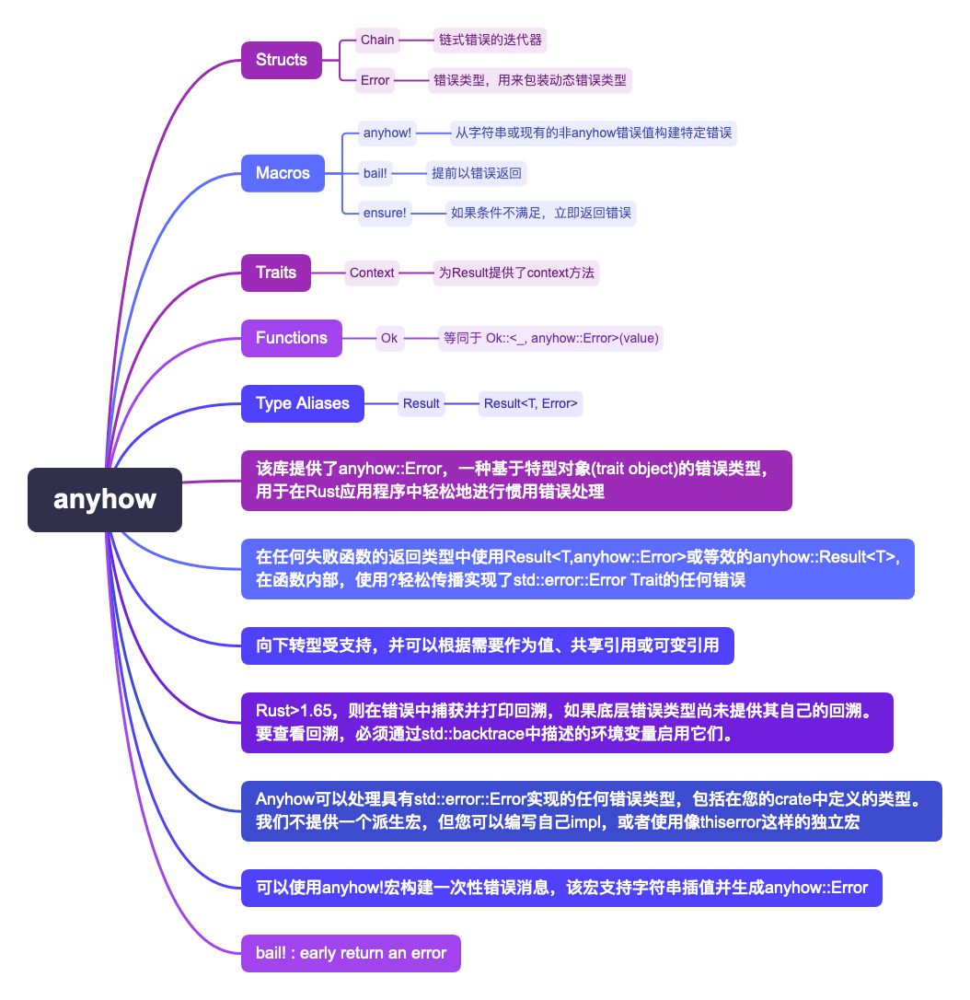

# Anyhow 库的错误处理特性和使用场景

`anyhow`库为Rust应用程序提供了一种基于trait对象的错误类型`anyhow::Error`，以便于进行简便和惯用的错误处理。

## 主要特性

- **简化错误传播**：通过使用`?`操作符，可以轻松地传播实现了`std::error::Error` trait的任何错误。
- **上下文添加**：允许为错误添加上下文，帮助调试时理解错误发生的具体环节。这是通过`Context` trait和相关方法（如`.context()`和`.with_context()`）实现的。
- **错误下转型**：支持将`anyhow::Error`下转型为具体的错误类型，以便进行更精确的错误处理或信息获取。
- **自动捕获回溯信息**：在Rust版本≥1.65时，如果底层错误类型没有提供自己的回溯信息，`anyhow`会自动捕获并打印错误的回溯信息。通过环境变量可以控制回溯信息的显示。
- **与任何错误类型兼容**：`anyhow`可以与任何实现了`std::error::Error`的错误类型一起工作，不需要特定的derive宏来实现相关trait。
- **宏支持**：提供了几个宏来简化错误处理，例如`anyhow!`用于创建一个即时的错误消息，`bail!`用于提前返回一个错误，以及`ensure!`用于在条件不满足时返回错误。

## 使用场景

- **函数返回类型**：对于可能失败的函数，推荐使用`Result<T, anyhow::Error>`（或等价的`anyhow::Result<T>`）作为返回类型。
- **错误传播**：在函数内部，使用`?`来简化错误的传播。
- **添加错误上下文**：在可能导致调试困难的低级错误上添加上下文信息，以提供更多关于错误发生时上下文的信息。
- **处理特定错误**：通过错误下转型来处理特定类型的错误。
- **自定义错误类型**：虽然`anyhow`不直接提供derive宏，但可以与如`thiserror`库结合使用，来定义和实现自定义错误类型。
- **即时错误消息**：通过`anyhow!`和`bail!`宏来快速创建和返回错误。

## 适用性

由于其灵活性和简便性，`anyhow`库适用于大多数Rust应用程序中的错误处理。它特别适合那些需要简单、直接且灵活处理各种可能错误的应用程序。
对于需要在库中暴露具体错误类型的情况，可能需要结合使用如`thiserror`之类的库来提供更精细的错误定义和处理。