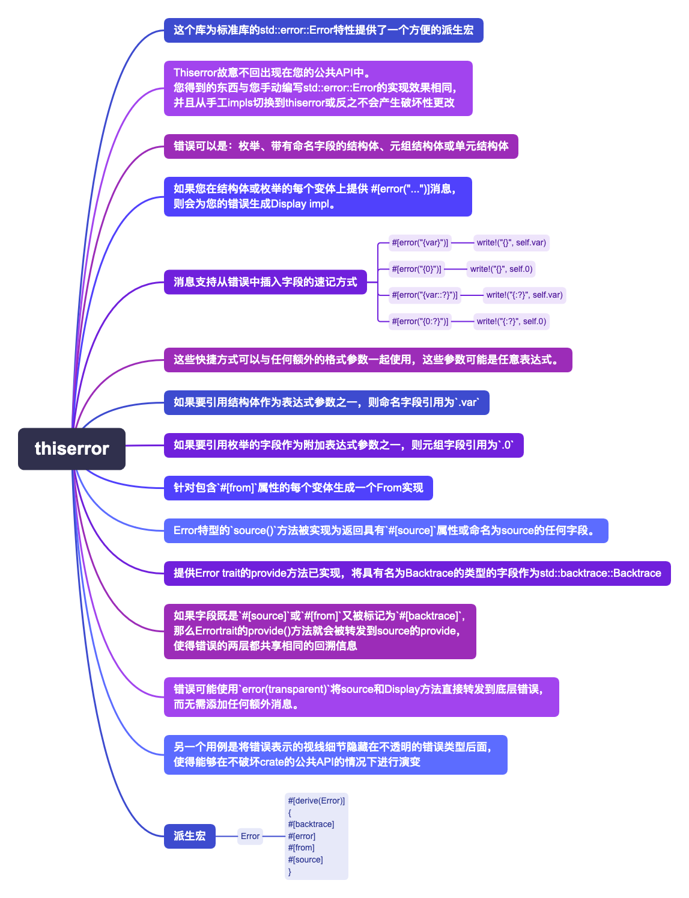

# Thiserror 派生宏错误类型的含义和用法

`thiserror` 库为 Rust 的 `std::error::Error` trait 提供了一个方便的派生宏，使得定义错误类型变得更加简单和高效。下面是对 `thiserror` 中不同属性的用法和含义的总结，以及它们的使用情况。

## `#[error("...")]`

- **用法**: 用于为错误类型或枚举的每个变体提供一个显示格式（Display）。
- **含义**: 定义了当错误被打印时显示的消息格式。
- **适用情况**: 任何需要向用户展示错误信息的场景。

## `#[from]`

- **用法**: 用于自动实现从源错误类型到当前错误类型的 `From` trait。
- **含义**: 允许一个错误类型自动转换（"from"）另一个错误类型。
- **适用情况**: 当你想要从一个特定的错误类型自动转换到你定义的错误类型时。这通常用在错误链的上下文中，允许底层错误被包装成更高层的抽象错误。

## `#[source]`

- **用法**: 标记一个字段作为源错误（即导致当前错误的底层错误）。
- **含义**: 该字段会被 `Error` trait 的 `source()` 方法返回，用于错误链的追踪。
- **适用情况**: 当你的错误是由另一个错误导致的，并且你想要保留这种因果关系时。这对于调试和错误报告非常有用。

## `#[backtrace]`

- **用法**: 标记一个字段为回溯（backtrace）信息。
- **含义**: 允许捕获和存储错误发生时的调用栈信息。
- **适用情况**: 在需要调试或详细了解错误发生上下文时非常有用。这通常用于复杂系统中，通过回溯可以更容易地定位问题源头。

## `#[error(transparent)]`

- **用法**: 使得当前错误类型在显示和源链处理上透明地代理到内部的错误类型。
- **含义**: 当前错误类型的 `Display` 和 `source` 方法将直接委托给它包装的错误类型。
- **适用情况**: 当你定义的错误类型仅仅是对另一个错误类型的简单封装，而你不希望添加任何额外信息或行为时。这在定义通用或透明的错误包装时特别有用。

通过这些属性，`thiserror` 库大大简化了 Rust 中错误处理的复杂性，使得定义丰富而又具有表达力的错误类型变得非常简单。
无论是简单的直接转换，还是更复杂的错误链处理和调试信息捕获，`thiserror` 都提供了强大而灵活的工具，以支持各种不同的使用场景。
相关信息可以在其[官方文档](https://docs.rs/thiserror/latest/thiserror/)和[GitHub 仓库](https://github.com/dtolnay/thiserror)中找到。