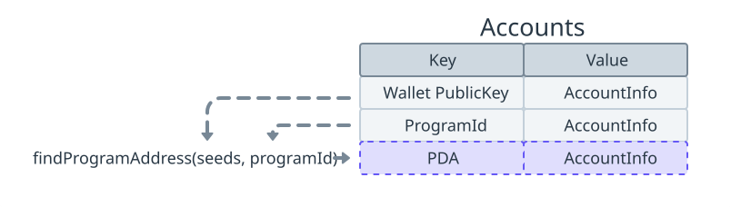
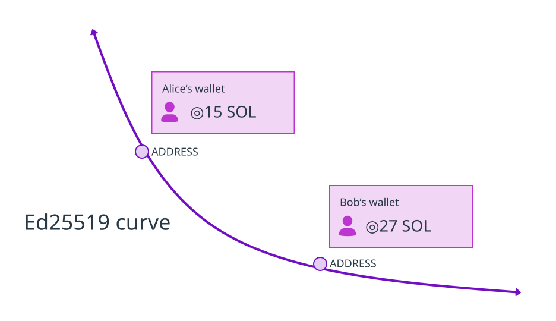
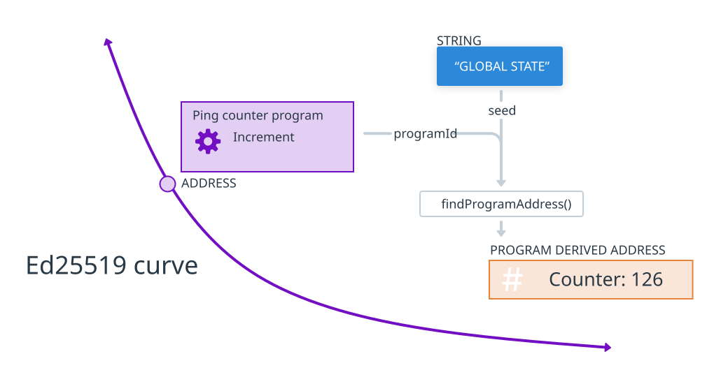
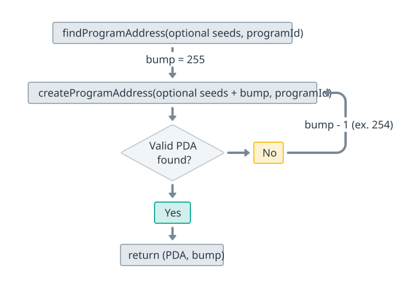

import { RedText, BlueText, YellowText } from '@site/src/components/ColorText'

# Solana核心概念: 程序派生地址 (PDA)

在Solana中，程序派生地址（`PDA`）**有两个主要用途**：

1. **确定性账户地址**：通过组合可选“种子”（预定义输入）和特定程序ID来确定性地派生地址。
2. **启用程序签名**：Solana运行时允许程序对派生自其程序ID的PDA进行“签名”。

可以将`PDA`看作是通过预定义输入（例如字符串、数字和其他账户地址）在链上创建类似哈希表结构的一种方式。

这种方法的好处在于，它消除了对准确地址的跟踪需求。 相反，您只需记住用于其派生的特定输入。



重要的是要明白，简单地派生程序派生地址（`PDA`）不会自动在该地址上创建链上账户。
以 PDA 作为链上地址的账户必须通过用于派生地址的程序明确创建。
你可以将派生 PDA 理解为在地图上找到地址。仅有地址并不意味着该位置上有任何建筑物。

:::info
本节将涵盖有关推导 PDAs 的详细信息。
有关程序如何使用 PDAs 进行签名的细节将在跨程序调用 (CPIs) 部分中进行讨论，
因为这需要两个概念的上下文。
:::

## 关键点

- 通过使用用户定义的种子、`bump seed` 和程序的 ID 的组合，确定性地推导出 PDAs 地址。
- PDAs 是指偏离 `Ed25519` 曲线且没有相应私钥的地址。
- Solana 程序可以通过其程序 ID 为使用该程序 ID 推导出的 PDAs 进行程序化“签名”。
- 推导 `PDA` 不会自动创建链上账户。
- 使用 `PDA` 作为地址的账户必须通过 Solana 程序内的专用指令显式创建。

## 什么是PDA

`PDA`是确定性派生的地址，类似标准公钥，但没有关联的私钥。

外部用户无法为该地址生成有效签名。

然而，Solana运行时允许程序无需私钥即可程序化地对PDA进行“签名”。

在上下文中，Solana Keypairs 是 `Ed25519` 曲线上的点(椭圆曲线加密)，具有公钥和对应的私钥。

<YellowText text="我们经常使用公钥作为新的链上账户的唯一标识符，私钥用于签名"/>。



PDA 是使用预定义的一组输入故意导出到 Ed25519 曲线之外的点。

不在 Ed25519 曲线上的点没有有效的对应私钥，无法用于加密操作（签名）。

<YellowText text="PDA 然后可以用作链上账户的地址（唯一标识符）"/>，
提供一种便捷的存储、映射和获取程序状态的方法。



## 如何派生PDA

派生PDA需要三个输入：

1. **可选种子**：用于派生PDA的预定义输入（如字符串、数字、其他账户地址），
这些输入转换为字节缓冲区。
2. **递增种子**：保证生成有效PDA的附加输入（值在`255`到`0`之间）。
递增种子附加到可选种子后用于生成PDA，将点“推离”Ed25519曲线。
3. **程序ID**：用于派生PDA的程序地址，也是可以代表PDA“签名”的程序。

使用`findProgramAddressSync`方法可以派生PDA，输入可选种子的字节缓冲区和程序ID。
找到有效`PDA`后，该方法返回地址（`PDA`）和递增种子。



以下示例包含指向Solana Playground的链接，在那里您可以在基于浏览器的编辑器中运行示例。

### 示例代码

要衍生一个PDA，我们可以使用 `@solana/web3.js` 中的 `findProgramAddressSync` 方法。
在其他编程语言（例如 Rust）中也有这个函数的等价物，但本节中我们将通过Javascript的示例进行讲解。

使用 `findProgramAddressSync` 方法时，我们传入：
- 预定义的可选seeds转换为字节缓冲区，
- 以及用于衍生PDA的程序ID（地址） 

找到有效的PDA后，`findProgramAddressSync` 方法将返回PDA的地址和用于衍生PDA的`bump seed`。 

以下示例衍生一个PDA，而不提供任何可选`seeds`。

```javascript
import { PublicKey } from "@solana/web3.js";

const programId = new PublicKey("11111111111111111111111111111111");

const [PDA, bump] = PublicKey.findProgramAddressSync([], programId);

console.log(`PDA: ${PDA}`);
console.log(`Bump: ${bump}`);
```
您可以在 Solana Playground 上运行此示例。`PDA` 和`bump seed` 输出将始终相同。
```
PDA: Cu7NwqCXSmsR5vgGA3Vw9uYVViPi3kQvkbKByVQ8nPY9
Bump: 255
```

增加可选种子“helloWorld”：

```javascript
import { PublicKey } from "@solana/web3.js";

const programId = new PublicKey("11111111111111111111111111111111");
const string = "helloWorld";

const [PDA, bump] = PublicKey.findProgramAddressSync(
  [Buffer.from(string)],
  programId,
);

console.log(`PDA: ${PDA}`);
console.log(`Bump: ${bump}`);
```

你也可以在 Solana Playground 上运行此示例。PDA 和 增量种子 的输出将始终相同：
```
PDA: 46GZzzetjCURsdFPb7rcnspbEMnCBXe9kpjrsZAkKb6X
Bump: 254
```

请注意，增量种子为`254`。这意味着`255`导出了`Ed25519`曲线上的一个点，并不是有效的`PDA`。

由 `findProgramAddressSync` 返回的增量种子是在给定的可选种子和程序 ID 组合中导出有效 PDA 的第一个值（介于`255-0`之间）。

:::info
这个第一个有效的提升种子被称为“规范提升”。
为了程序安全起见，在处理 PDAs 时建议只使用规范提升。
:::

### 生成PDA账户

在底层，`findProgramAddressSync` 会迭代地将一个额外的`bump seed` (nonce) 
附加到种子缓冲区并调用 `createProgramAddressSync` 方法。
`bump seed` 从值为 `255` 开始，每次减 `1`，直到找到有效的 `PDA` (脱轨)。

您可以通过使用 `createProgramAddressSync` 并显式传递 `254` 的增量种子来复制先前的示例。

```javascript
import { PublicKey } from "@solana/web3.js";
 
const programId = new PublicKey("11111111111111111111111111111111");
const string = "helloWorld";
const bump = 254;
 
const PDA = PublicKey.createProgramAddressSync(
  [Buffer.from(string), Buffer.from([bump])],
  programId,
);
 
console.log(`PDA: ${PDA}`);
```
在Solana Playground上运行上述示例。在使用相同的seeds和程序ID的情况下，PDA输出将与先前的匹配：
```
PDA: 46GZzzetjCURsdFPb7rcnspbEMnCBXe9kpjrsZAkKb6X
```

### Canonical Bump

“规范碰撞” 指的是从 `255` 开始递减到 `1` 的第一个碰撞 `seed`，从而派生出一个有效的 `PDA`。
出于程序安全考虑，建议仅使用从规范碰撞派生的 PDA。

使用上面的例子作为参考，下面的示例尝试使用从 `255-0` 的每个碰撞 `seed` 来派生一个 PDA。

```javascript
import { PublicKey } from "@solana/web3.js";
 
const programId = new PublicKey("11111111111111111111111111111111");
const string = "helloWorld";
 
// Loop through all bump seeds for demonstration
for (let bump = 255; bump >= 0; bump--) {
  try {
    const PDA = PublicKey.createProgramAddressSync(
      [Buffer.from(string), Buffer.from([bump])],
      programId,
    );
    console.log("bump " + bump + ": " + PDA);
  } catch (error) {
    console.log("bump " + bump + ": " + error);
  }
}
```

在 Solana Playground 上运行示例，您应该会看到以下输出：
```
bump 255: Error: Invalid seeds, address must fall off the curve
bump 254: 46GZzzetjCURsdFPb7rcnspbEMnCBXe9kpjrsZAkKb6X
bump 253: GBNWBGxKmdcd7JrMnBdZke9Fumj9sir4rpbruwEGmR4y
bump 252: THfBMgduMonjaNsCisKa7Qz2cBoG1VCUYHyso7UXYHH
bump 251: EuRrNqJAofo7y3Jy6MGvF7eZAYegqYTwH2dnLCwDDGdP
bump 250: Error: Invalid seeds, address must fall off the curve
...
// remaining bump outputs
```

正如预期的那样，bump 种子 `255` 会引发错误，第一个用于导出有效 PDA 的 `bump` 种子是 `254`。

但请注意，`bump` 种子 `253-251` 都会导出具有不同地址的有效 PDA。
这意味着，在给定相同的可选种子和`programId`的情况下，
具有不同值的 bump 种子仍然可以导出有效的 PDA。

:::warning
在构建Solana程序时，建议包含安全检查，验证传递给程序的PDA是否使用规范的增量派生。 
如果未这样做，可能会引入漏洞，允许向程序提供意外的帐户。
:::

## 创建PDA账户

在 Solana Playground 上的这个示例程序演示了如何使用 PDA 作为 `newaccount` 的地址来创建帐户。
该示例程序是使用 Anchor 框架编写的。

在 `lib.rs` 文件中，您将找到以下程序，其中包含一个指令，用于使用 PDA 作为账户地址创建新账户。

新账户存储用户地址和用于派生 PDA 的递增种子。

```rust title="lib.rs"
use anchor_lang::prelude::*;
 
declare_id!("75GJVCJNhaukaa2vCCqhreY31gaphv7XTScBChmr1ueR");
 
#[program]
pub mod pda_account {
    use super::*;
 
    pub fn initialize(ctx: Context<Initialize>) -> Result<()> {
        let account_data = &mut ctx.accounts.pda_account;
        // store the address of the `user`
        account_data.user = *ctx.accounts.user.key;
        // store the canonical bump
        account_data.bump = ctx.bumps.pda_account;
        Ok(())
    }
}
 
#[derive(Accounts)]
pub struct Initialize<'info> {
    #[account(mut)]
    pub user: Signer<'info>,
 
    #[account(
        init,
        // set the seeds to derive the PDA
        seeds = [b"data", user.key().as_ref()],
        // use the canonical bump
        bump,
        payer = user,
        space = 8 + DataAccount::INIT_SPACE
    )]
    pub pda_account: Account<'info, DataAccount>,
    pub system_program: Program<'info, System>,
}
 
#[account]
 
#[derive(InitSpace)]
pub struct DataAccount {
    pub user: Pubkey,
    pub bump: u8,
}
```

用于派生 PDA 的种子包括指令中提供的`user`帐户的硬编码字符串`data`和地址。
Anchor 框架会自动派生规范化的`bump`种子。

```rust
#[account(
    init,
    seeds = [b"data", user.key().as_ref()],
    bump,
    payer = user,
    space = 8 + DataAccount::INIT_SPACE
)]
pub pda_account: Account<'info, DataAccount>,
```

`init`约束指示Anchor调用系统程序，使用PDA作为地址创建新帐户。 

在幕后，这是通过CPI完成的。

```rust
#[account(
    init,
    seeds = [b"data", user.key().as_ref()],
    bump,
    payer = user,
    space = 8 + DataAccount::INIT_SPACE
)]
pub pda_account: Account<'info, DataAccount>,
```

在上面提供的 Solana Playground 链接中的测试文件（`pda-account.test.ts`）中，
您将找到派生 PDA 的 JavaScript 等效代码。

```javascript
const [PDA] = PublicKey.findProgramAddressSync(
  [Buffer.from("data"), user.publicKey.toBuffer()],
  program.programId,
);
```
然后发送交易以调用`initialize`指令，使用PDA作为地址创建新的链上账户。
一旦发送交易，PDA用于获取在该地址创建的链上账户。

```ts
it("Is initialized!", async () => {
  const transactionSignature = await program.methods
    .initialize()
    .accounts({
      user: user.publicKey,
      pdaAccount: PDA,
    })
    .rpc();
 
  console.log("Transaction Signature:", transactionSignature);
});
 
it("Fetch Account", async () => {
  const pdaAccount = await program.account.dataAccount.fetch(PDA);
  console.log(JSON.stringify(pdaAccount, null, 2));
});
```

请注意，如果您多次使用相同的`user`地址作为种子调用`initialize`指令，则交易将失败。

这是因为在派生地址处已经存在一个帐户。

## 总结

### 程序派生地址 (PDA) 概述

在Solana中，程序派生地址（PDA）有两个主要用途：

1. **确定性账户地址**：通过组合可选的“种子”和程序ID来确定性地生成地址。
2. **程序签名**：Solana运行时允许程序对PDA进行签名。

### 关键特点

- **确定性派生**：PDA通过用户定义的种子、递增种子（bump seed）和程序ID组合确定性地派生。
- **无私钥**：PDA没有对应的私钥，因此没有用户可以对其生成有效签名，但程序可以进行签名。
- **显式创建账户**：派生PDA不会自动创建链上账户，必须通过程序显式创建。

### PDA的派生过程

派生PDA需要三个输入：

1. **可选种子**：预定义的输入（如字符串、数字、其他账户地址）。
2. **递增种子**：用于保证生成有效PDA的附加输入，值在255到0之间。
3. **程序ID**：用于派生PDA的程序地址。

使用这些输入，程序可以确定性地生成唯一的PDA。

### 示例代码

以下示例展示了如何使用`findProgramAddressSync`方法派生PDA：

```javascript
import { PublicKey } from "@solana/web3.js";

const programId = new PublicKey("11111111111111111111111111111111");

const [PDA, bump] = PublicKey.findProgramAddressSync([], programId);

console.log(`PDA: ${PDA}`);
console.log(`Bump: ${bump}`);
```

增加可选种子“helloWorld”：

```javascript
import { PublicKey } from "@solana/web3.js";

const programId = new PublicKey("11111111111111111111111111111111");
const string = "helloWorld";

const [PDA, bump] = PublicKey.findProgramAddressSync(
  [Buffer.from(string)],
  programId,
);

console.log(`PDA: ${PDA}`);
console.log(`Bump: ${bump}`);
```

### 创建PDA账户

以下示例展示了如何使用PDA作为新账户的地址创建账户（使用Anchor框架编写）：

```rust
use anchor_lang::prelude::*;

declare_id!("75GJVCJNhaukaa2vCCqhreY31gaphv7XTScBChmr1ueR");

#[program]
pub mod pda_account {
    use super::*;

    pub fn initialize(ctx: Context<Initialize>) -> Result<()> {
        let account_data = &mut ctx.accounts.pda_account;
        account_data.user = *ctx.accounts.user.key;
        account_data.bump = ctx.bumps.pda_account;
        Ok(())
    }
}

#[derive(Accounts)]
pub struct Initialize<'info> {
    #[account(mut)]
    pub user: Signer<'info>,

    #[account(
        init,
        seeds = [b"data", user.key().as_ref()],
        bump,
        payer = user,
        space = 8 + DataAccount::INIT_SPACE
    )]
    pub pda_account: Account<'info, DataAccount>,
    pub system_program: Program<'info, System>,
}

#[account]
#[derive(InitSpace)]
pub struct DataAccount {
    pub user: Pubkey,
    pub bump: u8,
}
```

### 注意事项

- **规范递增种子**：建议只使用规范递增种子派生的PDA，以确保程序安全。
- **账户创建**：使用相同用户地址作为种子多次调用`initialize`指令会失败，因为在派生地址处已经存在账户。

