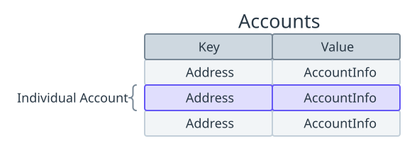
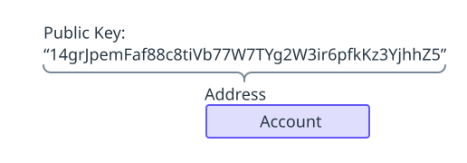
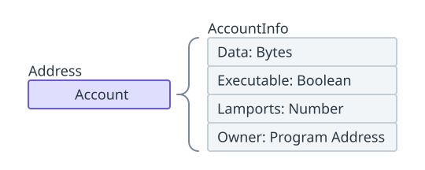
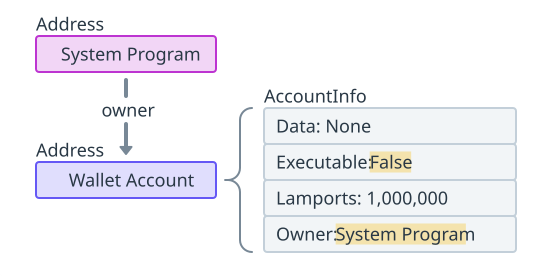
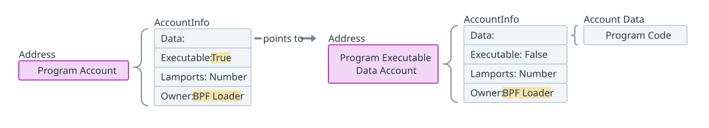
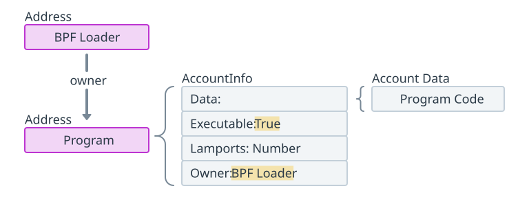
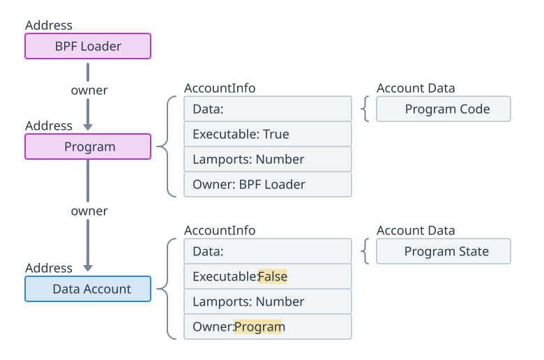

import { RedText, BlueText, YellowText } from '@site/src/components/ColorText'

# Solana核心概念: Solana 账户模型
<RedText text="在 Solana 上，所有数据都存储在称为账户的结构中"/>。

<RedText text="Solana 上的数据组织方式"/>**类似于键值存储**，其中<RedText text="数据库中的每个条目称为账户"/>。

### 关键点
- <RedText text="账户"/>可以存储最多 `10MB` 的数据，这些数据可以是**可执行程序代码**或**程序状态**。
- <RedText text="账户"/>需要存入与存储数据量成比例的 `SOL` 作为**租金**，<YellowText text="当账户关闭时"/>，这些租金可以全额退还。
- <RedText text="每个账户"/>都有一个程序**所有者**。只有拥有账户的程序才能修改其数据或扣除其 `lamport` 余额。
不过，任何人都可以增加账户的余额。
- <BlueText text="程序（智能合约）"/>**是存储可执行代码的无状态账户**。
- <BlueText text="数据账户"/>**由程序创建，用于存储和管理程序状态**。
- <BlueText text="原生程序"/>**是 Solana 运行时包含的内置程序**。
- <BlueText text="Sysvar 账户"/>**是存储网络集群状态的特殊账户**。

### 账户
**每个账户通过其唯一地址进行标识**，该地址由 `32` 字节组成，格式为 `Ed25519` 公钥。

<RedText text="可以将地址视为账户的唯一标识符"/>。

账户与其地址之间的关系可以看作是键值对，其中地址作为键，用于定位账户对应的链上数据。

### 账户信息
账户的最大大小为 `10MB`（`10` 兆字节），每个 Solana 上存储的数据账户都具有以下结构，
称为<RedText text="账户信息"/>（`AccountInfo`）。

每个账户的账户信息包括以下字段：
- `data`：存储账户状态的字节数组。如果账户是一个程序（智能合约），则存储可执行程序代码。该字段通常称为“账户数据”。
- `executable`：一个布尔标志，指示该账户是否是一个程序。
- `lamports`：账户余额的数字表示，**单位**为 `lamports`，这是 `SOL` 的最小单位（`1 SOL = 10 亿 lamports`）。
- `owner`：指定拥有账户的程序的公钥（**程序 ID**）。

**作为 Solana 账户模型的一个关键部分**，<RedText text="每个 Solana 上的账户都有一个指定的“所有者”，即一个程序"/>。

只有被指定为账户所有者的程序才能修改账户上存储的数据或扣除 `lamport` 余额。

需要注意的是，虽然只有所有者可以扣除余额，但任何人都可以增加余额。

:::info
要在链上存储数据，需要将一定数量的 `SOL` 转入账户。
转入的数量与账户上存储的数据量成比例。
这个概念通常称为**租金**。不过，**您可以将租金视为押金**，
因为当账户关闭时，分配给账户的 `SOL` 可以全额退还。
:::

### 原生程序
Solana 包含少量原生程序，这些程序是验证器实现的一部分，并为网络提供各种核心功能。
您可以在此处找到完整的原生程序列表。

**在 Solana 上开发自定义程序时，您通常会与两个原生程序进行交互，即系统程序和 BPF 加载器**。

### 系统程序
默认情况下，所有新账户都由系统程序拥有。

系统程序执行以下几个关键任务：
- **新账户创建**：只有系统程序可以创建新账户。
- **空间分配**：设置每个账户数据字段的字节容量。
- **分配程序所有权**：系统程序创建账户后，可以将指定的程序所有者重新分配给其他程序账户。
这就是自定义程序如何获得系统程序创建的新账户的所有权。

在 Solana 上，“钱包”只是由系统程序拥有的一个账户。钱包的 lamport 余额是账户拥有的 SOL 数量。

:::info
只有由系统程序拥有的账户才能用作交易费用支付者。
:::

### BPF 加载器程序
BPF 加载器是网络上所有其他程序（不包括原生程序）的指定“所有者”。它负责部署、升级和执行自定义程序。

### Sysvar 账户
**Sysvar 账户**是位于预定义地址的特殊账户，提供访问集群状态数据的功能。

这些账户会动态更新网络集群的数据。您可以在此处找到 **Sysvar 账户**的完整列表。

### 自定义程序
<RedText text="在 Solana 上，智能合约称为程序"/>。

**程序**是<BlueText text="包含可执行代码的账户"/>，通过设置为 true 的“可执行”标志来表示。

有关程序部署过程的详细说明，请参阅本文档的部署程序页面。

### 程序账户
当在 Solana 上部署新程序时，实际上会创建三个独立的账户：
- **程序账户**：表示链上程序的主账户。该账户存储可执行数据账户的地址（存储已编译的程序代码）和程序的更新权限（授权更改程序的地址）。
- **程序可执行数据账户**：包含程序可执行字节代码的账户。
- **缓冲账户**：在程序正在部署或升级时存储字节代码的临时账户。完成后，数据将转移到程序可执行数据账户，缓冲账户将关闭。

例如，这里是指向 Solana Explorer 的 Token 扩展程序账户及其相应的程序可执行数据账户的链接。

为简单起见，您可以将“程序账户”视为程序本身。

:::info
**程序账户**的地址通常称为**程序 ID**，<RedText text="用于调用程序"/>。
:::

### 数据账户
Solana 程序是“无状态”的，这意味着**程序账户仅包含程序的可执行字节代码**。

为了存储和修改额外的数据，必须创建新账户。

这些账户通常称为**数据账户**。

数据账户可以存储在所有者程序代码中定义的任何任意数据。

请注意，只有系统程序可以创建新账户。

系统程序创建账户后，可以将新账户的所有权转移给另一个程序。

换句话说，为<BlueText text="自定义程序创建数据账户需要两个步骤"/>：
1. 调用系统程序创建账户，然后将所有权转移给自定义程序。
2. 调用现在拥有该账户的自定义程序，然后根据程序代码初始化账户数据。

这个数据账户创建过程通常被抽象为一步，但了解底层过程是有帮助的。

## Solana 账户模型总结

在 Solana 区块链上，<RedText text="所有数据都存储在称为“账户”的结构中"/>。

以下是 Solana 上账户模型的主要内容和账户类型：

### 账户类型
1. **程序账户（`Program Accounts`）**
   - **描述**：存储可执行程序代码的无状态账户。
   - **用途**：代表链上的智能合约，包含可执行的字节码。
   - **关键点**：程序账户的地址被称为程序 ID，用于调用该程序。

2. **数据账户（`Data Accounts`）**
   - **描述**：存储程序状态的账户。
   - **用途**：用于存储和管理与程序相关的任意数据。
   - **关键点**：只有系统程序可以创建新账户，创建后可以将所有权转移给自定义程序。

3. **原生程序账户（`Native Program Accounts`）**
   - **描述**：内置于 Solana 运行时的程序账户。
   - **用途**：提供网络的核心功能。
   - **关键点**：包括系统程序和 BPF 加载器等，系统程序默认拥有新账户。

4. **Sysvar 账户（`Sysvar Accounts`）**
   - **描述**：存储网络集群状态的特殊账户。
   - **用途**：提供动态更新的网络状态数据。
   - **关键点**：包括诸如时钟、租金等集群状态信息。

### 账户功能
- **租金（`Rent`）**：存储数据的账户需要存入与数据量成比例的 `SOL` 作为租金，这些 `SOL` 可以在账户关闭时全额退还。
- **账户地址**：每个账户都有唯一的地址，格式为 `Ed25519` 公钥，作为账户的唯一标识符。
- **账户信息（`AccountInfo`）**：
  - **data**：存储账户状态的字节数组。
  - **executable**：标识账户是否为程序的布尔标志。
  - **lamports**：账户余额，单位为 `lamports`（`1 SOL = 10 亿 lamports`）。
  - **owner**：账户的所有者程序的公钥（程序 ID）。

### 系统程序（`System Program`）
- **新账户创建**：只有系统程序可以创建新账户。
- **空间分配**：设置账户数据字段的字节容量。
- **分配程序所有权**：系统程序创建账户后，可以将所有权转移给其他程序。

### BPF 加载器（`BPF Loader`）
- **描述**：负责部署、升级和执行自定义程序的程序。
- **用途**：管理非原生程序的部署和执行。

### 总结
Solana 的账户模型包括多种账户类型，各自具有不同的功能和用途。

- **程序账户**：用于存储和执行智能合约
- **数据账户**：用于存储程序状态
- **原生程序账户**：提供核心网络功能
- **Sysvar 账户**：存储网络状态数据
- **系统程序**：负责新账户的创建和管理
- **BPF 加载器**：管理自定义程序的部署和执行。

理解这些账户类型及其作用，有助于更好地进行 Solana 区块链的开发和使用。