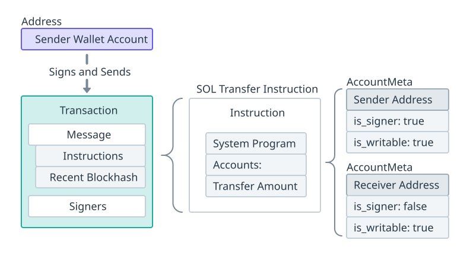
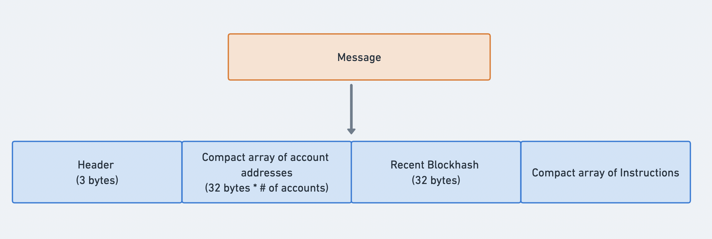
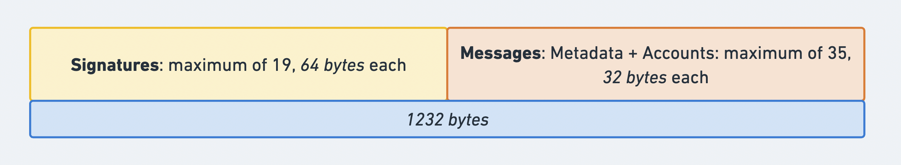
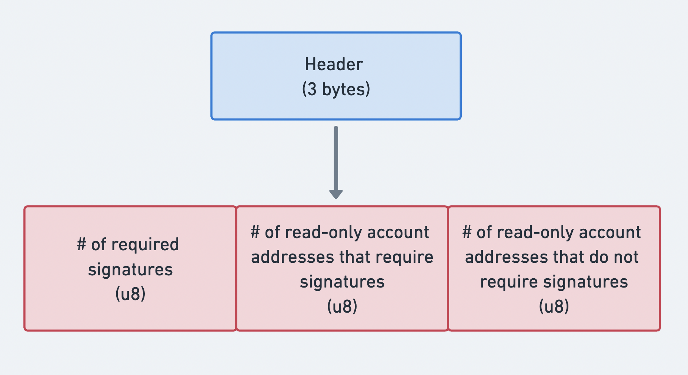
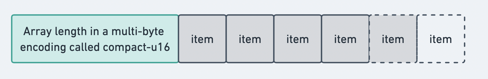
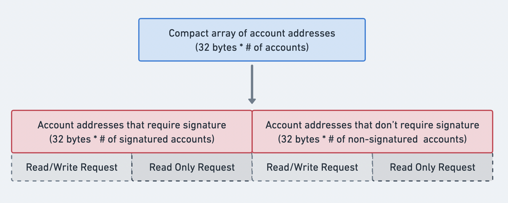
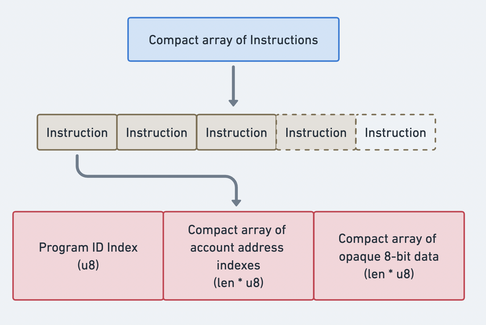
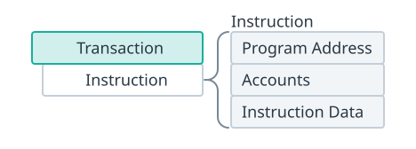
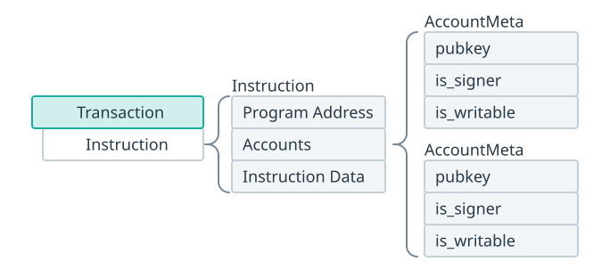

import { RedText, BlueText, YellowText } from '@site/src/components/ColorText'

# Solana核心概念: Solana 交易和指令

在 Solana 上，**我们通过发送交易来与网络交互**。

<RedText text="交易包含一个或多个指令，每个指令代表一个特定的操作"/>，

<BlueText text="指令的执行逻辑存储在部署到 Solana 网络的程序中"/>。

以下是交易执行的关键细节：

## 交易执行顺序与原子性
- **执行顺序**：如果一个交易包含多个指令，这些<RedText text="指令会按照它们在交易中的顺序依次处理"/>。
- **原子性**：交易是原子的，要么所有指令全部成功执行，要么全部失败。
<RedText text="如果任何一个指令失败，整个交易都不会执行"/>。

<YellowText text="可以简单地将交易看作是处理一个或多个指令的请求"/>。

## 交易中的关键点
- **Solana 交易由与网络上各种程序交互的指令组成，每个指令代表一个特定的操作**。
- **每个指令指定要执行指令的程序、指令所需的账户以及指令执行所需的数据**。
- **交易中的指令按列出的顺序处理**。
- **交易是原子的，要么所有指令全部成功执行，要么整个交易失败**。
- **交易的最大大小为`1232`字节**。

## 基本示例
下面是一个包含单个指令的交易的示意图，该指令用于将 `SOL` <YellowText text="从发送方转移到接收方"/>。

在 Solana 上，**钱包是由系统程序拥有的账户**。

根据 Solana 账户模型，只有拥有账户的程序才可以修改账户上的数据。

因此，从“钱包”账户转移 `SOL` **需要发送一个交易，以调用系统程序上的转移指令**。



发送方账户必须包含在交易的签名者（`is_signer`）中，以批准扣除其`lamport`余额。

发送方和接收方账户都必须是可变的（`is_writable`），
因为该指令会修改两个账户的`lamport`余额。

**一旦交易发送，系统程序将被调用来处理转账指令**。
然后，系统程序将相应地更新发送方和接收方帐户的`lamport`余额。

### 简单的SOL转账

以下是一个 Solana Playground 示例，
演示如何使用 `SystemProgram.transfer` 方法构建 `SOL` **转账指令**：
```javascript
// Define the amount to transfer
const transferAmount = 0.01; // 0.01 SOL
 
// Create a transfer instruction for transferring SOL from wallet_1 to wallet_2
const transferInstruction = SystemProgram.transfer({
  fromPubkey: sender.publicKey,
  toPubkey: receiver.publicKey,
  lamports: transferAmount * LAMPORTS_PER_SOL, // Convert transferAmount to lamports
});
 
// Add the transfer instruction to a new transaction
const transaction = new Transaction().add(transferInstruction);
```

运行脚本并检查记录在控制台的交易详细信息。在下面的部分中，我们将逐步讲解发生在幕后的细节。

## 交易

### Solana 交易的组成
<YellowText text="Solana 交易包括以下部分"/>：
- **签名**：交易中包含的一组签名。
- **消息**：要原子处理的指令列表。


<YellowText text="交易消息的结构"/>包括：
- **消息头**：<YellowText text="指定签名者和只读账户的数量"/>。
- **账户地址**：<YellowText text="指令所需的账户地址数组"/>。
- **最近区块哈希**：<YellowText text="作为交易时间戳的区块哈希"/>。
- **指令**：<YellowText text="要执行的指令数组"/>。



### 交易大小
Solana 网络遵循 `1280` 字节的最大传输单元（`MTU`）大小。
去掉必要的头（`40` 字节用于 `IPv6` 和 `8` 字节用于分段头），剩余 `1232` 字节用于数据包数据，
例如序列化的交易。

这意味着 Solana 交易的总大小限制为 `1232` 字节，<RedText text="签名和消息的组合不能超过此限制"/>。
- **签名**：<BlueText text="每个签名需要 64 字节"/>。签名的数量可以根据交易的要求而变化。
- **消息**：消息包括指令、账户和附加元数据，<BlueText text="每个账户需要 32 字节"/>。
账户加上元数据的组合大小可以根据交易中包含的指令而变化。



### 消息头
<YellowText text="消息头指定交易中账户地址数组中账户的权限"/>，由三个 `u8` 整数组成，分别表示：
- **交易所需的签名数量**。
- **需要签名的只读账户地址数量**。
- **不需要签名的只读账户地址数量**。



### 紧凑数组格式
紧凑数组是按以下格式序列化的数组：
- 数组长度，以紧凑 `u16` 编码。
- 数组的各个项目按顺序列出。



<YellowText text="这种编码方法用于指定交易消息中账户地址和指令数组的长度"/>。

### 账户地址数组

交易消息包含一个数组，其中包含了交易中所有指令所需的所有账户地址。

该数组以紧凑型的 `u16` 编码开始，表示账户地址的数量，然后是按账户权限排序的地址。
**消息头中的元数据用于确定每个部分中的账户数量**。 
- 可写且有签名的帐户 
- 只读且有签名的帐户
- 可写但无签名的帐户 
- 只读且无签名的帐户



### 最近的区块哈希 
所有交易都包括一个最近的区块哈希，用作交易的时间戳。
区块哈希用于防止重复和消除陈旧的交易。

交易的区块哈希的最大年龄为 `150` 个区块（假设每个区块时间为 `400` 毫秒，
则约为 `1` 分钟）。如果交易的区块哈希比最新的区块哈希旧了 `150` 个区块，
那么就被视为过期。这意味着在特定时间框架内未处理的交易将永远不会被执行。

您可以使用 `getLatestBlockhash` RPC 方法获取当前的区块哈希和该区块哈希将有效的最后一个区块高度。
这里是在 Solana Playground 上的一个示例。

### 指令数组
交易消息包含一个包含请求进行处理的所有指令的数组。
交易消息中的指令采用`CompiledInstruction`的格式。

与账户地址数组类似，这个紧凑数组以指令数量的紧凑`u16`编码开头，后跟一组指令。
数组中的每个指令指定以下信息：
- **程序 ID**：标识将处理指令的链上程序。这表示为指向账户地址数组内帐户地址的 `u8` 索引。
- **紧凑的帐户地址索引数组**：指向指令所需的每个帐户的帐户地址数组的 `u8` 索引数组。
- **稀疏的不透明 u8 数据数组**：与调用的程序特定的 `u8` 字节数组。
这些数据指南程序要调用的指令，以及指令所需的任何其他数据（如函数参数）。



### 示例交易结构

下面是一个事务结构的示例，包括单个 SOL 转账指令。
它显示消息详细信息，包括头部、帐户密钥、块哈希和指令，以及事务的签名。
- `header`：包括用于指定`accountKeys`数组中的读/写和签署者权限的数据。
- `accountKeys`：数组，包括事务中所有指令的帐户地址。
- `recentBlockhash`：事务创建时包含的块哈希。
- `instructions`：数组，包括事务中的所有指令。
指令中的每个`account`和`programIdIndex`按索引引用`accountKeys`数组。
- `signatures`：数组，包括所有由事务中的指令作为签署者所需的帐户的签名。
签名是通过使用相应的私钥为帐户签署事务消息而创建的。

```json
"transaction": {
    "message": {
      "header": {
        "numReadonlySignedAccounts": 0,
        "numReadonlyUnsignedAccounts": 1,
        "numRequiredSignatures": 1
      },
      "accountKeys": [
        "3z9vL1zjN6qyAFHhHQdWYRTFAcy69pJydkZmSFBKHg1R",
        "5snoUseZG8s8CDFHrXY2ZHaCrJYsW457piktDmhyb5Jd",
        "11111111111111111111111111111111"
      ],
      "recentBlockhash": "DzfXchZJoLMG3cNftcf2sw7qatkkuwQf4xH15N5wkKAb",
      "instructions": [
        {
          "accounts": [
            0,
            1
          ],
          "data": "3Bxs4NN8M2Yn4TLb",
          "programIdIndex": 2,
          "stackHeight": null
        }
      ],
      "indexToProgramIds": {}
    },
    "signatures": [
      "5LrcE2f6uvydKRquEJ8xp19heGxSvqsVbcqUeFoiWbXe8JNip7ftPQNTAVPyTK7ijVdpkzmKKaAQR7MWMmujAhXD"
    ]
  }
	```

## 指令 
<BlueText text="指令是在链上处理特定操作的请求"/>，
并且是程序中**执行逻辑的最小连续单位**。

<YellowText text="在构建要添加到交易中的指令时"/>，
**每个指令必须包含以下信息**：
- **程序地址**：指定要调用的程序。
- **账户**：列出每个指令从中读取或写入的每个帐户，包括其他程序，使用 `AccountMeta` 结构。
- **指令数据**：一个字节数组，指定要调用程序上的哪个指令处理程序，以及指令处理程序需要的任何其他数据（函数参数）。



### AccountMeta
对于每个指令所需的帐户，必须指定以下信息：
`pubkey`：帐户的链上地址
`is_signer`：指定帐户是否作为交易的签名者
`is_writable`：指定帐户数据是否将被修改

此信息称为AccountMeta。


通过指定指令所需的所有账户，并指明每个账户是否可写，可以并行处理交易。

例如，两个不包含写入相同状态的任何账户的交易可以同时执行。

### 示例指令结构

以下是 SOL 转账指令结构的示例，详细说明了指令所需的账户密钥、程序 ID 和数据。
- `keys`：包含了每个指令所需的 `AccountMeta`。
- `programId`：包含了被调用指令执行逻辑的程序地址。
- `data`：作为字节缓冲区的指令数据。

```json
{
  "keys": [
    {
      "pubkey": "3z9vL1zjN6qyAFHhHQdWYRTFAcy69pJydkZmSFBKHg1R",
      "isSigner": true,
      "isWritable": true
    },
    {
      "pubkey": "BpvxsLYKQZTH42jjtWHZpsVSa7s6JVwLKwBptPSHXuZc",
      "isSigner": false,
      "isWritable": true
    }
  ],
  "programId": "11111111111111111111111111111111",
  "data": [2,0,0,0,128,150,152,0,0,0,0,0]
}
```

## 扩展示例

构建程序指令的细节通常通过客户端库进行抽象。
但是，如果没有可用的库，您总是可以退而手动构建指令。 

### 手动 SOL 转账 
这是一个 Solana Playground 的例子，演示如何手动构建 `SOL` 转账指令：
```javascript
// Define the amount to transfer
const transferAmount = 0.01; // 0.01 SOL
 
// Instruction index for the SystemProgram transfer instruction
const transferInstructionIndex = 2;
 
// Create a buffer for the data to be passed to the transfer instruction
const instructionData = Buffer.alloc(4 + 8); // uint32 + uint64
// Write the instruction index to the buffer
instructionData.writeUInt32LE(transferInstructionIndex, 0);
// Write the transfer amount to the buffer
instructionData.writeBigUInt64LE(BigInt(transferAmount * LAMPORTS_PER_SOL), 4);
 
// Manually create a transfer instruction for transferring SOL from sender to receiver
const transferInstruction = new TransactionInstruction({
  keys: [
    { pubkey: sender.publicKey, isSigner: true, isWritable: true },
    { pubkey: receiver.publicKey, isSigner: false, isWritable: true },
  ],
  programId: SystemProgram.programId,
  data: instructionData,
});
 
// Add the transfer instruction to a new transaction
const transaction = new Transaction().add(transferInstruction);
```

在幕后，使用`SystemProgram.transfer`方法的简单示例在功能上等同于上面更冗长的示例。
`SystemProgram.transfer`方法简单地隐藏了为每个操作所需的指令数据缓冲区和`AccountMeta`的详细信息。