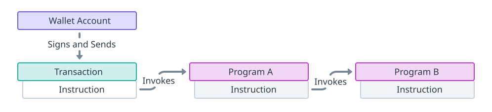

import { RedText, BlueText, YellowText } from '@site/src/components/ColorText'

# Solana核心概念: 跨程序调用 (CPI)

跨程序调用（CPI）指的是一个程序调用另一个程序的指令。这种机制使得Solana程序具有组合性。

你可以把指令看作是一个程序对网络公开的API端点，而CPI则是一个API内部调用另一个API。



当程序启动对另一个程序的跨程序调用（CPI）时：
- 签名者的特权从调用程序(`A`)的初始事务传递到被调用方(`B`)程序
- 被调用方（`B`）程序可以进一步调用其他程序，最多达到`4`层深度（例如，`B->C`，`C->D`）
- 这些程序可以代表其程序ID派生的PDAs进行"签名"

:::info
Solana 程序运行时定义了一个名为 `max_invoke_stack_height` 的常量，设置为 `5`。 
这代表程序指令调用堆栈的最大高度。 堆栈高度从事务指令的 `1` 开始，
每当一个程序调用另一个指令时增加 `1`。 此设置有效地限制了 CPI 的调用深度为 `4`。
:::

## 关键点

- CPI使Solana程序指令可以直接调用另一个程序的指令。
- 调用程序的签名权限会延伸到被调用的程序。
- 在进行CPI时，程序可以代表从其程序ID派生的PDA进行签名。
- 被调用的程序可以进一步调用其他程序，最大调用深度为`4`。

## 编写CPI

编写CPI指令的模式与构建一个交易指令类似。每个CPI指令必须指定以下信息：

- **程序地址**：指定被调用的程序。
- **账户**：列出指令读取或写入的所有账户，包括其他程序。
- **指令数据**：指定要调用的程序指令及所需的其他数据（函数参数）。

取决于要调用的程序，可能有一些`crate`提供了构建指令的辅助函数。
程序通过`solana_program` crate中的以下函数执行CPI：

- `invoke`：用于没有PDA签名者的情况。
- `invoke_signed`：用于需要调用程序用其程序ID派生的PDA进行签名的情况。

### 基本CPI

`invoke`函数用于不需要PDA签名者的CPI。
在进行CPI时，提供给调用程序的签名者权限会自动延伸到被调用程序。

```rust
pub fn invoke(
    instruction: &Instruction,
    account_infos: &[AccountInfo<'_>]
) -> Result<(), ProgramError>
```

这是在 Solana Playground 上的一个示例程序，它使用 `invoke` 函数进行 CPI，
调用 System Program 上的转账指令。您还可以参考基础 CPI 指南获取更多详细信息。

### 带PDA签名者的CPI

`invoke_signed`函数用于需要PDA签名者的CPI。

用于派生签名者PDA的种子通过`signer_seeds`参数传递给`invoke_signed`函数。

您可以查阅程序派生地址页面，了解关于如何派生 PDAs 的详细信息。

```rust
pub fn invoke_signed(
    instruction: &Instruction,
    account_infos: &[AccountInfo<'_>],
    signers_seeds: &[&[&[u8]]]
) -> Result<(), ProgramError>
```

运行时使用授予调用程序的权限来确定可以扩展到被调用程序的权限。
这些权限包括签名者和可写账户。
例如，如果调用程序处理的指令包含一个签名者或可写账户，
那么调用程序可以调用包含该签名者和/或可写账户的指令。

尽管PDA没有私钥，但它们仍可以通过CPI在指令中充当签名者。
为了验证PDA是否由调用程序派生，必须在`signers_seeds`中包含用于生成PDA的种子。

在处理CPI时，Solana运行时内部调用`create_program_address`，
使用`signers_seeds`和调用程序的`program_id`。
如果找到有效的PDA，该地址会被添加为有效的签名者。

这是在 Solana Playground 上的一个示例程序，使用 invoke_signed 函数进行 CPI，
调用 System Program 上的 transferinstruction，并使用 PDA 签名者。
您可以参考使用 PDA 签名者指南了解更多详细信息。

## 总结

跨程序调用（CPI）是Solana程序的重要组成部分，通过允许程序调用其他程序的指令，

实现了程序的高度组合性和灵活性。

通过合理使用CPI，开发者可以创建更加复杂和功能丰富的去中心化应用。