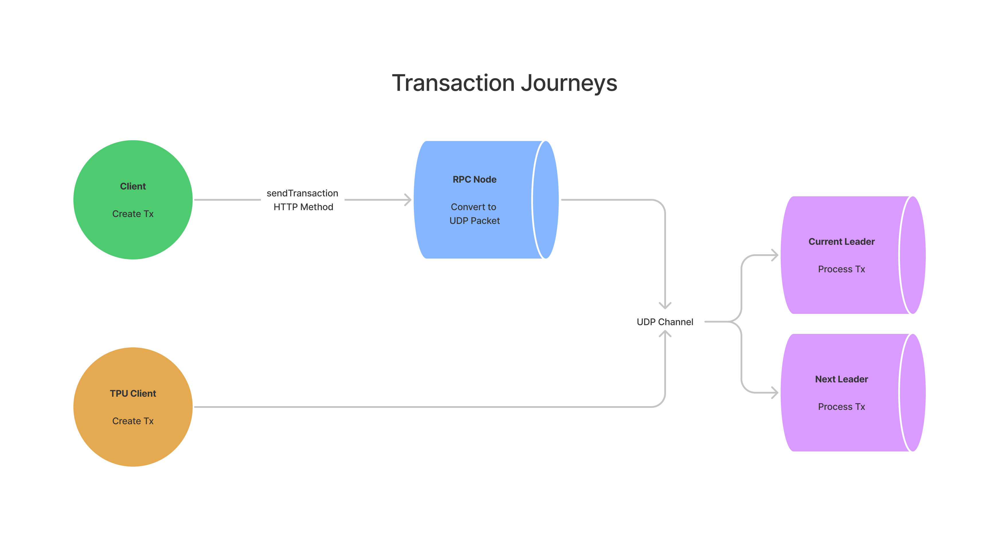
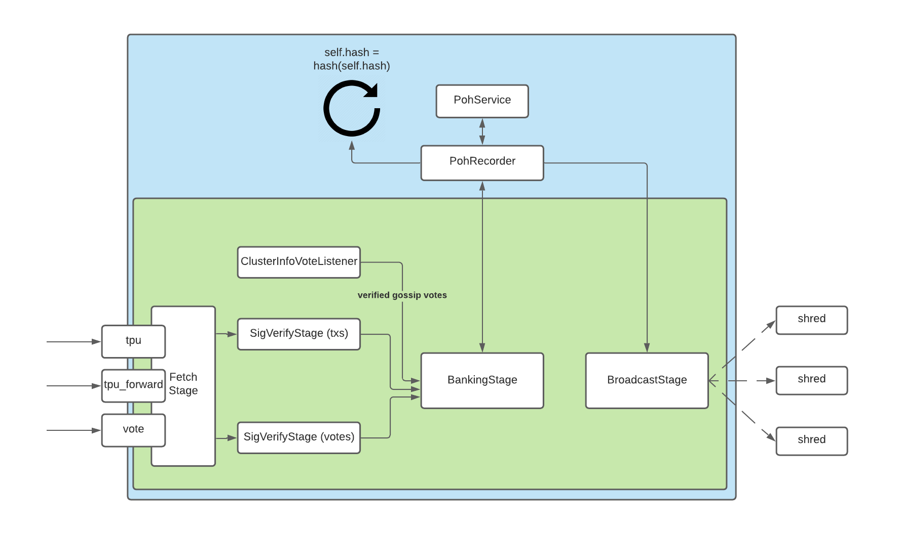
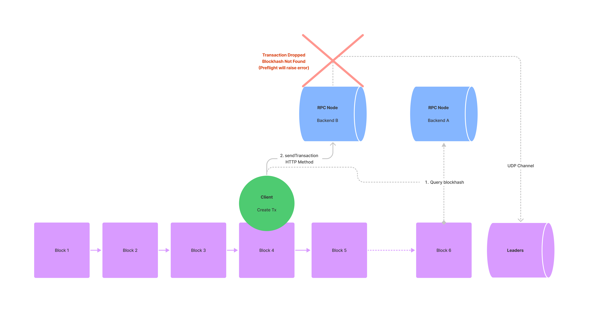
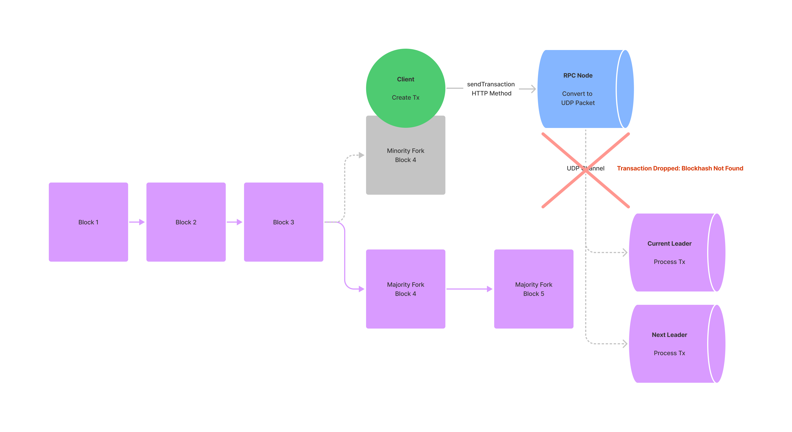
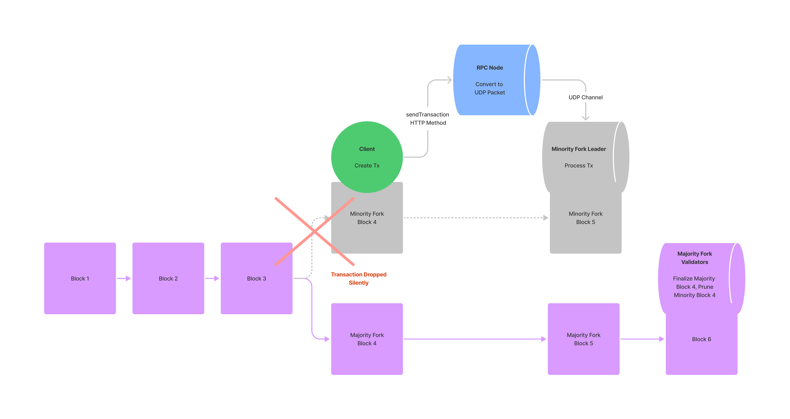

import { RedText, BlueText, YellowText } from '@site/src/components/ColorText'

# Solana高级概念: 重试交易

## 重试交易

有时，一个看似有效的交易可能在被包含在区块之前被丢弃。
这通常发生在网络拥堵期间，当RPC节点未能将交易重新广播给领导者时。

对于终端用户来说，这可能看起来像他们的交易完全消失了。
虽然RPC节点配备了通用的重新广播算法，但应用程序开发人员也可以开发自己的自定义重新广播逻辑。

## 要点概述(TLDR)
- RPC节点将尝试使用通用算法重新广播交易。
- 应用程序开发人员可以实现自己的自定义重新广播逻辑。
- 开发人员应利用`sendTransaction` **JSON-RPC**方法中的`maxRetries`参数。
- 开发人员应启用**预检检查**，以在提交交易前引发错误。
- 在**重新签署任何交易之前**，确保初始交易的区块哈希已过期非常重要。

## 交易的旅程
### 客户端如何提交交易
在Solana中，没有`mempool`的概念。

所有交易，无论是通过编程方式还是由终端用户发起的，
都会有效地路由到领导者，以便处理并纳入区块。

<YellowText text="有两种主要方式可以将交易发送给领导者"/>：

1. 通过RPC服务器和`sendTransaction` **JSON-RPC**方法代理发送。
2. 直接通过**TPU客户端**发送给领导者。

绝大多数终端用户将通过RPC服务器提交交易。

当客户端提交交易时，接收的RPC节点将尝试将交易广播给当前和下一个领导者。

在交易被领导者处理之前，除了客户端和中继RPC节点所知道的之外，没有任何交易记录。

对于**TPU客户端**，重新广播和领导者转发完全由客户端软件处理。



### RPC节点如何广播交易

**RPC节点**通过`sendTransaction`接收到交易后，
会将交易转换为**UDP数据包**，
然后再转发给相关的领导者。

**UDP**允许验证者快速互相通信，但不保证交易传递。

由于Solana的领导者时间表在**每个时期**(`epoch`)（大约`2`天）之前就已知，
因此RPC节点会将交易直接广播给当前和下一个领导者。
这与其他如以太坊的`gossip`协议不同，后者随机且广泛地传播交易。
默认情况下，**RPC节点**将尝试每两秒钟将交易转发给领导者，
直到交易被最终处理或交易的区块哈希过期（`150`个区块或约`1`分`19`秒）。
如果未处理的重新广播队列大小超过`10,000`笔交易，新提交的交易将被丢弃。
RPC操作员可以通过命令行参数调整此重试逻辑的默认行为。

当RPC节点广播交易时，
它将尝试将交易转发给领导者的**交易处理单元**（`TPU`）。

<YellowText text="TPU在五个不同阶段处理交易"/>：

1. Fetch阶段
2. SigVerify阶段
3. Banking阶段
4. 历史证明(`PoH`)服务
5. 广播阶段



在这五个阶段中，<YellowText text="Fetch阶段负责接收交易"/>。

**在Fetch阶段**，**验证者**会根据**三个端口**对传入交易进行分类：

- `tpu`处理常规交易，如代币转移、NFT铸造和程序指令。
- `tpu_vote`专门处理投票交易。
- `tpu_forwards`在当前领导者无法处理所有交易时，将未处理的数据包转发给下一个领导者。

有关TPU的更多信息，请参阅Jito Labs的优秀文章。

## 交易如何被丢弃
在交易的旅程中，有几种情况下交易可能会无意中从网络中丢失。

### 在交易处理之前
如果网络丢弃交易，很可能在交易被领导者处理之前就发生。
UDP数据包丢失是最简单的原因。

在网络负载过高时，验证者也可能因需要处理的大量交易而不堪重负。
虽然验证者配备了通过`tpu_forwards`转发多余交易的功能，但可转发的数据量有限。

此外，每次转发仅限于验证者之间的一跳。
也就是说，通过`tpu_forwards`端口接收的交易不会进一步转发给其他验证者。

还有**两个不太为人知的原因**也可能导致交易在处理之前被丢弃。
- 第一种情况涉及通过RPC池提交的交易。
有时，RPC池的一部分可能显著领先于其余部分。
当池中的节点需要协同工作时，这可能会导致问题。
在此示例中，交易的`recentBlockhash`从池的先进部分（后端A）查询。
当交易提交到池的滞后部分（后端B）时，节点将无法识别高级的区块哈希并丢弃交易。
如果开发人员在`sendTransaction`上启用预检检查，可以在交易提交时检测到这一点。

- 临时的网络分叉也可能导致交易丢弃。
如果验证者在银行阶段慢于重放其区块，它可能会创建一个少数分叉。
当客户端构建交易时，交易可能引用仅存在于少数分叉中的`recentBlockhash`。
在交易提交后，集群可能会在交易处理前切换离开其少数分叉。
在这种情况下，由于找不到区块哈希，交易将被丢弃。


### 交易处理后且在最终确认之前
如果交易引用了少数分叉的`recentBlockhash`，交易仍可能被处理。
然而，此时交易将由少数分叉的领导者处理。
当该领导者尝试将其处理的交易与网络其他部分共享时，它将无法与不识别少数分叉的大多数验证者达成共识。
在此时，交易将在最终确认之前被丢弃。


## 处理丢弃的交易
虽然RPC节点将尝试重新广播交易，但他们使用的算法是通用的，通常不适合特定应用的需求。
为应对网络拥堵，应用程序开发人员应定制自己的重新广播逻辑。

### 深入了解sendTransaction
提交交易时，`sendTransaction` RPC方法是开发人员可用的主要工具。
`sendTransaction`仅负责将交易从客户端中继到RPC节点。
如果节点接收到交易，`sendTransaction`将返回可用于跟踪交易的交易ID。
成功响应并不表示交易将被集群处理或最终确认。

### 请求参数
- `transaction: string` - 完全签名的交易，以编码字符串形式
- （可选）`configuration object: object`
- `skipPreflight: boolean` - 如果为true，跳过预检交易检查（默认值：`false`）
- （可选）`preflightCommitment: string` - 用于预检模拟的承诺级别，针对银行槽（默认值：`"finalized"`）。
- （可选）`encoding: string` - 用于交易数据的编码。可以是`"base58"`（慢）或`"base64"`（默认值：`"base58"`）。
- （可选）`maxRetries: usize` - RPC节点重试将交易发送给领导者的最大次数。
如果未提供此参数，RPC节点将重试交易直到交易被最终处理或区块哈希过期。

### 响应
- `transaction id: string` - 交易中嵌入的第一个交易签名，以`base-58`编码字符串形式。
可以使用此交易ID通过`getSignatureStatuses`轮询状态更新。

## 自定义重新广播逻辑
为了开发自己的重新广播逻辑，开发人员应利用`sendTransaction`的`maxRetries`参数。

如果提供，`maxRetries`将覆盖**RPC节点**的默认重试逻辑，允许开发人员在合理范围内手动控制重试过程。

手动重试交易的常见模式涉及临时存储从`getLatestBlockhash`获取的`lastValidBlockHeight`。
一旦存储，应用程序可以轮询集群的区块高度，并在适当的间隔手动重试交易。
在网络拥堵时，设置`maxRetries`为`0`并通过自定义算法手动重新广播是有利的。
虽然一些应用程序可能使用指数退避算法，
但其他如Mango的应用程序选择在某个超时发生前持续以恒定间隔重新提交交易。

示例代码展示了如何实现这一过程：

```javascript
import {
  Keypair,
  Connection,
  LAMPORTS_PER_SOL,
  SystemProgram,
  Transaction,
} from "@solana/web3.js";
import * as nacl from "tweetnacl";

const sleep = async (ms: number) => {
  return new Promise(r => setTimeout(r, ms));
};

(async () => {
  const payer = Keypair.generate();
  const toAccount = Keypair.generate().publicKey;

  const connection = new Connection("http://127.0.0.1:8899", "confirmed");

  const airdropSignature = await connection.requestAirdrop(
    payer.publicKey,
    LAMPORTS_PER_SOL,
  );

  await connection.confirmTransaction({ signature: airdropSignature });

  const blockhashResponse = await connection.getLatestBlockhashAndContext();
  const lastValidBlockHeight = blockhashResponse.context.slot + 150;

  const transaction = new Transaction({
    feePayer: payer.publicKey,
    blockhash: blockhashResponse.value.blockhash,
    lastValidBlockHeight: lastValidBlockHeight,
  }).add(
   

 SystemProgram.transfer({
      fromPubkey: payer.publicKey,
      toPubkey: toAccount,
      lamports: 1000000,
    }),
  );
  const message = transaction.serializeMessage();
  const signature = nacl.sign.detached(message, payer.secretKey);
  transaction.addSignature(payer.publicKey, Buffer.from(signature));
  const rawTransaction = transaction.serialize();
  let blockheight = await connection.getBlockHeight();

  while (blockheight < lastValidBlockHeight) {
    connection.sendRawTransaction(rawTransaction, {
      skipPreflight: true,
    });
    await sleep(500);
    blockheight = await connection.getBlockHeight();
  }
})();
```

在通过`getLatestBlockhash`轮询时，应用程序应指定其预期的承诺级别。

通过将其承诺级别设置为`confirmed`（已投票）或`finalized`（在`confirmed`之后约`30`个区块），
应用程序可以避免轮询少数分叉的区块哈希。

如果应用程序可以访问负载均衡器后的RPC节点，它还可以选择将工作负载分配给特定节点。
处理数据密集型请求（如`getProgramAccounts`）的RPC节点可能会落后，并且可能不适合同时转发交易。
对于处理时间敏感交易的应用程序，可能需要有专门的节点仅处理`sendTransaction`。

### 跳过预检的成本
默认情况下，`sendTransaction`将在提交交易之前执行三个预检检查。

具体而言，`sendTransaction`将：

1. 验证所有签名是否有效。
2. 检查引用的区块哈希是否在最近150个区块内。
3. 在预检承诺级别指定的银行槽上模拟交易。

如果这些预检检查中的任何一项失败，`sendTransaction`将在提交交易之前引发错误。

预检检查通常是防止交易丢失和允许客户端优雅处理错误之间的区别。

为了确保考虑到这些常见错误，建议开发人员将`skipPreflight`保持为false。

### 何时重新签署交易
尽管尝试重新广播，但有时客户端可能需要重新签署交易。
在重新签署任何交易之前，确保初始交易的区块哈希已过期非常重要。
如果初始区块哈希仍然有效，可能会导致网络接受两个交易。
对于终端用户来说，这似乎是他们无意中发送了相同的交易两次。

在Solana中，一旦交易引用的区块哈希比从`getLatestBlockhash`获得的`lastValidBlockHeight`更旧，
丢弃的交易就可以安全地被丢弃。

开发人员应通过查询`getEpochInfo`并与响应中的`blockHeight`进行比较来跟踪此`lastValidBlockHeight`。
一旦区块哈希失效，客户端可以重新签署一个新查询的区块哈希。

## 总结

### 重试交易要点总结

1. **交易丢失原因**：
  - 网络拥堵时，RPC节点可能未能重新广播交易。
  - UDP数据包丢失或验证者因过载未能处理所有交易。
  - 临时网络分叉或RPC池部分节点滞后导致交易丢失。

2. **RPC节点重试逻辑**：
  - RPC节点使用通用算法每两秒重新广播交易，直到交易被处理或区块哈希过期（约`1`分`19`秒）。
  - 如果重试队列超过`10,000`笔交易，新交易将被丢弃。
  - RPC节点可以通过命令行参数调整重试逻辑。

3. **自定义重试逻辑**：
  - 开发人员可以利用`sendTransaction`方法中的`maxRetries`参数，手动控制重试过程。
  - 使用自定义算法在网络拥堵时手动重新广播交易，避免重复提交。

4. **预检检查**：
  - `sendTransaction`默认执行预检检查，包括签名验证、区块哈希检查和交易模拟。
  - 保持`skipPreflight`为`false`，以防止常见错误和交易丢失。

5. **重新签署交易**：
  - 在重新签署交易之前，确保初始交易的区块哈希已过期，避免重复交易。
  - 通过查询`getEpochInfo`并比较响应中的区块高度，跟踪`lastValidBlockHeight`。

6. **交易处理过程**：
  - 交易通过RPC服务器或TPU客户端提交。
  - RPC节点将交易转换为UDP数据包并广播给当前和下一个领导者。
  - 交易在TPU的五个阶段处理：`Fetch`、`SigVerify`、`Banking、Proof of History Service`和`Broadcast`。

7. **示例代码实现**：
   - 使用JavaScript和Solana web3.js库实现手动重试交易逻辑，确保在区块哈希过期前持续重试。

通过这些要点，开发人员可以更好地理解和处理交易重试，确保在网络拥堵和其他异常情况下交易的可靠性。