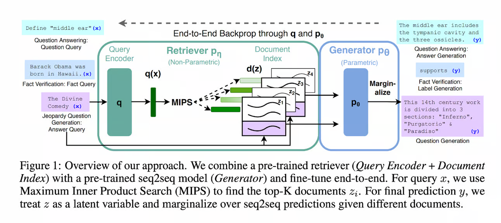
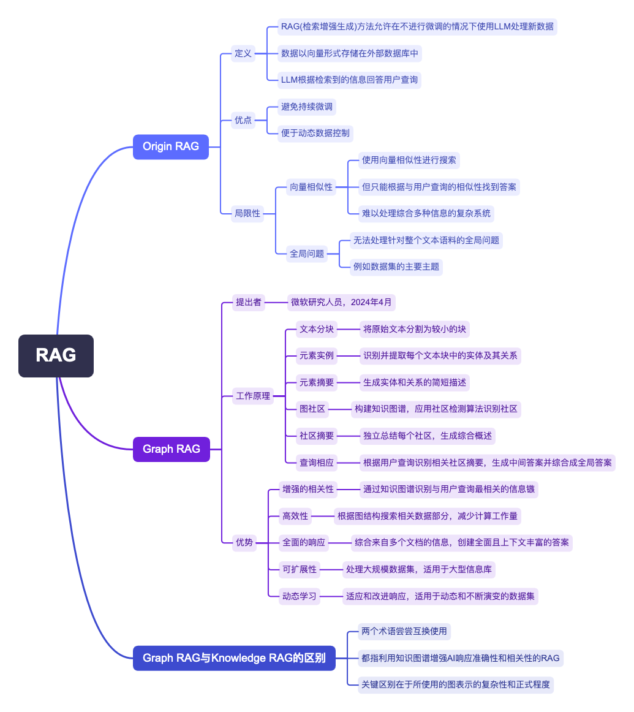

import { RedText, BlueText, YellowText, GreenText } from '@site/src/components/ColorText'

# 什么是图RAG(Graph RAG)方法？

我们讨论RAG的局限性，并探讨图RAG方法的优势，同时澄清术语并提供资源列表。

当AI悲观主义者谈论末日和AI接管时，他们常常忽略即使是最先进的语言模型也难以基于复杂的连接进行推理和得出结论。
另一个问题是训练或微调（适应您的数据）大型语言模型（LLMs）的成本极高。

**图RAG**（**检索增强生成**）方法解决了这两个问题，并且是我们之前讨论的原始RAG技术的升级版。让我们来探索这些图表！

在今天的讨论中，我们将涵盖：

1. 回顾原始RAG的基础知识
2. 原始RAG的局限性
3. 图RAG方法登场
4. 图RAG特别擅长什么？
5. 术语澄清：“图RAG”与“知识图谱RAG”
6. 额外资源

## 回顾原始RAG

让我们简要回顾一下RAG背后的关键概念。

<BlueText text="此方法允许在不需要微调的情况下使用LLM处理之前未见过的数据"/>。

<YellowText text="在RAG设置中，数据以向量形式存储在外部数据库中"/>。

<GreenText text="使用RAG，LLM从中检索必要的信息，并根据检索到的事实回答用户查询"/>。

<RedText text="RAG通过避免数据更新时的持续微调节省资源，同时也使外部数据库的动态数据控制变得容易"/>。

## 原始RAG的局限性

<GreenText text="原始RAG方法使用向量相似性作为搜索技术"/>。

这被认为是一项强大的技术，改变了我们访问信息的方式，并且是传统搜索引擎的宝贵更新。

<RedText text="然而，它也有局限性，尤其是在理解向量相似性的本质时"/>。

[Pinecone的向量嵌入](./pinecone.png)

您可能还记得我们之前探讨过变压器时提到的向量或词嵌入。

**这些嵌入是单词的密集向量表示，捕捉了语义和句法关系**。

<YellowText text="它们使语言模型能够通过将单词表示为向量空间中的点来量化语义相似性，从而学习单词之间的关系"/>。

向量相似性是一种用于衡量关系的指标，计算方法包括欧几里得距离、余弦相似性和点积相似性，每种方法都有其优缺点。

然而，向量相似性仅根据其与用户查询的相似性找到答案。

在需要结合各种信息或答案不明确存在于单个文档中的情况下，
这种方法在更复杂的系统中表现出局限性，导致原始RAG模型的限制。

图RAG方法的作者写道：
“RAG在针对整个文本语料库的全局问题（如‘数据集的主要主题是什么？’）上失败，
因为这本质上是一个面向查询的摘要任务，而不是明确的检索任务。”

同时，先前的**QFS方法**无法扩展到**典型RAG**系统索引的大量文本。

**图RAG方法**有效解决了更复杂的查询问题。

## 图RAG方法登场

**图RAG方法**由微软研究人员于2024年4月提出。

与**原始RAG**不同，<GreenText text="此方法将数据组织成图结构，表示文本数据及其相互关系"/>。

[图RAG演示图片](./graph-rag-demo.jpg)

**图RAG的工作原理**如下：

1. **源文档 → 文本块**：首先将外部数据库中的原始文本分割成较小的、可管理的块。
2. **文本块 → 元素实例**：使用LLM和针对数据库领域量身定制的提示，图RAG从每个文本块中识别并提取实体（如人、地点、组织）及其关系。
3. **元素实例 → 元素摘要**：使用另一组LLM提示生成每个实体和关系的简短描述，以总结初始原始文本数据。
4. **元素摘要 → 图社区**：使用总结的实体和关系构建知识图谱，其中节点表示实体，边表示关系。然后对该图应用社区检测算法（如Leiden算法），以识别紧密相关节点的社区。
5. **图社区 → 社区摘要**：然后独立总结每个检测到的社区，生成其代表的主题和信息的综合概述。
6. **社区摘要 → 社区答案 → 全局答案**：<RedText text="当用户提交查询时"/>：
  - 首先根据内容和与查询的关系识别相关的社区摘要。
  - 使用LLM为每个相关社区摘要独立生成中间答案。
  - 然后汇编这些中间答案，评估其相关性和帮助性（有时由LLM评分），并综合成最终的全局答案返回给用户。

**通过基于图的索引和社区聚焦的摘要，图RAG是RAG系统中处理面向查询的摘要的宝贵补充**。

## 图RAG特别擅长什么？

<RedText text="使用图RAG的主要优势"/>包括：

1. **增强的相关性**：<GreenText text="图RAG通过将数据结构化为知识图谱"/>，识别与用户查询最相关的信息簇。
2. **高效性**：图RAG根据图结构搜索相关数据部分，<GreenText text="相比于每次查询都处理整个数据集，减少了计算工作量"/>。
3. **全面的响应**：<GreenText text="系统可以综合来自多个文档的信息"/>，创建比单一文档响应更全面且上下文丰富的答案。
4. **可扩展性**：通过利用基于图的结构，<GreenText text="图RAG能够高效处理大规模数据集"/>，使其在大信息库中既可扩展又有效。
5. **动态学习**：随着更多数据添加或更新到图中，图RAG可以适应和改进其响应，<GreenText text="适用于动态和不断演变的数据集"/>。

## 术语澄清：“图RAG”与“知识图谱RAG”

“图RAG”和“知识图谱RAG”这两个术语经常互换使用，

因为它们都指利用知识图谱增强AI响应准确性和相关性的检索增强生成（RAG）方法。

**实际上，大多数利用图结构进行检索的RAG系统本质上都在使用某种形式的知识图谱，即使它没有明确标示为知识图谱**。

<RedText text="关键区别在于所使用的图表示的复杂性和正式程度"/>。

## 额外资源

### 原始资源

图RAG于2024年4月发布，并承诺很快将在官方网站和GitHub上作为开源项目发布。

- **网站**：[GraphRAG项目 - 微软研究：概述](https://www.microsoft.com/en-us/research/project/graphrag/overview/)
- **博客文章**：[GraphRAG：在私有叙述数据上解锁LLM发现 - 微软研究](https://www.microsoft.com/en-us/research/blog/graphrag-unlocking-llm-discovery-on-narrative-private-data)
- **文章**：[从局部到全局：面向查询的图RAG方法](https://arxiv.org/abs/2404.16130)

### 实现

虽然原始实现尚未可用，但有一些关于如何使用知识图谱与LLM结合的教程：

- [LlamaIndex的知识图谱RAG查询引擎](https://docs.llamaindex.ai/en/stable/examples/query_engine/knowledge_graph_rag_query_engine)
- [使用知识图谱实现RAG应用程序](https://neo4j.com/developer-blog/knowledge-graph-rag-application)
- 课程：[RAG的知识图谱](https://www.deeplearning.ai/short-courses/knowledge-graphs-rag)
- [通过构建和利用知识图谱来提升基于 RAG 的应用程序准确性](https://blog.langchain.dev/enhancing-rag-based-applications-accuracy-by-constructing-and-leveraging-knowledge-graphs)
- [GraphRAG：通过知识图谱增强传统RAG方法](https://www.pingcap.com/article/graphrag-enhancing-traditional-rag-through-knowledge-graph)
- [GraphRAG 逐步教程](https://github.com/pingcap/tidb-vector-python/blob/main/examples/graphrag-step-by-step-tutorial/README.md)
- [KG_RAG：使用基于知识图谱的检索增强生成（KG-RAG）为知识密集型任务增强大型语言模型（LLM）](https://github.com/BaranziniLab/KG_RAG)

## 要点总结

### 1. 原始RAG方法
- **定义**: RAG（检索增强生成）方法允许在不进行微调的情况下使用LLM处理新数据。数据以向量形式存储在外部数据库中，LLM根据检索到的信息回答用户查询。
- **优点**: 避免持续微调，便于动态数据控制。

### 2. 原始RAG的局限性
- **向量相似性**: 使用向量相似性进行搜索，但只能根据与用户查询的相似性找到答案，难以处理需要综合多种信息的复杂系统。
- **全局问题**: 无法处理针对整个文本语料库的全局问题，例如数据集的主要主题。

### 3. 图RAG方法
- **提出者**: 微软研究人员，2024年4月。
- **工作原理**:
  1. **文本分块**: 将原始文本分割为较小的块。
  2. **元素实例**: 识别并提取每个文本块中的实体及其关系。
  3. **元素摘要**: 生成实体和关系的简短描述。
  4. **图社区**: 构建知识图谱，应用社区检测算法识别社区。
  5. **社区摘要**: 独立总结每个社区，生成综合概述。
  6. **查询响应**: 根据用户查询识别相关社区摘要，生成中间答案并综合成全局答案。

### 4. 图RAG的优势
- **增强的相关性**: 通过知识图谱识别与用户查询最相关的信息簇。
- **高效性**: 根据图结构搜索相关数据部分，减少计算工作量。
- **全面的响应**: 综合来自多个文档的信息，创建全面且上下文丰富的答案。
- **可扩展性**: 处理大规模数据集，适用于大型信息库。
- **动态学习**: 适应和改进响应，适用于动态和不断演变的数据集。

### 5. 术语澄清
- **图RAG与知识图谱RAG**: 这两个术语常常互换使用，都指利用知识图谱增强AI响应准确性和相关性的RAG方法。关键区别在于所使用的图表示的复杂性和正式程度。

图RAG方法通过基于图的索引和社区聚焦的摘要，

解决了原始RAG方法的局限性，为处理面向查询的复杂摘要提供了高效、可扩展和动态的解决方案。

