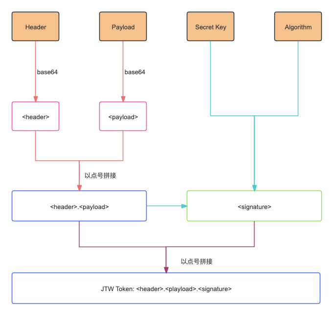

import { RedText, BlueText, YellowText } from '@site/src/components/ColorText'

# 什么是JWT？深入理解JSON Web令牌与身份验证



**JWT**（**JSON Web Token**）是一种用于标识和验证经过身份验证用户的安全令牌，通常用于 **身份验证** 和 **授权**。它们由身份验证服务器签发，并由客户端和服务器使用来保护 API，确保信息的安全传输和身份的准确验证。

本文将为您全面讲解 **JWT 的工作原理**、**结构**、**声明规范**、**优缺点** 以及在 **开发过程中常见的问题**，帮助您深入理解并有效使用 **JSON Web Token**。

## 什么是JWT？

**JSON Web 令牌（JWT）是一种开放的行业标准，用于在两个实体之间共享信息**，通常是客户端（如您的应用前端）和服务器（如您的应用后端）。JWT 中包含的 JSON 数据被加密签名，确保信息不能被篡改，并可通过公私钥验证其真实性。

例如，当您使用 Google 登录某个应用时，Google 会生成并返回一个 JWT，如下：

```json
{
  "iss": "https://accounts.google.com",
  "aud": "1234987819200.apps.googleusercontent.com",
  "sub": "10769150350006150715113082367",
  "email": "jsmith@example.com",
  "email_verified": true,
  "iat": 1353601026,
  "exp": 1353604926
}
```

通过这个令牌，您的应用就可以准确了解用户的身份信息并验证其真实性。

## 为什么需要使用JWT？

您可能会想，为什么不直接发送一个 JSON 对象，而需要使用令牌的形式呢？**JWT 的安全性** 是其主要优势。

如果身份验证服务器仅发送纯 JSON 数据，那么恶意用户可以对其内容进行修改，而客户端无法判断数据的真实性。因此，**JWT 通过加密和签名机制，确保传递的数据不能被篡改**，并且可以在接收端通过验证机制确保数据的可信度。

**简单来说，JWT 是一个安全的字符串，包含共享信息，并且能够验证该信息的完整性和来源**。

## JWT的结构

一个 **JWT** 由三部分组成：

1. **Header（头部）**：包含签名算法类型和令牌类型，通常为 JWT。
2. **Payload（负载）**：包含声明（Claim）或用户相关的 JSON 数据。
3. **Signature（签名）**：通过加密算法生成，用于验证令牌的完整性和真实性。

JWT 使用 `<header>.<payload>.<signature>` 的格式进行编码和传递，确保数据在传输过程中保持完整且安全。

### JWT 声明约定

JWT 的负载部分包含声明，声明可以是标准化的或自定义的。常见的声明包括：

- **iss**（Issuer）：签发者，例如 `https://accounts.google.com`。
- **aud**（Audience）：令牌的受众，通常为应用的客户端 ID。
- **sub**（Subject）：用户的唯一标识符。
- **iat**（Issued At）：令牌的签发时间。
- **exp**（Expiration Time）：令牌的过期时间，确保令牌在一定时间后失效。

## JWT 的工作原理（示例）

以下是一个简单的示例，演示如何生成和验证 JWT：

### 1. 创建 JSON 负载

首先，我们创建一个包含用户信息的 JSON 负载：

```json
{
  "userId": "abcd123",
  "expiry": 1646635611301
}
```

### 2. 选择签名密钥和签名算法

签名密钥可以是一个随机生成的字符串，算法可以选择 **HMAC + SHA256**，即 **HS256**。

### 3. 生成 Header

Header 通常包含签名算法类型，例如：

```json
{
  "typ": "JWT",
  "alg": "HS256"
}
```

### 4. 创建签名

我们将 **Header** 和 **Payload** 分别进行 **base64 编码**，然后使用密钥和算法生成签名。最终的 JWT 格式为：

`<header>.<payload>.<signature>`

### 5. 验证 JWT

在服务器端，JWT 需要经过以下验证步骤：

1. 验证签名是否与密钥匹配。
2. 检查 **exp**（过期时间）是否仍然有效。
3. 确保所有声明（例如 **iss**、**aud**）均符合要求。

## JWT 的优缺点

### 优点

- **安全性**：JWT 使用签名机制，确保数据不能被篡改。
- **无状态和高效**：JWT 是自包含的，服务器端无需存储用户会话状态，极大提高了系统的扩展性。
- **灵活性**：JWT 可以轻松在多个应用程序之间共享用户身份信息，适合于微服务架构。

### 缺点

- **不可撤销**：JWT 一旦签发便无法撤销，直到过期。虽然可以使用黑名单机制，但管理复杂。
- **密钥依赖**：JWT 的安全性依赖于签名密钥的安全，一旦泄露，攻击者可以伪造合法令牌。

## 开发中的常见问题

### 1. JWT 被拒绝

此错误通常表示 JWT 验证失败，原因可能是：

- **JWT 已过期**：需要检查 **exp** 字段。
- **签名不匹配**：签名密钥不一致，或数据被篡改。
- **无效的声明**：例如，令牌的 **aud**（受众）不匹配预期应用。

### 2. JWT 不支持所需的范围

JWT 中可以包含用户的权限范围，若应用程序请求的权限超出了 JWT 提供的权限范围，便会导致错误。这时需要在令牌中包含更多的范围信息，或者请求用户进行授权升级。

### 3. JWT 解码失败

此错误可能是由于 **JWT 格式错误**，例如令牌中的某部分未正确 **base64 编码**。需要确保生成和传输过程中 JWT 的完整性和正确性。

## 进一步的阅读

- [什么是 JWT？深入理解 JSON Web Tokens](https://supertokens.com/blog/what-is-jwt)
- [JWT 官方标准规范](https://tools.ietf.org/html/rfc7519)
- [JWT 在线解码与验证工具](https://jwt.io/)
