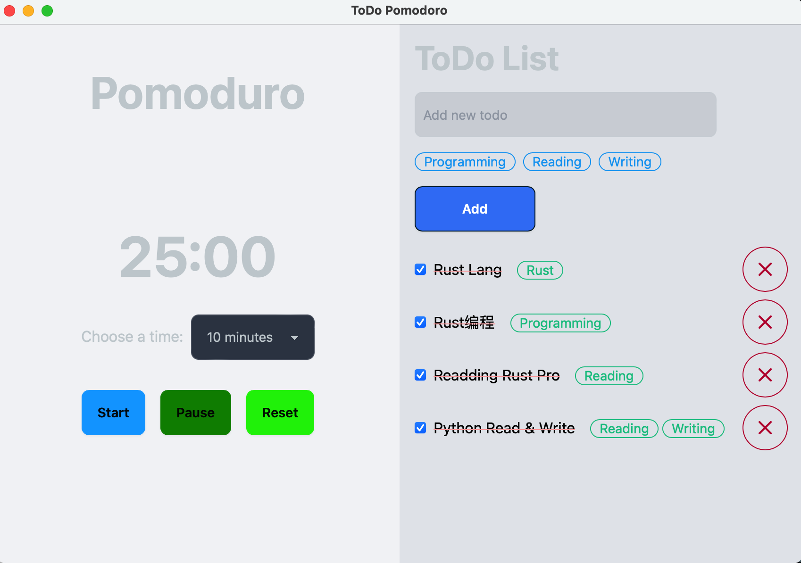
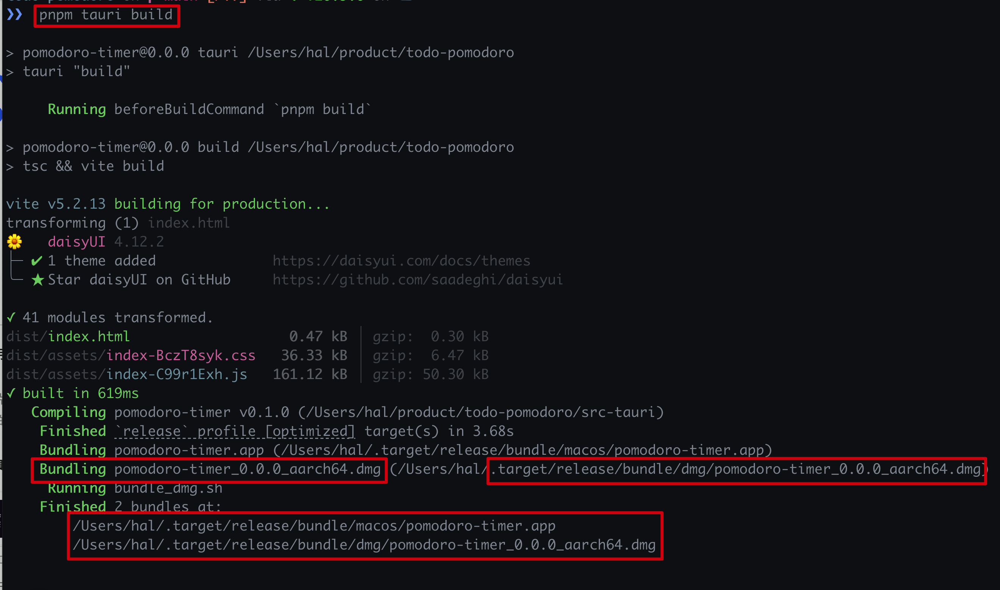
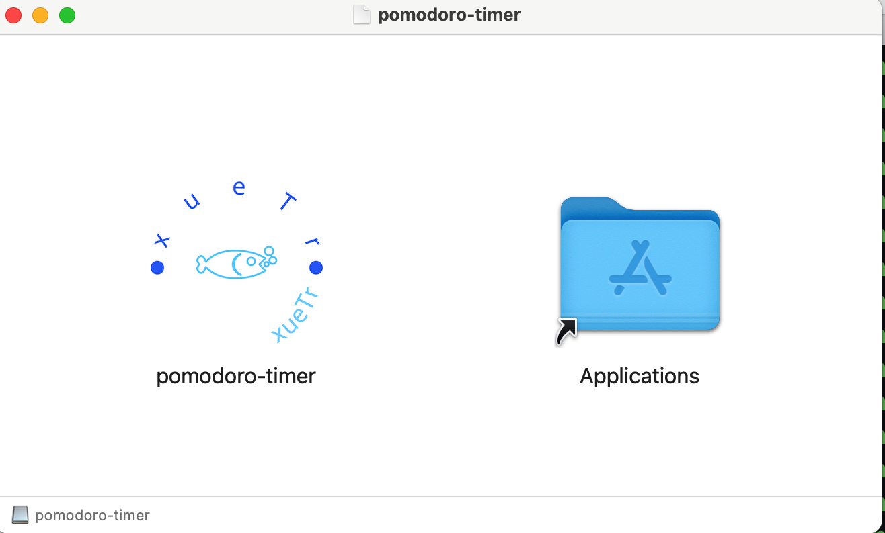

# 待办事项番茄钟

这两天想用待办事项的番茄钟，以前也用过很多其他的产品，包括免费的、付费的，在手机上的还有在电脑上的都有。

然后最近都一直在学Rust的内容，以及之前学过一点Tauri，所以就想着自己写一个番茄钟的应用，然后就有了这个项目。

## **项目初衷**
1. 用Rust写一个待办事项番茄钟的应用，练习Rust的开发
2. 足够简单好用，**只专注于今天的事情**，
不要有太多的功能(以往用的番茄钟都有很多功能，比如统计、报表等等，但是我只想专注于今天的事情，
比如四象限等还要想怎么安排，然后就容易导致事情拖延，托着拖着就不做了)
3. 既有待办事项，又有番茄钟，**两者结合**，不要分开，这样就不用来回切换了
4. 只专注于电脑端，不要有手机端，因为手机端的话，就容易分心，不专注于今天的事情了
5. 只专注于电脑端，只专注于办公

## 项目地址
[Github Repo: https://github.com/yuxuetr/todo-pomodoro](https://github.com/yuxuetr/todo-pomodoro)

## 安装依赖
1. 安装Rust
```bash
curl --proto '=https' --tlsv1.2 https://sh.rustup.rs -sSf | sh
```

2. 安装Node.js
[安装链接和方法](https://nodejs.org/en/download/package-manager)

3. 安装`pnpm`
```bash
npm i -g pnpm
```

## 构建方式

1. 克隆仓库
```bash
git clone https://github.com/yuxuetr/todo-pomodoro.git
```

2. 安装依赖
```bash
cd todo-pomodoro
pnpm install
```

3. 构建运行项目
```bash
pnpm run tauri dev
```

4. 运行结果如图


## 设置应用的图标

图标文件存放在`src-tauri/icons`下，在这下面有针对不同平台的应用图标格式。

图标的设置在`tauri.conf.json`文件中，如下所示
```json
"bundle": {
	"active": true,
	"targets": "all",
	"identifier": "com.yuxuetr.dev",
	"icon": [
		"icons/32x32.png",
		"icons/128x128.png",
		"icons/128x128@2x.png",
		"icons/icon.icns",
		"icons/icon.ico"
	]
}
```

在MacOS下，应用的图标是`icon.icns`，所以需要将图标文件放到`icons`目录下，然后在`tauri.conf.json`文件中设置图标的路径。

MacOS平台应用的图标大小是`1024x1024`，所以需要将图标文件转换成`1024x1024`的大小，然后修改成`icon.icns`放到`icons`目录下。

如果需要将图标由直角转换成圆角，可以使用在线工具。也可以试试我写的工具。

有三个不同的版本：
- Python版本: [https://github.com/yuxuetr/make-rounded-corner-icons/blob/main/scripts/make_icons.py](https://github.com/yuxuetr/make-rounded-corner-icons/blob/main/scripts/make_icons.py)
- Rust版本: [https://github.com/yuxuetr/make-rounded-corner-icons](https://github.com/yuxuetr/make-rounded-corner-icons)
- WASM版本: [https://github.com/yuxuetr/rounded-corner-icons](https://github.com/yuxuetr/rounded-corner-icons)

## 应用发布

第一次发布应用，需要先构建应用需要使用`--target`参数,指定目标平台
```shell
cargo tauri build --target aarch64-apple-darwin
# 或者
pnpm tauri build --target aarch64-apple-darwin
```

之后每次发布应用，只需要执行下面的命令即可
```shell
pnpm tauri build
```



执行命令后，会弹出下面的窗口



然后按照Mac应用的方式安装应用，将应用拖到应用文件夹即可

## 项目后续

1. 项目后期增加统计功能(如果有必要的话)
2. 项目后期增加命令行功能(Tauri支持`clip`命令，可以在命令行中使用)
