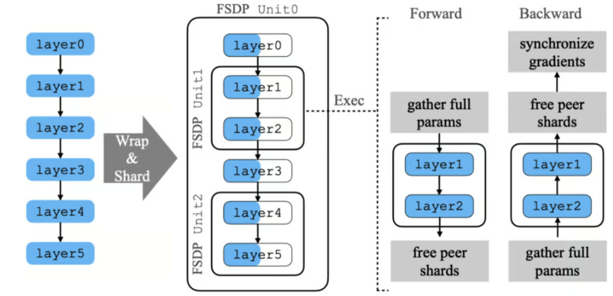
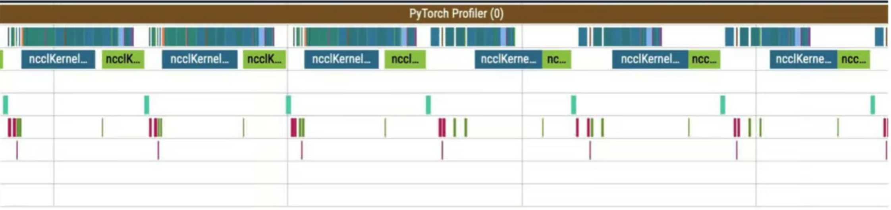
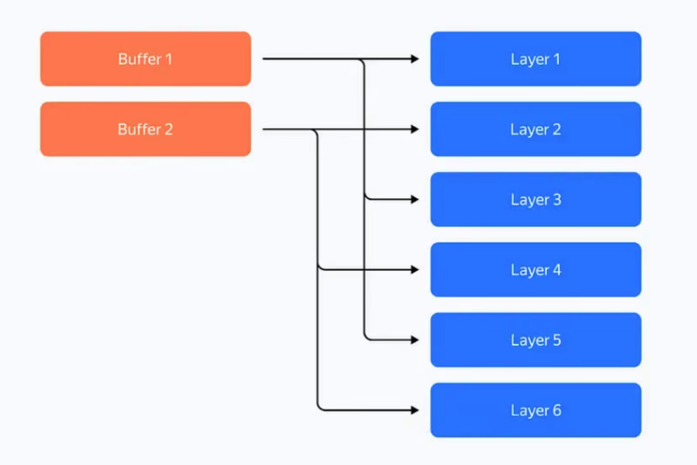
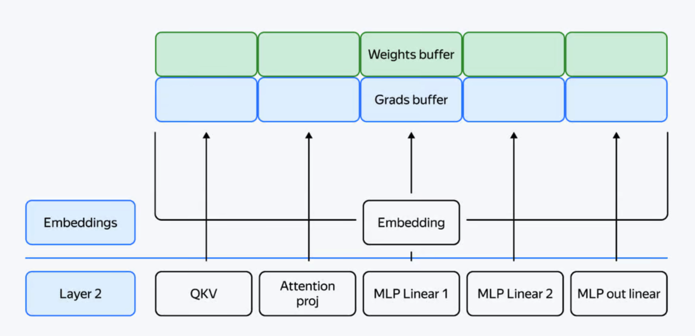
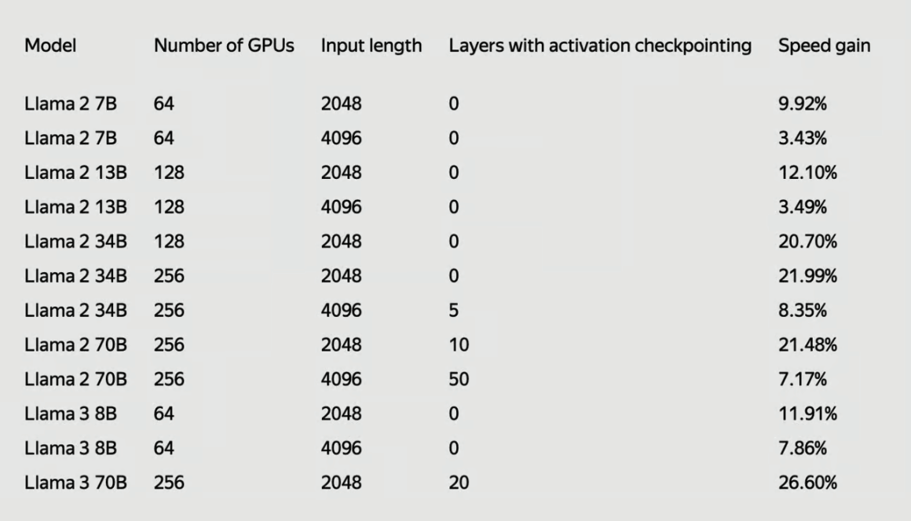

import { RedText, BlueText, YellowText } from '@site/src/components/ColorText'

# 什么是 FSDP 和 YaFSDP？
我们讨论 GPU 优化技术的突破，探索 **YaFSDP** 如何超越 **FSDP**，
在提高大语言模型的效率和可扩展性方面取得了进展。

在讨论 AI 的未来时，怀疑论者经常指出训练基础模型所需的巨大资源需求以及当前优化技术的局限性。
即使对于资金充足的机构来说，训练这些庞然大物的成本也可能是难以承受的。

像 **Fully Sharded Data Parallel (FSDP)** 及其增强版 **YaFSDP** 
这样的 GPU 优化技术提供了一个有前途的解决方案。
**FSDP** 允许模型在多个 GPU 之间分割，减少内存开销并加快训练速度。

**YaFSDP** 在此基础上进一步提高了效率和可扩展性。
让我们深入了解 **FSDP** 和 **YaFSDP** 的机制，发现它们如何变革 AI 优化！

在今天的讨论中，我们将涵盖：

- 什么是 **Fully Sharded Data Parallel (FSDP)**？
- **FSDP** 的局限性是什么？
- **YaFSDP** 的出现
- **YaFSDP** 的工作原理
- **YaFSDP** 特别擅长什么？性能提升
- 原始资源

## 什么是 **Fully Sharded Data Parallel (FSDP)**？
<RedText text="传统的数据并行方法"/>（如 PyTorch 中的 **Distributed Data Parallel (DDP)**）
**在多个 GPU 上复制整个模型并同步梯度以确保模型一致性**。
<YellowText text="然而，这种方法受限于单个 GPU 的内存容量，使得训练日益庞大的模型变得困难"/>。

2023 年 9 月，Meta AI 的研究人员提出了他们在 **PyTorch Fully Sharded Data Parallel (FSDP)** 上的工作，
<RedText text="解决了训练超出单个 GPU 内存容量的大型神经网络模型的问题"/>。

这个问题很关键，因为大模型能够在各个领域提供出色的性能，但由于技术障碍，目前仅对少数高级用户和行业领导者可用。

为了解决这个问题，团队设计了 **FSDP**，将其紧密集成到 PyTorch 的核心组件中，
**如 Tensor 实现、调度系统和 CUDA 内存缓存分配器**。
<YellowText text="这种集成确保了非侵入式的用户体验和高效的训练"/>。

**FSDP** 通过分片模型参数来优化不同硬件配置的资源利用。
它采用了延迟初始化等技术，即在虚拟设备上创建模型，然后逐层分片到实际 GPU 上。

它还使用可配置的分片策略以匹配集群拓扑和各种通信优化，以重叠通信与计算。
这些方法共同使 **FSDP** 能够处理比 **Distributed Data Parallel** 更大的模型，
同时保持可比的性能和近线性的 **TFLOPS** 可扩展性。
但 **FSDP** 也有一些重要的局限性。

## FSDP 的局限性是什么？
- 可能无法完全匹配本地训练结果，尤其是对于依赖于未分片值或特定张量结构的优化器。
- 处理共享参数可能很棘手，如果处理不当，可能会导致错误并消耗比必要更多的内存。
- 即使有优化，对于更大的模型或更多的 GPU，仍然可能存在大量通信开销，需要仔细调整策略。
- 设置 **FSDP** 可能很复杂，尤其是对于大模型，有时需要其他方法，这些方法自身也有挑战。
- 将 **FSDP** 与其他并行方法（如流水线或张量并行）混合使用可能很难，需要仔细设置以避免过多的开销。
- 由于 **FSDP 与 PyTorch 深度集成**，相较于简单的数据并行方法，它更难调试和故障排除。

正如 <RedText text="YaFSDP 的作者所写：“尽管有这些优势，我们也面临一些问题"/>：

1. <YellowText text="FSDP 动态分配层的内存，有时需要比实际需要更多的内存"/>。

2. 在反向传播过程中，我们遇到了一种现象，称之为‘让路效应’。”

这里的第一行是计算流，其他行表示通信流。

那么，轮廓中发生了什么？在 reduce_scatter 操作（蓝色）之前，有许多准备计算（通信下的小操作）。
这些小计算与主要计算流并行运行，严重减慢了通信速度。
这导致通信之间出现大间隙，进而在计算流中出现相同的间隙。”

## YaFSDP 的出现
**Yet Another Fully Sharded Data Parallel (YaFSDP)** 是 Yandex 于 2024 年 5 月开发并开源的。
它通过提供更高效的内存管理、减少冗余计算以及优化大语言模型训练过程中的通信和同步，
改进了 **FSDP**。

## YaFSDP 的工作原理
- 层分片：**YaFSDP** 不是分片单个参数，而是分片整个层。
这种方法保持了高效的通信并减少了冗余。
每个 GPU 处理模型的不同分片，最小化内存使用。

- 缓冲区预分配：**YaFSDP** 为所有必要数据预分配缓冲区，
确保 Torch 分配器的内存管理不会引入低效。
该方法使用两个缓冲区来存储中间权重和梯度，在奇数层和偶数层之间交替使用。

## 内存消耗优化
<RedText text="YaFSDP 通过以下方式显著减少内存消耗"/>：

- **高效缓冲区使用**：缓冲区存储中间值，消耗恒定数量的内存。
- **激活检查点**：在前向传递期间仅存储必要的激活，并在反向传递期间重新计算，大大减少内存使用。
例如，训练一个 **Llama 2 70B** 模型，批量大小为 `8192` 个标记，可以将激活存储从超过 110 GB 减少到 5 GB。
然而，这种技术增加了计算开销，**YaFSDP** 可以通过优化内存使用和避免某些层的激活检查点来减轻这种负担。
- **分片权重、梯度和优化器状态**：随着进程数量的增加，这些组件的内存消耗趋于接近零，最小化了重复。

## 通信优化
<RedText text="YaFSDP 通过以下方式提高通信效率"/>：

- **重叠通信与计算**：使用 CUDA 流，**YaFSDP** 有效管理并发计算和通信。
使用两个流：一个用于计算，一个用于通信，通过事件同步以确保操作顺序正确。
- **减少通信开销**：通过确保数据传输仅在必要时发生，并使用技术最小化冗余操作，
**YaFSDP** 提高了整体效率。

## **YaFSDP** 特别擅长什么？性能提升
<RedText text="YaFSDP 显示出显著的性能提升"/>。
对于一个具有 700 亿参数的模型，它可以节省约 150 个 GPU 的资源，
每月节省成本约为 50 万至 150 万美元。
与现有方法（如 **FSDP**）相比，训练时间减少了高达 26%。

与 **FSDP** 相比，**YaFSDP** 在 **Llama 2** 和 **Llama 3** 上的最终加速显示出训练效率的显著改进。

**YaFSDP** 可以与 **huggingface** 工作流程结合使用，并且比 **FSDP** 快 `25%`。

## 原始资源
- 论文：[PyTorch FSDP: Experiences on Scaling Fully Sharded Data Parallel](https://arxiv.org/pdf/2304.11277)
- GitHub：[YaFSDP](https://github.com/yandex/YaFSDP)
- 博客文章：[Yandex develops and open-sources YaFSDP — a tool for faster LLM training and optimized GPU consumption](https://medium.com/yandex/yafsdp-a-tool-for-faster-llm-training-and-optimized-gpu-utilization-is-no-632b7539f5b3)