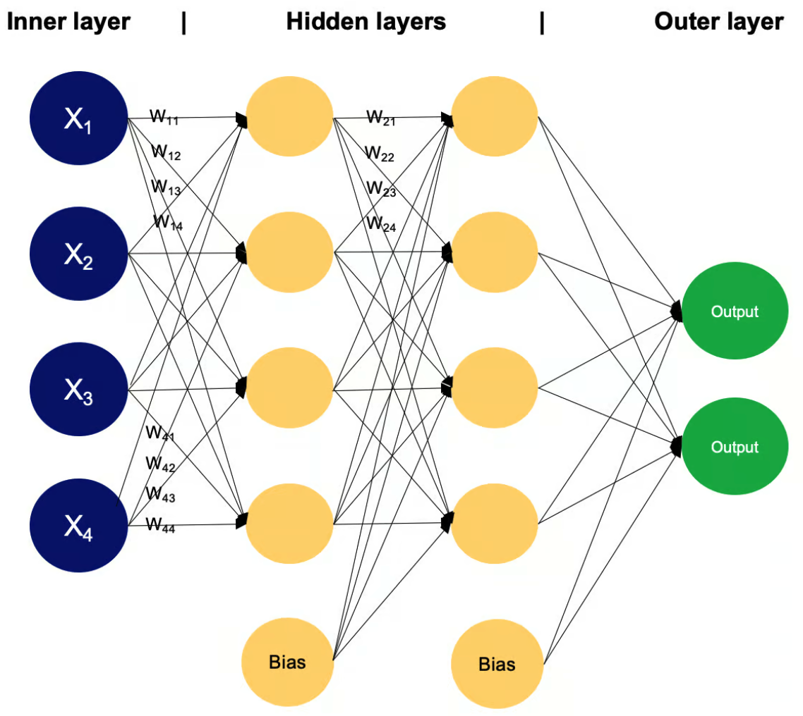
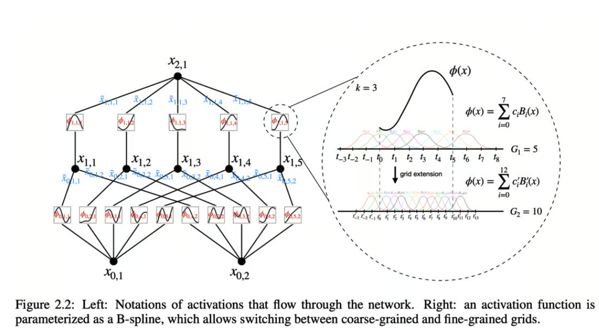
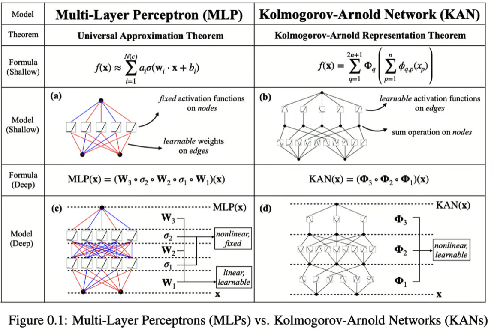
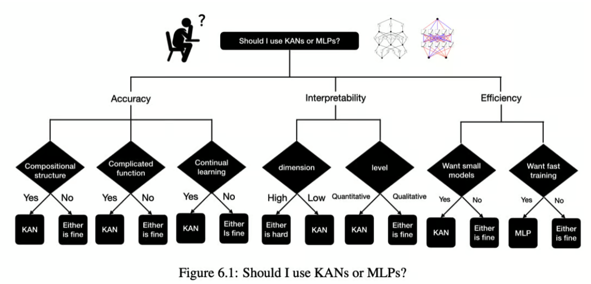

import { RedText, BlueText, YellowText } from '@site/src/components/ColorText'

# 什么是KAN？

我们生活在一个变革和修订的时代，因为我们需要更好的算法、更强大的计算能力和新的人工智能水平。效率是人工智能世界中的一个新流行术语，它取代了之前对最大模型的争夺。在此背景下，一些基础方法正在被重新审视。

例如，多层感知器（MLP）可以说是深度学习历史上最重要的算法，最近才刚刚出现了一种替代方案。一组研究人员提出了Kolmogorov-Arnold网络（KANs），报告在某些任务中，其准确性和可解释性优于MLP。

什么是KAN？它如何改善MLP所取得的成果？让我们一探究竟。

在今天的内容中，我们将涵盖：
- 首先，什么是MLP以及它的起源？
- KAN的故事
- KAN的架构
- KAN是改进版的MLP吗？
- KAN相对于MLP的优势
- KAN的局限性
- 结论
- 附加资源

## 首先，什么是MLP以及它的起源？
多层感知器（MLPs）是人工智能中的核心前馈神经网络类型。
在不同类型的神经网络（NNs）中，前馈神经网络（FNNs）是最简单的。
信息仅以一种方向流动，从输入到输出，网络架构中没有循环或环路。

:::note
神经网络受到人脑中发生的过程的启发，生物神经元共同工作以识别现象、权衡选择，并得出结论。
:::

为了理解MLPs，让我们复习一些神经网络的基础知识。多层感知器由节点层（也称为神经元或感知器）组成：
- **输入层**：这是数据进入网络的初始点。这里的每个节点代表输入数据的不同特征，有效地将原始数据转换为网络可以处理的格式。
- **隐藏层**：位于输入层和输出层之间，这些层的数量和大小可以根据网络的复杂性而变化。
这些层中的每个神经元处理来自前一层所有神经元的输入，通过权重、偏置和激活函数进行转换，然后将结果传递到下一层。
- **输出层**：这是最后一层，输出网络的预测或分类。这里的神经元数量与手头具体任务的所需输出维度相符。

其他重要概念：
- **权重和偏置**：这些参数定义了神经元之间连接的强度。它们通过训练进行调整，对于确定网络的输出至关重要。
- **激活函数**：如`ReLU`或`sigmoid`，这些函数根据输入决定神经元的输出。
这些函数对于引入非线性到网络中，使其能够建模复杂的模式非常重要。
- **学习规则**：一种算法方法，如反向传播，根据预测输出和实际输出之间的误差调整网络的权重和偏置，从而迭代地优化模型。

MLPs起源于20世纪60年代。
最初的概念是由Frank Rosenblatt提出的，他的感知器模型是一种简单的神经网络，展示了基本的模式识别任务。
但是，感知器的能力是有限的，正如Marvin Minsky和Seymour Papert所示，它无法解决非线性问题。
这一发现暂时中止了神经网络研究。

几乎二十年后，研究人员开始探索多层前馈网络的能力，以逼近从一个有限维空间到另一个空间的一般映射。
1989年，Kurt Hornik、Maxwell Stinchcombe和Halbert White证明了MLPs在给定足够数量的隐藏层和单元的情况下，
可以逼近任何连续函数——无论多么复杂。
他们的最终结果被称为**通用逼近定理**。

这一特性，被称为**通用逼近**，确立了MLPs作为能够解决广泛任务的多才多艺工具，
从简单的回归到复杂的模式识别挑战，而无需为每个新问题设计定制算法。

根据《深度学习》教科书，MLPs是“典型的深度学习模型”。
今天，MLPs广泛应用于机器学习的各个领域，处理文本、图像和语音等。
它们在架构上的灵活性和逼近非线性函数的能力使其成为深度学习和神经网络研究中的基础构建块。

## KAN的故事
与通用逼近定理并行存在的是由**Vladimir Arnold**和**Andrey Kolmogorov**在1957年证明的**Kolmogorov-Arnold**表示定理。

<RedText text="该定理指出，任何多变量连续函数都可以表示为单变量连续函数和加法运算的有限组合"/>。

换句话说，**Kolmogorov-Arnold**表示定理表明，多维函数可以分解为只有一个维度的函数的线性组合。

那么，为什么研究人员当初不使用它呢？问题在于，这些一维函数不一定具有被神经网络表示所需的性质。
因此，在20世纪90年代，研究人员重新审视了这个主题并指出“Kolmogorov定理是不相关的”，使得研究界对此沉默。

快进到2024年，KAN：Kolmogorov-Arnold网络的作者在当今的深度学习世界中重新审视和上下文化了这个定理。
他们建议将该定理适应于任意宽度和深度的网络，这将允许在机器学习模型中更灵活和鲁棒的应用。

此外，作者强调，科学和日常生活中遇到的许多函数具有平滑性和稀疏组合结构等特性。
这些特性有利于使用Kolmogorov-Arnold方法进行表示，这可能使该定理在实际场景中更具实用性。

## KAN的架构
KANs的主要创新是用可学习的边上的激活函数替代节点上的固定激活函数，从而消除了线性权重矩阵。
相反，每个KAN中的“权重”都被建模为一个可学习的一维函数，特别是参数化为样条函数。
这一变化意味着网络中的每个连接可以根据数据调整其函数，提供了更灵活和定制的数据处理路径。

<RedText text="KAN的架构允许其处理输入并以与MLPs根本不同的方式执行计算"/>。

<YellowText text="KANs的其他核心特征包括"/>：
- **没有线性权重**：在传统网络中，线性变换（权重）在通过网络层映射输入方面起着关键作用。
而**KANs**使用样条函数代替线性权重，允许每个连接执行复杂的非线性变换，以满足输入数据的特定需求。
- **求和节点**：**KANs**中的节点主要功能是汇总来自传入边的输入。
这些输入不会在节点本身进行任何进一步的非线性变换，这与MLP节点中常用的`ReLU`或`sigmoid`激活函数的使用不同。
- **样条参数化**：**KAN**中的每个边函数都被参数化为样条，这为使用相对简单的数学构造建模非线性关系提供了强大的方法。
样条提供了形成平滑曲线的灵活性，可以拟合广泛的数据形状，使其非常适合KAN所需的多样化函数变换。

## KAN是改进版的MLP吗？
<RedText text="KANs在理论和实践上都比传统的MLP具有若干优势。它们有效地集成了MLPs和样条的优点，利用各自的优势来解决各自的局限性"/>。

<YellowText text="KAN中样条的优势"/>：
- **低维精度**：样条特别擅长在低维空间中准确建模函数。这种精度对于需要对函数形状进行细致控制的任务非常重要。
- **局部可调性**：样条的性质允许容易地进行局部调整，这意味着对样条参数的更改可以直接精确地影响函数的特定部分，而不会对其他部分产生意外影响。
- **分辨率灵活性**：样条可以在不同的分辨率之间切换，为函数逼近提供了一种多用途的工具，可以根据需要粗略或详细。

<YellowText text="KAN中MLPs的优势"/>：
- **处理高维数据**：与样条不同，**MLPs**不太容易受到维度诅咒的影响，使其在高维输入空间中更有效。
- **特征学习**：**MLPs**擅长从数据中学习复杂的特征层次，这对于需要从原始输入中提取和集成信息特征的任务非常有利。

## KAN相对于MLP的优势
<RedText text="决定KANs是否优于MLPs在很大程度上取决于应用、数据的性质和模型的目标"/>。

<YellowText text="KANs的主要优势包括"/>：
- **函数逼近**：**KANs**可能提供更精确和灵活的函数逼近能力，特别是因为它们使用样条作为激活函数，
可以更紧密地调整以适应输入数据的特定特征，而不是**MLPs**中通常使用的固定激活函数。
- **可解释性**：使用样条可以提供潜在的更高可解释性。
由于每个连接的函数是直接可修改和可观察的，因此更容易理解输入在整个网络中的变换方式。
- **灵活性**：**KANs**在适应各种分辨率和数据复杂性方面提供了灵活性，
可能在涉及复杂非线性关系的任务中表现更好，这些关系可以通过样条更好地建模。
- **高维功能**：虽然传统上样条在高维空间中表现较差，
但与**MLP**类似结构的集成使**KANs**可能比单独的样条更有效地处理高维数据。

## KAN的潜在局限性

迄今为止，<YellowText text="KANs的最大问题是训练速度慢"/>。它比神经网络慢10倍，限制了主流采用。

KAN的作者建议：

KAN论文的作者说: <RedText text="如果您关注可解释性和/或准确性，而训练速度不是主要问题，我们建议至少在小规模AI+科学问题上尝试KANs。"/>

KANs在小规模问题上表现出改进，但它们在工业应用中典型的大规模、更复杂的数据集和问题上的可扩展性仍未得到验证。
KANs的独特之处——对每个连接使用样条函数——可能会在参数数量和学习这些参数所需的计算资源方面带来高成本，
特别是在网络深度和复杂性增加时。

此外，正如Devan的新闻通讯中所指出的，<RedText text="可能还存在其他缺点"/>：
- **研究缺乏**：与转换器和扩散模型相比，研究KAN的研究人员不多，这可能意味着潜在的未知障碍。
- **市场适应性**：硬件倾向于支持转换器/神经网络，这可能会阻碍KAN的采用。

## 结论
尽管LLMs（大型语言模型）占据主导地位，但大量研究探索了像KANs这样的替代方案。
通过独特的样条函数，KANs提供了精确、灵活的函数逼近和更高的可解释性。
尽管它们面临诸如训练速度慢和可扩展性等挑战，
但对KANs的持续探索强调了人工智能研究的多样性，确保了不断的进步和稳健的解决方案。

在注重AI效率的时代，重新评估诸如MLP的方法至关重要。
神经网络在经历了暂时的停滞后重新崛起，表明有前途的技术可以通过持续的研究克服最初的障碍。
同样，KANs可能会发展成为更高效和广泛应用的技术。

## 附加资源
- KAN论文: https://arxiv.org/abs/2404.19756 
- KAN原代码: https://github.com/KindXiaoming/pykan 
- 文档: https://kindxiaoming.github.io/pykan/
- 推特: https://x.com/zimingliu11/status/1785483967719981538
- Ziming Liu，KAN的作者之一，在Google TechTalks上的演讲录像
- Ziming Liu对Portal社区的演讲录像
- KAN扩展：卷积Kolmogorov-Arnold网络
- 时间序列分析的Kolmogorov-Arnold网络（KANs）：https://arxiv.org/abs/2405.08790
- Wav-KAN：小波Kolmogorov-Arnold网络：https://arxiv.org/abs/2405.12832
- 有趣的实验：使用Chebyshev多项式而不是B样条的Kolmogorov-Arnold网络（KAN）：https://github.com/SynodicMonth/ChebyKAN
- 其他优秀的KAN资源（相关论文、库、项目、讨论和教程）可以在这里找到：https://github.com/mintisan/awesome-kan

文章中提到的论文：
- [Rosenblatt的感知器：教授的感知器为AI铺平了道路——早了60年](https://news.cornell.edu/stories/2019/09/professors-perceptron-paved-way-ai-60-years-too-soon)
- [Marvin Minsky和Seymour Papert对感知器的批判：感知器：计算几何的简介](https://direct.mit.edu/books/monograph/3132/PerceptronsAn-Introduction-to-Computational)
- [深度学习教科书](https://www.deeplearningbook.org/?utm_source=www.turingpost.com&utm_medium=referral&utm_campaign=topic-6-what-is-kan)
- [通用逼近定理：多层前馈网络是通用逼近器](https://www.sciencedirect.com/science/article/abs/pii/0893608089900208)
- [Kolmogorov-Arnold表示定理：关于多变量连续函数通过单变量连续函数和加法的超位置表示](https://www.mathnet.ru/php/archive.phtml)
- [评论科尔莫戈洛夫-阿诺德表示定理在机器学习中的适用性：网络的表示特性：科尔莫戈洛夫定理是不相关的](https://direct.mit.edu/neco/article-abstract/1/4/465/5509/Representation-Properties-of-Networks-Kolmogorov-s)