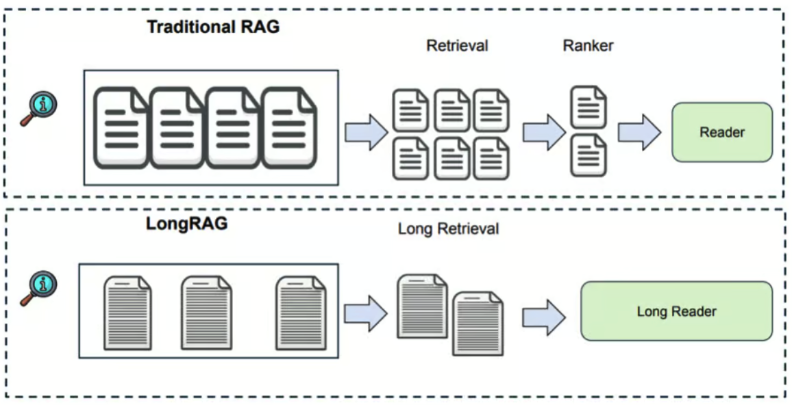
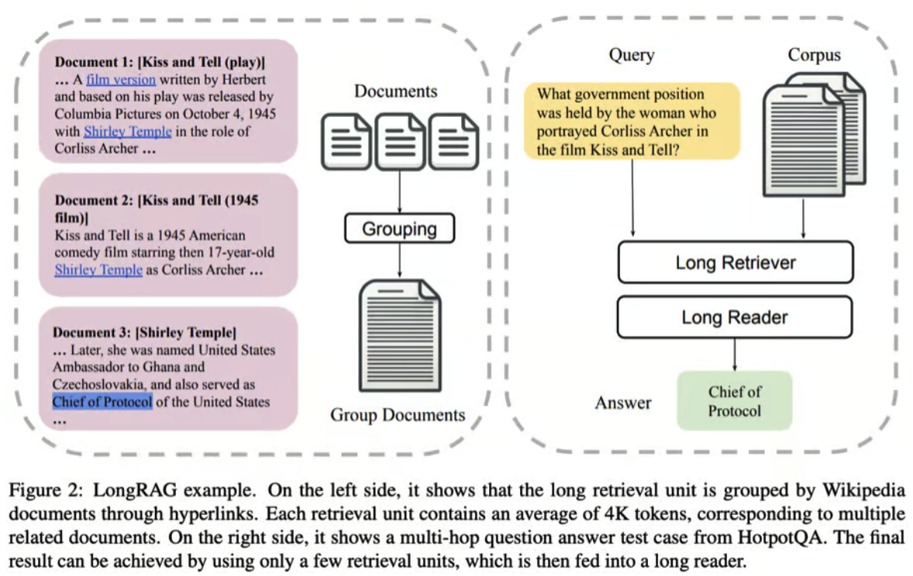

# LongRAG 框架是什么？
近年来，检索增强生成（RAG）作为一种利用外部知识增强大型语言模型（LLM）的方法变得越来越流行。

## 原始RAG及其工作过程
RAG使得LLM可以在以前未见过的数据上使用，而无需进行微调。
此外，通过利用外部语料库的独立检索组件，自然语言形式的知识可以完全卸载LLM的参数化内存。

### RAG 工作过程：  
- **查询编码器**：将用户查询编码成适合搜索文本段落或文档数据库的数值表示。  
- **检索器**：使用查询编码器生成的向量搜索索引文档的外部数据库。检索单据中基于所选搜索算法的前 K 个最相关文档。 
- **生成器**：大型语言模型根据检索器选择的文档和输入查询生成输出。

## LongRAG背后的直觉

在《LongRAG: Enhancing Retrieval-Augmented Generation with Long-context LLMs》一文中，
滑铁卢大学的研究人员通过对检索过程进行修改提出了以下建议：
- 将每个文档的标记大小从原始RAG中的`100`个标记扩展到**LongRAG**中的`4,000`个标记。
- 将焦点从在原始RAG中准确定位与用户查询相关的精确信息转移到在**LongRAG**中选择包含相关但未必精确信息的文档。

这样做的原因是从检索精确、小片段信息过渡到选择更大、上下文更丰富且语义完整的片段。
这种调整减轻了检索员的负担，并更均匀地分配了检索员和生成器之间的任务。
因此，**LongRAG**充分利用了最新LLM的扩展上下文能力，它们作为生成器，
从最近对处理长上下文的显著增强中受益。

## LongRAG如何运作：架构
LongRAG 对原始 RAG 进行了三项架构更新：

- **长检索单元**：**LongRAG** 使用了检索单元，其范围包括整个文档或一组文档，
而不是从大型文档中截取 `100` 个标记，这遵循了论文中提出的**Group Documents Algorithm**。
此次单元大小增加到 `4K`，将维基百科语料库从 `22M` 减少到 `600K` 的检索单元。
- **长检索器**：为进一步处理识别长检索单元。
- **长读者（生成器）**：从长检索单元中提取答案。这是一个以用户查询及长检索单元为提示的 LLM。

### 这是 LongRAG 逐步运作的方式
1. Retrieval（在原始论文中命名为Long Retriever）：
  
	- **编码**: 两个编码器将输入问题和检索单元分别映射到一个d维向量。
	- **形成长的检索单元**: 分组文档算法涉及创建相关文档的组。每个文档基于连接性与相关文档分组，不超过指定的最大组大小。这种分组能够更有效地检索相关信息，因为相关文档一起处理。
	- **相似性搜索**: 编码步骤中的向量用于计算问题和检索单元之间的相似性，当选择相关的长检索单元时。
	- **结果汇总**: 最相关的顶部组被汇总，形成对查询的全面响应，根据其大小调整包括的组数量。

2. 生成（原始论文中称为 Long Reader）：LLM（长期记忆模型）使用用户查询和来自检索步骤的聚合结果生成最终输出。 
长文阅读器中使用的LLM应能处理长文本，并且不展现出过度的位置偏见。

## LongRAG的优势
**LongRAG** 通过将维基百科处理成 `4,000` 个令牌单位来优化检索，将数量从 `2,200` 万减少到 `60` 万。
单位大小的增加意味着减少了许多单位的召回需求，避免了截断，并保留了更多上下文。
更长的单位有助于通过整合全面信息直接回答复杂问题。

**LongRAG** 框架实现了令人印象深刻的提取分数，并且与最先进模型具有可比的结果，
无需额外训练，展示了将 RAG 与长上下文 LLMs 结合的效率和潜力。

### 以下是对LongRAG实施的一些关键结果：

- **Recall@1**：在自然问题（NQ）数据集上提高至`71％`，而之前为`52％`。 
- **Recall@2**：在**HotpotQA**数据集（完全维基）上提高至`72％`，而之前为`47％`。 
- **Exact Match（EM）**：在NQ上取得`62.7％`的EM得分，在**HotpotQA**（完全维基）上为`64.3％`，
表现与最先进模型不相上下。

## 资源
- 原始RAG论文：[用于知识密集型自然语言处理任务的检索增强生成](https://arxiv.org/abs/2005.11401v4)
- **LongRAG**论文：[LongRAG：使用长上下文LLMs增强检索增强生成](https://arxiv.org/abs/2406.15319)
- **LongRAG** GitHub：[https://github.com/TIGER-AI-Lab/LongRAG/](https://github.com/TIGER-AI-Lab/LongRAG/)
- **LongRAG**数据集：[https://huggingface.co/datasets/TIGER-Lab/LongRAG](https://huggingface.co/datasets/TIGER-Lab/LongRAG)
- 与Hugging Face上的作者讨论：[论文页面 - LongRAG：使用长上下文LLMs增强检索增强生成](https://huggingface.co/papers/2406.15319)