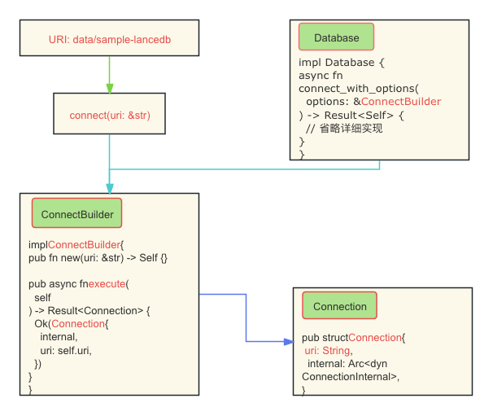

# LanceDB入门指南

本文将详细介绍如何从头开始使用LanceDB。每个步骤都附有详细的说明和图示，帮助您快速上手LanceDB。



## 环境搭建

在开始之前，请确保您的开发环境中安装了以下工具：

- **Rust**: 用于编写和编译代码。
- **Tokio**: 异步运行时。
- **LanceDB**: 数据库库。

### Rust安装

使用以下命令安装Rust：

```sh
curl --proto '=https' --tlsv1.2 -sSf https://sh.rustup.rs | sh
```

### 创建Rust项目

创建一个新的Rust项目：

```sh
cargo new lancedb-example
cd lancedb-example
```

### 安装Tokio

在项目中添加Tokio依赖：

```sh
cargo add tokio --features rt-multi-thread
```

### 安装LanceDB

在项目中添加LanceDB依赖：

```sh
cargo add lancedb
```

## 代码解析

以下是一个简单的LanceDB数据库连接示例：

```rust
use lancedb::{connect, Result};

#[tokio::main]
async fn main() -> Result<()> {
  let uri = "data/example-lancedb";
  let db_builder = connect(uri);
  let db_connect = connect(uri).execute().await?;
  println!("LanceDB builder: {:?}", db_builder);
  println!("LanceDB connect: {}", db_connect);
  Ok(())
}
```

### 代码说明

- **URI**: 数据库的URI。
- **connect**: 接收URI参数，返回`ConnectBuilder`。
- **execute**: 返回`Connection`，在执行目录创建数据库。

### `connect`函数

`connect`函数用于创建一个`ConnectBuilder`实例：

```rust
pub fn connect(uri: &str) -> ConnectBuilder {
  ConnectBuilder::new(uri)
}
```

### `ConnectBuilder`结构体

`ConnectBuilder`用于配置和建立与LanceDB数据库的连接。

主要字段和方法包括：

- `uri: String`: 数据库的URI。
- `execute(self) -> Result<Connection>`: 执行连接建立。

### `Database`结构体

`Database`封装了与实际数据库交互的逻辑。

### `Connection`结构体

`Connection`表示与LanceDB数据库的连接实例。

## 总结

通过本文，您可以了解如何在Rust中使用LanceDB进行数据库操作。希望这篇指南能帮助您快速上手LanceDB。

## 相关链接

- [LanceDB GitHub仓库](https://github.com/yuxuetr/lancedb-examples/tree/main/get_started)
