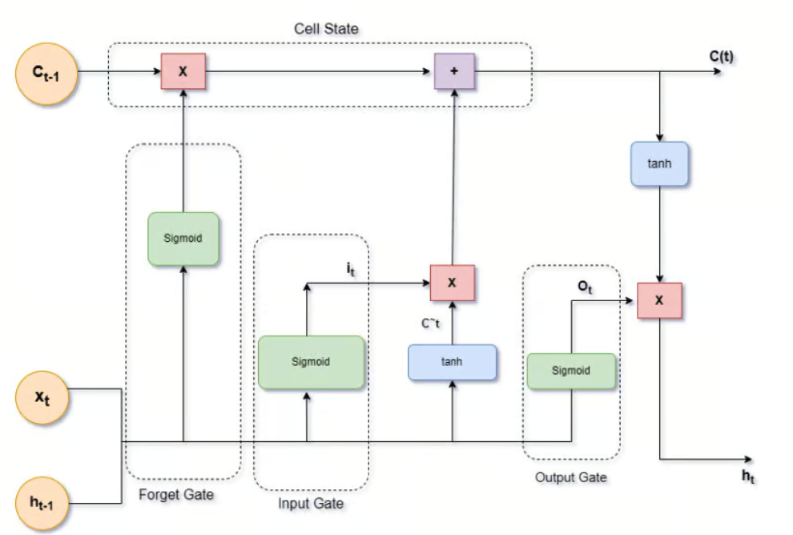
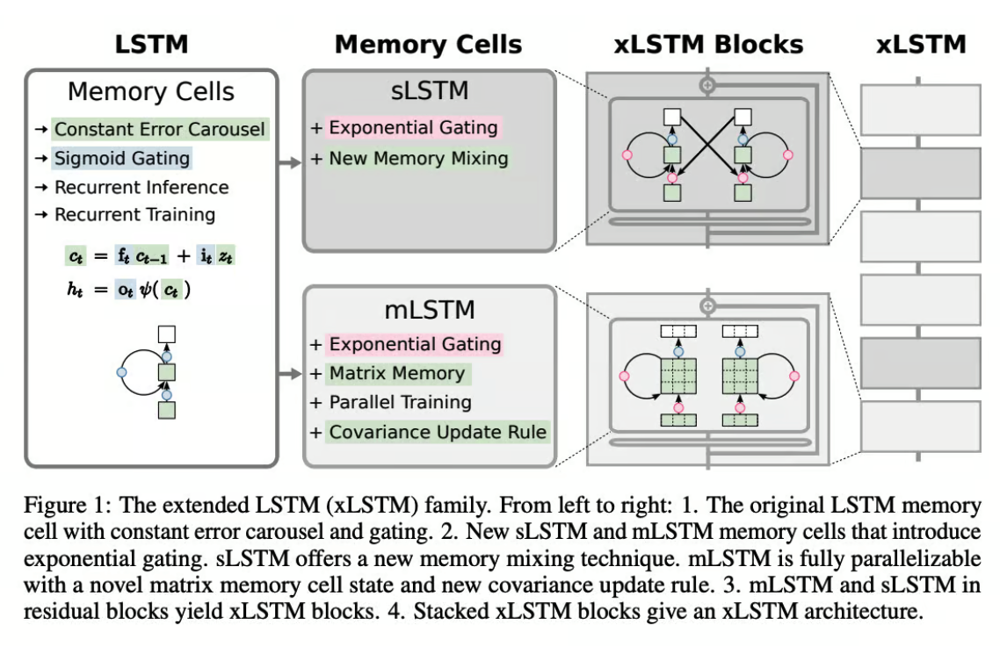
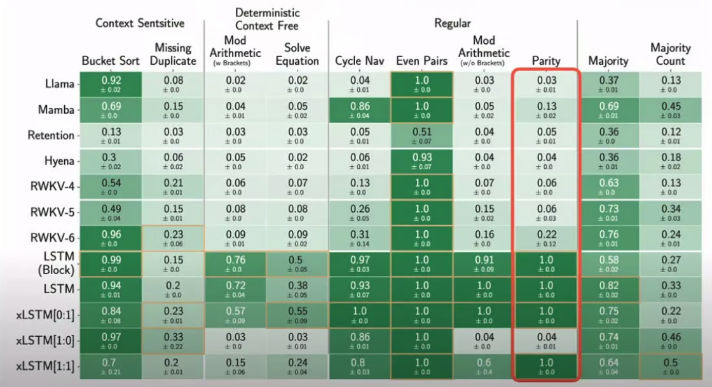

# 什么是LSTM和xLSTM

有一种观点认为，ChatGPT和基于变压器的大型语言模型（LLMs）的最近成功吸走了
其他深度学习领域（包括循环神经网络RNNs）的大部分资源。
LLMs的令人印象深刻的成就和商业潜力严重影响了研究优先事项、媒体报道和教育趋势，
使得RNNs、计算机视觉、强化学习等领域受到的关注大大减少。

这就是为什么介绍了Extended Long Short-Term Memory（xLSTM）的
新论文让机器学习社区兴奋：LSTMs并未消亡！RNNs即将回归！

根据深度学习先驱和LSTM的作者之一Sepp Hochreiter的说法，
xLSTM在时间序列预测方面表现出色：
"我们的xLSTM Time模型对抗最先进的基于Transformer的模型以及其他最近提出的时间序列模型展现出优异表现。" 
这很了不起！让我们回顾一下关于LSTM网络的所知，并探索它们新的有前途的发展 - xLSTM。

## LSTMs一点也不过时：当前的用例
只是为了给每样东西应有的肯定，LSTMs一点也不过时。它们可能被遮盖，但仍然被广泛使用。
以下是一些说明LSTMs如何在我们日常生活中使用的例子（多年来！）：

- 导航应用中的交通预测：像Google地图或Waze这样的应用程序利用LSTMs来预测交通模式。
通过分析历史交通数据、当前状态，甚至诸如天气或当地活动等因素，
这些模型可以实时预测交通拥堵并建议最快的路线。
- 音乐生成和推荐：像Spotify这样的流媒体服务使用LSTMs来分析您的收听历史并生成个性化播放列表。
LSTM可以理解您喜欢的音乐类型中的模式并预测您可能喜欢的歌曲，甚至考虑到您的口味随时间变化。
- 智能手机上的预测文本：当您输入消息时，LSTMs可以根据您已经编写的内容来预测您可能会使用的下一个单词。
（“预测我们星球未来”-这正是LSTM刚刚建议给我的文本）。

## LSTM的故事 

在上世纪90年代初，研究人员对循环神经网络（RNNs）感到兴奋。
这些网络旨在处理顺序数据，使它们对语音识别和时间序列预测等任务非常有用。
但是，**RNNs存在一个重大缺陷：梯度消失问题**。

### 什么是梯度消失问题？ 
想象一下试图回忆几天前的一系列事件，同时还记得今天发生了什么。
对于RNN，更新它们的权重以从数据中学习类似。
它们使用通过时间的反向传播（BPTT）根据预测错误调整权重。
随着错误信号通过许多时间步骤传播回来，它可能变得如此之小，以至于网络的权重几乎不会改变。
这种梯度消失问题意味着网络难以学习长期依赖性，并且会忘记之前时间步骤中的重要信息。
对于人类来说不是问题，但对于RNN来说是一个巨大的挑战。

两位德国研究人员，Jürgen Schmidhuber 和他的博士生 Sepp Hochreiter，决心找到解决方案。
他们在1997年推出了一种名为长短期记忆（LSTM）的改进型循环神经网络架构。

LSTM 设计有一个记忆单元，可以在长时间内保持信息。

这个记忆单元由三个门控制：
- 输入门
- 遗忘门
- 输出门

这些门控制信息的流动，使网络能够保留更长时间的重要信息，并忘记不再需要的信息。

他们的工作最初的接受程度很冷淡。但一些研究人员继续在LSTM的基础上进行研究。
Schmidhuber本人并不打算放弃。
2000年，Felix Gers、Jürgen Schmidhuber和Fred Cummins引入了窥视孔连接，使门能够直接访问细胞状态。
这一改进帮助LSTM学习事件的精确时间，提高了它们的性能。

### 传播和成功
双向 LSTM（BiLSTM）（2005年）：Alex Graves 和 Jurgen Schmidhuber 于2005年引入了 BiLSTM，
包括在相反方向（正向和反向）运行的两个 LSTM 层。
这种架构捕获了过去和未来的背景信息，提高了语音识别和机器翻译等任务的性能。

2010年代深度学习的兴起带来了另一波创新。研究人员开始堆叠多个LSTM层，创建深度LSTM网络，能够学习分层特征。
这一进步使得LSTM变得更加强大，使它们能够在从机器翻译到语音识别等各种应用中表现出色。

2014年，Ilya Sutskever、Oriol Vinyals 和 Quoc V. Le 利用他们的序列到序列（Seq2Seq）模型为机器翻译推广了 LSTMs。
这些模型在编码和解码序列时使用 LSTMs，从而显著提高了翻译质量。

2015年，Dzmitry Bahdanau、KyungHyun Cho 和 Yoshua Bengio 引入了注意力机制（Bahdanau 注意力）。
这些机制允许 LSTM 关注输入序列的特定部分，在翻译和摘要等任务中进一步提高了它们的性能。

在 Vaswani 等人在论文《注意力就是一切》中引入 Transformer 模型后，2017 年发生了很多变化。 
这标志着向基于注意力机制的转变。 但为什么呢？

### LSTM的局限性及其被Transformer所遮蔽

LSTM网络在自然语言处理（NLP）的许多早期成功中发挥了关键作用。
但是，尽管它们能够捕捉长距离的依赖关系并解决梯度消失问题，LSTM存在着重大的局限性，
导致它们逐渐被transformers所取代。

首先，LSTMs 难以实现并行化。它们的序贯性质意味着每一步都依赖于前一步，
这使得在现代硬件上高效处理数据变得具有挑战性。
这导致训练时间较长和计算成本较高，这在一个速度和效率至关重要的时代显然不理想。

此外，LSTMs 在处理非常长的序列时经常面临困难。尽管它们被设计来记忆长时间段的信息，
但随着序列长度的增加，它们的效果逐渐减弱。
这种限制对于需要模型从大量输入数据中理解上下文的任务特别有问题，比如长篇文本或复杂的时间模式。

变压器解决了这些局限性。它们的效率、可扩展性和卓越性能已经牢固地确立了它们作为该领域的新标准，
它们在规模上超过了LSTM。

## 引入 xLSTM: 解决不足之处
“永不放弃”可能是LSTM爱好者的座右铭。还记得Schmidhuber的博士生Sepp Hochreiter吗？
他成为了林茨科技学院（LIT）人工智能实验室的负责人，
是人工智能高级研究所（IARAI）的创始董事，因其在LSTM网络上的工作而于2021年获得IEEE CIS神经网络先锋奖。
他继续致力于这方面的工作。到了2024年5月，他与来自奥地利林茨的其他八位研究人员一起，
推出了[扩展长短期记忆：xLSTM](https://arxiv.org/pdf/2405.04517)。

研究人员自问：通过将LSTM的规模扩展到数十亿个参数，利用现代大型语言模型的最新技术，
但又缓解LSTM已知的限制，我们在语言建模方面能走多远？

他们还认为，Transformer 很强大，但缺乏 LSTM 具有的随序列长度的线性缩放。

### xLSTM的架构
在传统LSTM的坚实基础上，研究人员引入了两个关键增强：
1. 指数门控：这个更新为LSTM提供了更灵活的信息流管理方法。
就像微调控制数据处理的机制，提供更微妙地处理输入和记忆的方式。
2. 新型记忆结构：xLSTM 以两种重要方式增强记忆力：

  - **标量 LSTM（sLSTM）**：该版本改善了记忆力的混合和更新方式，使数据保留和处理更加精确。
	- **矩阵 LSTM（mLSTM）**：通过将记忆单元转换为矩阵结构，mLSTM 增强了网络处理并行操作的能力，显著加快了处理速度。

mLSTM中的矩阵结构不仅扩展了记忆容量，还增强了信息检索和存储的效率。
这种结构变化可以更好地处理具有复杂数据结构或长程依赖性的任务。 

这些增强功能集成到坚韧块架构中，基本上意味着它们被堆叠在一起，以建立在每个先前层的知识之上，
从而创建一个深度和强大的网络。

通过这些改进，xLSTM 提高了处理复杂序列建模任务的能力，从而增强了在现实场景中的性能和适用性。

## 评估

研究人员进行了一系列结构化任务评估，在这些评估中，xLSTM 的表现非常出色。
这些模型还在 SlimPajama 和 PALOMA 数据集上进行了测试，专注于真实场景。
SlimPajama 提供了一个平台，比较了像 xLSTM、RWKV 和 Llama 这样的模型，
关注它们在广泛培训会话期间的困惑度等性能指标。这些测试突显了不同模型架构在规模性能上的影响。

由包含各种数据源的PALOMA数据集，允许在各种自然语言处理任务中进行测试，
从理解互联网俚语到复杂推理。这种测试展示了像 xLSTM 这样的模型在处理语言多样性方面的表现，
通常显示出更低的困惑度，这表明其具有处理多样化语言输入的更强能力。

这些关于SlimPajama和PALOMA的实验凸显了xLSTM的实际优势，展示了它在人工智能领域中的适应性和潜力。

### 跨领域应用
在文首提出的问题中，研究人员表示，xLSTMs的表现至少与当前技术（如Transformers或State Space Models）一样出色。 
xLSTM模型在语言建模方面表现出有希望的结果，与Transformers和State Space Models等先进技术可媲美。
它们的可扩展性表明它们有望有效竞争主要语言模型，并潜在影响诸如强化学习、时间序列预测和物理系统建模等领域。

## 结论：具有 xLSTM 的序列建模的未来

xLSTM代表了LSTM架构的重要演进，解决了过去的限制，并为序列建模设定了新标准。
它为解决涉及随时间变化数据的复杂问题开辟了全新的可能性。
随着这项技术不断成熟，将其整合到各个领域中有望推动人工智能在处理复杂、序列数据方面的能力取得进步。

通过利用现代深度学习创新，xLSTM能够扩展到数十亿个参数，
使其在与Transformers等现代模型的竞争中具有可伸缩性。
然而，xLSTM不太可能取代Transformers，因为后者在并行处理和基于注意力的任务方面更加优越。
相反，xLSTM很可能通过在内存效率和处理长序列方面表现出色来补充它们。
将xLSTM视为人工智能工具箱中的一种新工具，这种工具能够提高我们理解和预测世界模式的能力。
尤其令人兴奋的是，研究和突破也在RNN等其他领域发生。

## 资源
### 实现：
- xLSTM 的官方存储库：[https://github.com/NX-AI/xlstm](https://github.com/NX-AI/xlstm)
- 一个包含有关 xLSTM 资源的存储库：[https://github.com/AI-Guru/xlstm-resources](https://github.com/AI-Guru/xlstm-resources)

### 研究论文，提及在文章中或与主题相关的论文:

- [Long Short-Term Memory](https://deeplearning.cs.cmu.edu/F23/document/readings/LSTM.pdf) by Sepp Hochreiter and Jürgen Schmidhuber (2005)
- 由Alex Graves和Jürgen Schmidhuber（2005年）进行的
[Framewise Phoneme Classification with Bidirectional LSTM Networks](https://www.cs.toronto.edu/~graves/ijcnn_2005.pdf)
和
[Framewise phoneme classification with bidirectional LSTM and other neural network architectures](https://www.sciencedirect.com/science/article/abs/pii/S0893608005001206)。
- 由Alex Graves、Santiago Fernandez和Jürgen Schmidhuber于2005年撰写的
[Bidirectional LSTM Networks for Improved Phoneme Classification and Recognition](https://www.cs.toronto.edu/~graves/icann_2005.pdf)
- 由Ilya Sutskever, Oriol Vinyals, Quoc V. Le (2014)提出的
[Sequence to Sequence Learning with Neural Networks](https://arxiv.org/pdf/1409.3215)
- 由Dzmitry Bahdanau、KyungHyun Cho、Yoshua Bengio（2015）
[Neural Machine Translation by Jointly Learning to Align and Translate](https://arxiv.org/pdf/1409.0473)
- [Attention is All You Need](https://arxiv.org/pdf/1706.03762)
: 由 Ashish Vaswani、Noam Shazeer、Niki Parmar、Jakob Uszkoreit、Llion Jones、Aidan N. Gomez、Łukasz Kaiser、Illia Polosukhin（2017）
- [xLSTM: Extended Long Short-Term Memory](https://arxiv.org/pdf/2405.04517)
：由Maximilian Beck、Korbinian Pöppel、Markus Spanring、Andreas Auer、Oleksandra Prudnikova、Michael Kopp、Günter Klambauer、Johannes Brandstetter、Sepp Hochreiter（2024年）推出的扩展长短期记忆

### 优质阅读:
- [LSTMs得到升级？xLSTM现已挑战现状](https://www.analyticsvidhya.com/blog/2024/05/upgrade-xlstm/)
- [Interview With Jürgen Schmidhuber](https://analyticsindiamag.com/intellectual-ai-discussions/lstm-juergen-schmidhuber-artificial-intelligence-switzerland-goedel-machines/)