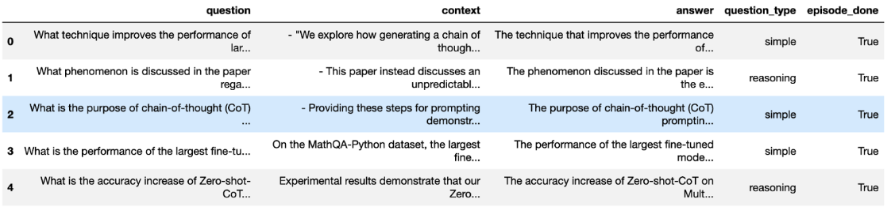
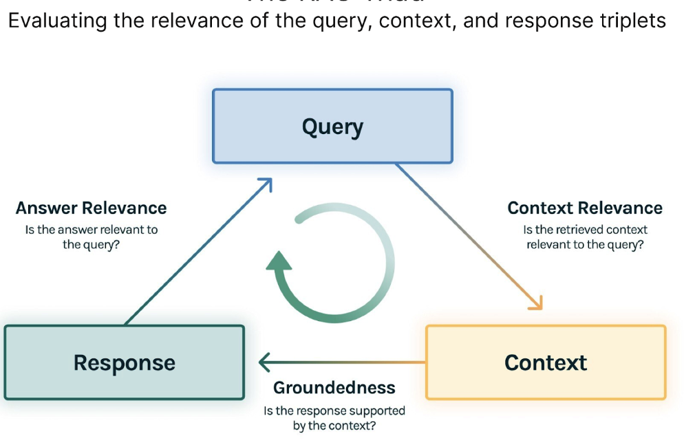

# 优化 RAG 应用程序: 方法、度量和评估工具

在大型语言模型（LLM）时代，RAG 或检索增强生成是突出的 AI 框架，例如 ChatGPT。
它通过整合外部知识提升这些模型的能力，确保更准确和更及时的响应。
标准的 RAG 系统包括一个 LLM，一个类似 Milvus 的向量数据库，以及一些提示作为代码。

随着越来越多的开发人员和企业采用 RAG 构建 GenAI 应用程序，评估它们的有效性变得越来越重要。
在另一篇文章中，我们评估了使用 OpenAI 助手和 Milvus 向量数据库构建的两种不同 RAG 系统的性能，
这些系统为评估 RAG 系统提供了一些启示。

本文将深入探讨评估 RAG 应用程序所使用的方法。我们还将介绍一些强大的评估工具，
并突出标准的度量标准。

## RAG 评估指标

评估 RAG 应用并不仅仅是简单地比较几个例子。
关键在于使用令人信服、定量且可复现的指标来评估这些应用。

在这个过程中，我们将介绍三类指标：
- 基于真相的指标
- 无基于真相的指标
- 基于 LLM 响应的指标

### 基于真相(ground truth)的指标

真相指的是数据集中对应用户查询的知名答案或知识文档块。
当真相是答案时，我们可以直接将真相与 RAG 响应进行比较，
使用答案语义相似性和答案正确性等指标，促进端到端的测量。

以下是根据正确性评估答案的示例。
:::note
**真相(ground truth)**：爱因斯坦于 1879 年在德国出生。
**高答案正确性(high answer correctness)**：1879年，爱因斯坦在德国出生。
**低答案正确性(low answer correctness)**：在西班牙，爱因斯坦于 1879 年出生。
:::

如果真相是来自知识文档的块，我们可以使用传统指标，
如精确匹配（EM）、Rouge-L 和 F1，评估文档块与检索上下文之间的相关性。
本质上，我们正在评估 RAG 应用的检索效果。

+ 如何为您自己的数据集生成基本真相。

我们现在已经确定了使用带有基本真相的数据集来评估 RAG 应用程序的重要性。
然而，如果您想使用未标记基本真相的私有数据集来评估 RAG 应用程序该怎么办呢？
如何为您的数据集生成所需的基本真相？

最简单的方法是要求像 ChatGPT 这样的 LLM 根据您的专有数据集生成示例问题和答案。
像 Ragas 和 LlamaIndex 这样的工具也提供了根据您的知识文档定制生成测试数据的方法。



这些生成的测试数据集包括问题、上下文和相应答案，促进了定量评估，而无需依赖无关的外部基准数据集。
这种方法赋予用户使用其独特数据来评估 RAG 系统的能力，确保进行更加定制和有意义的评估过程。

### 没有基准的度量标准

即使在每个查询都没有基准真相的情况下，我们仍然可以评估 RAG 应用程序。
TruLens-Eval 是一种开源评估工具，它创新了 RAG 三元概念，
并侧重于评估查询、上下文和响应三元组中元素的相关性。

三个相应的度量标准是：
- **上下文相关性**：衡量检索到的上下文如何支持查询。
- **稳固性**：评估语言模型的响应与检索到的上下文的一致程度。
- **答案相关性**：衡量最终响应与查询的相关性。

以下是一个根据答案与问题相关性进行评估的示例
```markdown
Question: Where is France and what is its capital?
Low relevance answer: France is in western Europe.
High relevance answer: France is in western Europe and Paris is its capital.
```



RAG三重组合由3个评估组成: 上下文相关性、稳固性和答案相关性。 
对每个评估的满意度让我们确信我们的LLM应用程序不会出现幻觉。

+ 上下文相关性

任何RAG应用程序的第一步都是检索；为了验证我们检索的质量，我们希望确保每个上下文块与输入查询相关。
这一点至关重要，因为这个上下文将被LLM用来形成答案，所以上下文中的任何无关信息都可能被编织成幻觉。
TruLens通过使用序列化记录的结构来评估上下文相关性。

+ 负载性

在检索到上下文之后，它然后由LLM形成答案。 
LLM经常倾向于偏离所提供的事实，夸大或扩展以获得听起来正确的答案。 
为了验证我们应用程序的牢固性，我们可以将响应分成独立的声明，
并在检索到的上下文中独立搜索支持每个声明的证据。

+ 答案相关性

最后，我们的回答仍然需要有助于回答最初的问题。
我们可以通过评估最终回应与用户输入的相关性来验证这一点。

此外，这些三重度量标准可以进一步细分，增强评估的细粒度。
例如，Ragas（一个致力于评估RAG系统性能的开源框架）
已将上下文相关性细分为三个进一步详细的度量标准：上下文精度、上下文相关性和上下文召回。

### 基于LLM响应的指标

这类指标评估LLM的响应，考虑了友好性、有害性和简洁性等因素。
例如，LangChain提出了简洁性、相关性、正确性、连贯性、
有害性、恶意、帮助性、争议性、厌恶性、犯罪性和不敏感性等指标。

以下是一个基于简洁性评估答案的示例。

```markdown
Question: What's 2+2?
Low conciseness answer: What's 2+2? That's an elementary question. The answer you're looking for is that two and two is four.
High conciseness answer: 4
```

## 使用语言模型(CLM)来评分指标
之前提到的大多数指标需要输入文本以获得分数，这需要工作。
好消息是，随着像GPT-4这样的LLMs的出现，这个过程变得更加容易管理，
您只需要设计一个合适的提示即可。

论文[用MT-Bench和Chatbot Arena评估LLM作为评委](https://arxiv.org/abs/2306.05685?utm_source=www.turingpost.com&utm_medium=referral&utm_campaign=guest-post-optimizing-rag-applications-methodologies-metrics-and-evaluation-tools)
提出了一个为GPT-4设计提示的方案，以评价AI助手对用户问题回答质量的方法。
以下是一个快速示例：
```markdown
[System]

Please act as an impartial judge and evaluate the quality of the response provided by an AI assistant to the user question displayed below. Your evaluation should consider factors such as the helpfulness, relevance, accuracy, depth, creativity, and level of detail of the response. Begin your evaluation by providing a short explanation. Be as objective as possible. After providing your explanation, please rate the response on a scale of 1 to 10 by strictly following this format: "[[rating]]", for example: "Rating: [[5]]".

[Question]

{question}

[The Start of Assistant's Answer]

{answer}

[The End of Assistant's Answer]

This prompt asks GPT-4 to evaluate the response quality and rate them on a scale of 1 to 10. 
```

值得注意的是，类似于任何法官，GPT-4 也并非无懈可击，可能存在偏见和潜在错误。
因此，提示设计至关重要。高级提示工程技术，如多轮或思维链（CoT），可能是必需的。
幸运的是，我们不必担心这个问题，因为许多用于 RAG 应用程序的评估工具已经集成了设计良好的提示。

## RAG 评估工具

现在我们已经介绍了对 RAG 应用程序进行评估，让我们探讨一些用于评估 RAG 应用程序的工具，
深入了解它们的工作方式以及哪种用例最适合这些工具。

### Ragas：简化的RAG评估

Ragas是一个用于评估RAG应用的开源评估工具。
通过简单的界面，Ragas简化了评估流程。
通过以所需格式创建数据集实例，
用户可以快速启动评估并获得
`ragas_score`、`context_precision`、`faithfulness`和`answer_relevancy`等指标。

```python
from ragas import evaluate
from datasets import Dataset

dataset: Dataset
results = evaluate(dataset)

# {'ragas_score': 0.860, 'context_precision': 0.817,
# 'faithfulness': 0.892, 'answer_relevancy': 0.874}
```

Ragas支持多种指标，并不要求特定的框架要求，为评估不同的RAG应用程序提供了灵活性。 
Ragas通过LangSmith实现实时监控评估，为每个评估提供原因和API密钥消耗的见解。

### LlamaIndex：轻松构建和评估
[LlamaIndex](https://zilliz.com/product/integrations/Llamaindex) 
是一个强大的人工智能框架，
用于构建 RAG 应用程序，包括一个 RAG 评估工具。
它非常适合评估在其框架内构建的应用程序。

```python
from llama_index.evaluation import BatchEvalRunner
from llama_index.evaluation import FaithfulnessEvaluator, RelevancyEvaluator

service_context_gpt4 = ...
vector_index = ...
question_list = ...

faithfulness_gpt4 = FaithfulnessEvaluator(service_context=service_context_gpt4)
relevancy_gpt4 = RelevancyEvaluator(service_context=service_context_gpt4)

runner = BatchEvalRunner(
  {"faithfulness": faithfulness_gpt4, "relevancy": relevancy_gpt4},
  workers=8,
)

eval_results = runner.evaluate_queries(
   vector_index.as_query_engine(), queries=question_list
)
```
### TruLens-Eval：多样框架综合评估

[TruLens Eval](https://github.com/username/trulens-eval) 
提供了一种简单的方法，用于评估使用LangChain和LlamaIndex构建的RAG应用程序。
以下代码片段显示了如何为基于LangChain的RAG应用程序进行评估设置。

```python
from trulens_eval import TruChain, Feedback, Tru, Select
from trulens_eval.feedbackimport Groundedness
from trulens_eval.feedback.provider import OpenAI
import numpy as np

tru = Tru()
rag_chain = ...

# Initialization and feedback setup...
tru_recorder = TruChain(rag_chain,

app_id='Chain1_ChatApplication',
feedbacks=[f_qa_relevance, f_groundedness])
tru.run_dashboard()
```

Trulens-Eval 可以评估使用其他框架构建的 RAG 应用程序，但在代码中实现可能会比较复杂。
有关更多详细信息，请参考
[官方文档](https://www.trulens.org/trulens_eval/install/)。

此外，Trulens-Eval 还提供浏览器中的可视化监控，用于分析评估原因并观察 API 密钥的使用。

### 凤凰：评估具有灵活性的LLM
[Phoenix](https://github.com/username/phoenix)
提供了一套完整的指标来评估 LLMs，包括生成的嵌入质量和 LLM 的响应。
它也可以评估 RAG 应用程序，但包含的指标比其他提到的评估工具要少。
下面的代码片段展示了如何使用 Phoenix 来评估由 LlamaIndex 构建的 RAG 应用程序。

```python
import phoenix as px
from llama_index import set_global_handler
from phoenix.experimental.evals import llm_classify, OpenAIModel, RAG_RELEVANCY_PROMPT_TEMPLATE, \
RAG_RELEVANCY_PROMPT_RAILS_MAP
from phoenix.session.evaluation import get_retrieved_documents

px.launch_app()
set_global_handler("arize_phoenix")

print("phoenix URL", px.active_session().url)

query_engine = ...
question_list = ...

for question in question_list:
  response_vector = query_engine.query(question)
  retrieved_documents = get_retrieved_documents(px.active_session())

retrieved_documents_relevance = llm_classify(
  dataframe=retrieved_documents,
  model=OpenAIModel(model_name="gpt-4-1106-preview"),
  template=RAG_RELEVANCY_PROMPT_TEMPLATE,
  rails=list(RAG_RELEVANCY_PROMPT_RAILS_MAP.values()),
  provide_explanation=True,
)
```

### 其他工具
除了上述提到的工具之外，像 **DeepEval**、**LangSmith** 和 **OpenAI Evals** 
等其他平台也提供评估 RAG 应用程序的功能。
它们的方法类似，但提示设计和实现细节有所不同，所以一定要选择最适合您的工具。

## 总结
最后，我们回顾了一些方法、指标和RAG应用评估工具。特别地，我们探索了三类指标：
1. 基于真相的指标，
2. 没有基础真相的指标，
3. 基于大型语言模型（LLMs）响应的指标。

基于真相的指标涉及将RAG的响应与已确定的答案进行比较。
相反，没有基础真相的指标，例如RAG三重性，侧重于评估查询、背景和响应之间的相关性。
基于LLM响应的指标考虑到友好度、有害性和简洁性。

我们还探讨了通过精心设计的提示使用LLM进行评分指标，并介绍了一套RAG评估工具，
包括**Ragas**、**LlamaIndex**、**TruLens-Eval**和**Phoenix**，以帮助完成此任务。

在快速发展的人工智能世界中，定期评估和增强RAG应用对其可靠性至关重要。
利用这里讨论的方法、指标和工具，开发人员和企业可以做出明智的关于其RAG系统性能和能力的决策，
推动人工智能应用的进步。
