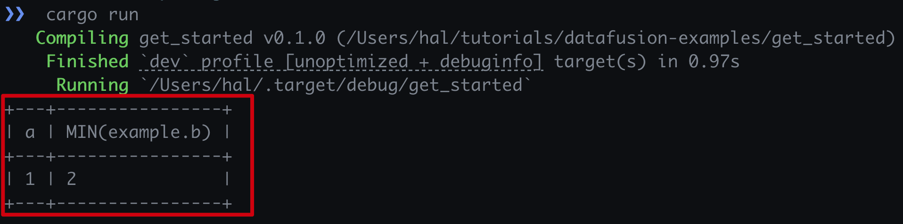

# 使用DataFusion在CSV文件上运行SQL查询

在这篇文章中，我们将探讨如何使用DataFusion在Rust中读取CSV文件并运行SQL查询。DataFusion是一个高性能的开源数据处理引擎，支持SQL查询。

## 安装依赖

首先，确保在项目中添加以下依赖：

```shell
cargo add tokio --features rt-multi-thread
cargo add datafusion
```

## 在DataFusion中运行SQL查询

### 1. 引入库

在Rust代码中引入DataFusion库：

```rust
use datafusion::prelude::*;
use datafusion::error::Result;
```

### 2. 注册CSV文件为表

使用以下代码将CSV文件注册为表：

```rust
let ctx = SessionContext::new();
ctx.register_csv("example", "assets/example.csv", CsvReadOption::new()).await?;
```

#### `register_csv`函数

`register_csv`函数用于将CSV文件注册为DataFusion中的表。其参数包括：

- `name: &str`: 表名
- `table_path: &str`: CSV文件路径
- `options: CsvReadOptions`: 读取CSV文件的选项

### 3. 创建SQL查询计划

使用以下代码创建SQL查询计划：

```rust
let df = ctx.sql("SELECT a, MIN(b) FROM example WHERE a <= b GROUP BY a LIMIT 100").await?;
```

#### `sql`函数

`sql`函数用于执行SQL查询，其参数为待执行的SQL语句。

### 4. 打印查询结果

使用以下代码打印查询结果：

```rust
df.show().await?;
```

#### `show`函数

`show`函数用于显示查询结果，其返回值为`Vec<RecordBatch>`。

## 执行结果

以下是执行结果的示例图：



通过这些步骤，您可以在Rust中使用DataFusion读取CSV文件并运行SQL查询。希望这篇指南能帮助您快速上手DataFusion。

## 相关链接

- [DataFusion GitHub仓库](https://github.com/apache/arrow-datafusion)
