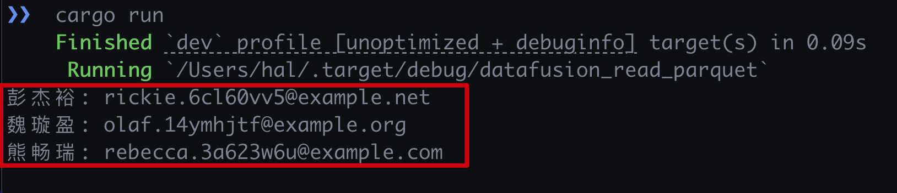

import { RedText, BlueText, GreenText, YellowText } from '@site/src/components/ColorText'

# 使用Rust的`datafusion`库读取parquet持久化存储文件

本文介绍使用`datafusion`读取parquet文件的相关代码和说明。

## `Cargo.toml`依赖库

``` toml
[package]
name = "datafusion_read_parquet"
version = "0.1.0"
edition = "2021"

[dependencies]
anyhow = "1.0.86"
datafusion = { version = "40.0.0", features = ["serde"] }
serde = { version = "1.0.204", features = ["derive"] }
tokio = { version = "1.38.1", features = ["rt", "rt-multi-thread"] }
```

## 代码说明

``` rust
use anyhow::Result;
use datafusion::{arrow::array::AsArray, execution::context::SessionContext};

const PQ_FILE: &str = "../assets/sample.parquet";

#[tokio::main]
async fn main() -> Result<()> {
  read_with_datafusion(PQ_FILE).await?;
  Ok(())
}

async fn read_with_datafusion(file: &str) -> Result<()> {
  let ctx = SessionContext::new();
  ctx.register_parquet("stats", file, Default::default()).await?;

  let ret = ctx
    .sql("SELECT name::text name, email::text email FROM stats limit 3")
    .await?
    .collect()
    .await?;

  for batch in ret {
    let names = batch.column(0).as_string::<i32>();
    let emails = batch.column(1).as_string::<i32>();

    for (name, email) in names.iter().zip(emails.iter()) {
      let (name, email) = (name.unwrap(), email.unwrap());
      println!("{}: {}", name, email);
    }
  }
  Ok(())
}
```

- 首先使用`SessionContext::new()`创建一个上下文会话(`Session`), 将数据转换成表以
  及执行表查询都需要这个上下文对象`ctx`
- SQL语句`SELECT name::text name, email::text email FROM stats limit 3`,这里获取
  3条数据，每条数据包含`name`与`email`,<RedText text="这些需要为这两个字段加上类型说明"/>，否则执
  行会报类型转换的错误"thread 'main' panicked at /path/to/.cargo/registry/src/index.crates.io-6f17d22bba15001f/arrow-array-52.1.0/src/cast.rs:769:29"
- 另外需要注意`batch.column(column_index)`这里是根据列索引取数据，需要跟SQL语句
  `SELECT`取的字段相对应，否则会出现信息对应错误的问题
- Rust中迭代器以及可以同时迭代多个集合的`zip`方法

## 运行方式

``` shell
# cd arrow-examples/datafusion_read_parquet
cargo run
```

- 运行结果



## 链接
- [Github: https://github.com/yuxuetr/arrow-examples/tree/main/datafusion_read_parquet](https://github.com/yuxuetr/arrow-examples/tree/main/datafusion_read_parquet)