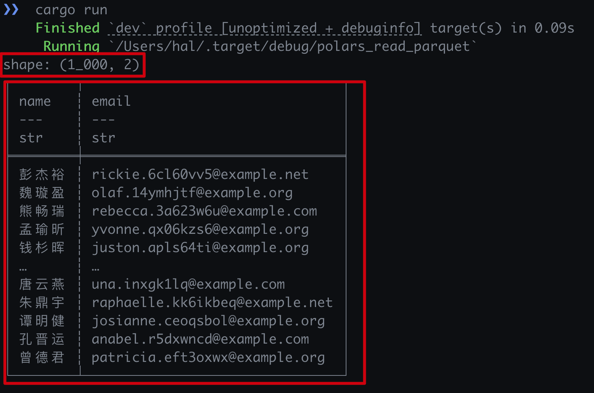

# 使用Polars库读取Arrow的parquet格式持久化存储文件

## `Cargo.toml`依赖库
``` toml
[package]
name = "polars_read_parquet"
version = "0.1.0"
edition = "2021"

[dependencies]
anyhow = "1.0.86"
polars = { version = "0.41.3", features = ["parquet", "timezones", "sql", "lazy"] }
```

其中:
- `parquet` features: 是用来加载parquet文件的特性
- `timizones` features: 是用来处理数据中的时区
- `sql` features: 是以SQL的方式操作数据
- `lazy` features: 是加载数据是执行懒加载，不是从一开始就把数据都加载到内存，而
  是需要数据做运算或者查询时才会加载数据，以`LazyFrame`替换`DataFrame`

## 代码

``` rust
use anyhow::Result;
use polars::{prelude::*, sql::SQLContext};

const PQ_FILE: &str = "../assets/sample.parquet";

fn main() -> Result<()> {
  read_with_polars(PQ_FILE)?;
  Ok(())
}

fn read_with_polars(file: &str) -> Result<()> {
  let df = LazyFrame::scan_parquet(file, Default::default())?;
  let mut ctx = SQLContext::new();
  ctx.register("stats", df);
  let df = ctx
    .execute("SELECT name::text name, email::text email FROM stats")?
    .collect()?;
  println!("{:?}", df);

  Ok(())
}
```

- 首先是使用`lazy`方式扫描加载parquet文件，返回一个LazyFrame的对象
- 使用`SQLContext`创建可以使用SQL操作DataFrame数据的上下文对象
- `ctx.register()`方法可以将读取到的`DataFrame`与执行名称的"表名"关联起来，可以
  理解为读取到DataFrame数据取一个名称，表格数据也可以直接当做表来操作，在后文中
  的SQL语句中使用这个名字
- 使用`ctx`执行SQL查询语句

## 运行方式

``` shell
# cd arrow-examples/polars_read_parquet
cargo run
```

- 运行结果如下



## 链接
- [Github: https://github.com/yuxuetr/arrow-examples/tree/main/polars_read_parquet](https://github.com/yuxuetr/arrow-examples/tree/main/polars_read_parquet)

