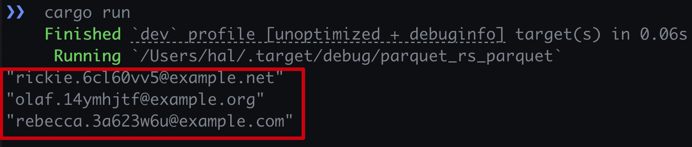

# 使用Rust parquet库读取parquet文件

本文介绍**Arrow生态持久化存储文件的读取方式之一**，使用Rust parquet库读取parquet文件。

## `Cargo.toml`中依赖库如下

``` toml
[package]
name = "parquet_rs_read_parquet"
version = "0.1.0"
edition = "2021"

[dependencies]
anyhow = "1.0.86"
arrow = { version = "52.1.0", features = ["prettyprint"] }
parquet = "52.1.0"
```

## 代码如下

``` rust
use anyhow::Result;
use arrow::array::AsArray;
use parquet::arrow::arrow_reader::ParquetRecordBatchReaderBuilder;
use std::fs::File;

const PQ_FILE: &str = "../assets/sample.parquet";

fn main() -> Result<()> {
  read_with_parquet(PQ_FILE)?;
  Ok(())
}

fn read_with_parquet(file: &str) -> Result<()> {
  let file = File::open(file)?;
  let reader = ParquetRecordBatchReaderBuilder::try_new(file)?
    .with_batch_size(8192)
    .with_limit(3)
    .build()?;

  for record_batch in reader {
    let record_batch = record_batch?;
    let emails = record_batch.column(0).as_binary::<i32>();

    for email in emails {
      let email = email.unwrap();
      println!("{:?}", String::from_utf8_lossy(email));
    }
  }
  Ok(())
}
```
+ `PQ_FILE`: 表示parquet文件的路径，当前我们使用的相对目录，这个目录是运行时的相
  对目录，即`cargo run`命令运行时的目录即为**当前目录**
+ `record_batch.column(0).as_binary::<i32>()`: 这里需要用到
  `arrow::array::AsArray` Trait
+ `ParquetRecordBatchReaderBuilder`: `build()`函数返回一个`ParquetRecordBatchReader`
+ `String::from_utf8_lossy()`: 将二进制转换为字符串

## 运行

``` shell
# `cd parquet_rs_read_parquet`, otherwise, the `sample.parquet` file cannot be found.
cargo run
```

* 执行结果



## 链接
- [Github: https://github.com/yuxuetr/arrow-examples/tree/main/parquet_rs_read_parquet](https://github.com/yuxuetr/arrow-examples/tree/main/parquet_rs_read_parquet)