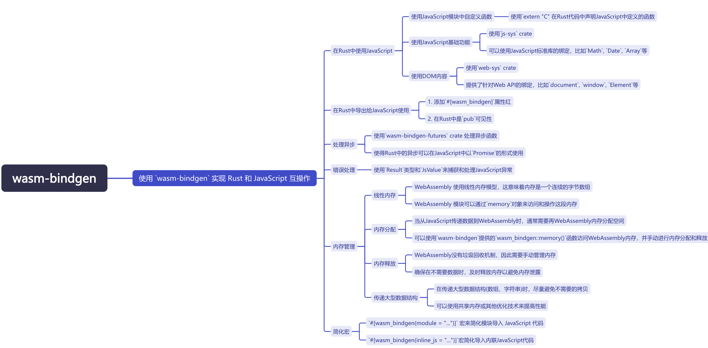

# 使用 `wasm-bindgen` 实现 Rust 和 JavaScript 互操作

`wasm-bindgen` 是一个强大的工具，它提供了多种方式来实现 Rust 和 JavaScript 之间的互操作性。
本文将总结 `wasm-bindgen` 的几种常见用法，并结合代码案例进行说明。



## 1. 使用 JavaScript 模块中的自定义函数

你可以在 Rust 中使用 `extern "C"` 块来声明从 JavaScript 导入的函数，然后在 Rust 中调用它们。
这种方式非常适合需要调用现有 JavaScript 函数的场景。

### 示例

+ JavaScript 部分 (`foo.js`)

```javascript
export function js_add(a, b) {
  return a + b;
}
```

+ Rust 部分

```rust
use wasm_bindgen::prelude::*;

// Declare the JavaScript function
#[wasm_bindgen(module = "/js/foo.js")]
extern "C" {
  fn js_add(a: i32, b: i32) -> i32;
}

// Define a Rust function that uses the imported JavaScript function
#[wasm_bindgen]
pub fn add_in_rust(a: i32, b: i32) -> i32 {
  js_add(a, b)
}
```

## 2. 使用 JavaScript 基础功能

如果你需要使用 JavaScript 的基础功能，可以依赖 `js-sys` crate。
`js-sys` 提供了对 JavaScript 标准库的绑定，例如 `Math`、`Date`、`Array` 等。

### 示例

```rust
use wasm_bindgen::prelude::*;
use js_sys::Math;

#[wasm_bindgen]
pub fn random_number() -> f64 {
  Math::random()
}
```

## 3. 使用 DOM 内容

如果你需要操作 DOM，可以依赖 `web-sys` crate。
`web-sys` 提供了对 Web API 的绑定，例如 `document`、`window`、`Element` 等。

### 示例

```rust
use wasm_bindgen::prelude::*;
use web_sys::window;

#[wasm_bindgen]
pub fn set_document_title(title: &str) {
	let window = window().expect("no global `window` exists");
	let document = window.document().expect("should have a document on window");
	document.set_title(title);
}
```

## 4. 在 Rust 中导出给 JavaScript 使用

在 Rust 中，只要添加 `#[wasm_bindgen]` 宏并且将函数或类型声明为 `pub`，
它们就可以导出给 JavaScript 使用。

### 示例

+ Rust 中的代码：

```rust
use wasm_bindgen::prelude::*;

#[wasm_bindgen]
pub fn greet(name: &str) -> String {
  format!("Hello, {}!", name)
}

#[wasm_bindgen]
pub struct Person {
	name: String,
	age: u32,
}

#[wasm_bindgen]
impl Person {
	#[wasm_bindgen(constructor)]
	pub fn new(name: &str, age: u32) -> Person {
		Person {
			name: name.to_string(),
			age,
		}
	}

	pub fn greet(&self) -> String {
		format!("Hello, my name is {} and I am {} years old.", self.name, self.age)
	}
}
```

+ 在 JavaScript 中使用：

```javascript
import init, { greet, Person } from './pkg/your_project_name.js';

async function run() {
	await init();
	console.log(greet("World")); // Should output "Hello, World!"
	
	let person = new Person("Alice", 30);
	console.log(person.greet()); // Should output "Hello, my name is Alice and I am 30 years old."
}

run();
```

## 5. 异步函数

你可以使用 `wasm-bindgen-futures` crate 来处理异步函数，
使得 Rust 中的异步函数可以在 JavaScript 中以 `Promise` 的形式使用。

### 示例

```rust
use wasm_bindgen::prelude::*;
use wasm_bindgen_futures::JsFuture;
use web_sys::window;

#[wasm_bindgen]
pub async fn fetch_data() -> Result<JsValue, JsValue> {
	let window = window().expect("no global `window` exists");
	let response = JsFuture::from(window.fetch_with_str("https://api.example.com/data")).await?;
	let response: web_sys::Response = response.dyn_into().unwrap();
	let json = JsFuture::from(response.json()?).await?;
	Ok(json)
}
```

## 6. 错误处理

使用 `Result` 类型和 `JsValue` 来捕获和处理 JavaScript 异常。

### 示例

```rust
use wasm_bindgen::prelude::*;

#[wasm_bindgen]
pub fn catch_js_error() -> Result<(), JsValue> {
	let result = js_sys::Reflect::get(&JsValue::NULL, &JsValue::from_str("non_existent_property"));
	match result {
		Ok(_) => Ok(()),
		Err(e) => Err(e),
	}
}
```

## 7. 内存管理

注意 WebAssembly 和 JavaScript 之间的内存管理，
特别是当你在 Rust 中创建大型数据结构并传递给 JavaScript 时。
1. 线性内存

	- WebAssembly 使用线性内存模型，这意味着内存是一个连续的字节数组。
	- WebAssembly 模块可以通过 `memory` 对象来访问和操作这段内存。

2.内存分配：

	- 当从 JavaScript 传递数据到 WebAssembly 时，通常需要在 WebAssembly 内存中分配空间。
	- 可以使用 `wasm-bindgen` 提供的 `wasm_bindgen::memory()` 函数来访问 WebAssembly 内存，并手动进行内存分配和释放。

3. 内存释放：

	- WebAssembly 没有垃圾回收机制，因此需要手动管理内存。
	- 确保在不再需要数据时，及时释放内存以避免内存泄漏。

4. 传递大型数据结构：

	- 在传递大型数据结构（如数组、字符串等）时，尽量避免不必要的拷贝。
	- 可以使用共享内存或其他优化技术来提高性能。

### 示例

+ Rust 中的代码：

```rust
use wasm_bindgen::prelude::*;
use wasm_bindgen::JsCast;
use js_sys::Uint8Array;

#[wasm_bindgen]
pub fn allocate_memory(size: usize) -> *mut u8 {
	let mut buffer = Vec::with_capacity(size);
	let ptr = buffer.as_mut_ptr();
	std::mem::forget(buffer); // Prevent Rust from deallocating the memory
	ptr
}

#[wasm_bindgen]
pub fn deallocate_memory(ptr: *mut u8, size: usize) {
	unsafe {
		let _ = Vec::from_raw_parts(ptr, size, size); // Reclaim the memory
	}
}

#[wasm_bindgen]
pub fn process_data(ptr: *mut u8, size: usize) -> Result<JsValue, JsValue> {
	let data = unsafe { Vec::from_raw_parts(ptr, size, size) };
	let sum: u8 = data.iter().sum();
	Ok(JsValue::from(sum))
}
```

+ JavaScript 中的代码：

```javascript
import init, { allocate_memory, deallocate_memory, process_data } from './pkg/your_project_name.js';

async function run() {
	await init();
	
	const size = 10;
	const ptr = allocate_memory(size);
	const memory = new Uint8Array(wasm_bindgen.memory.buffer, ptr, size);
	
	for (let i = 0; i < size; i++) {
		memory[i] = i + 1;
	}

	const result = process_data(ptr, size);
	console.log(result); // Should output the sum of the array

	deallocate_memory(ptr, size);
}

run();
```

## 8. 宏简化

使用 `#[wasm_bindgen(module = "...")]` 和 
`#[wasm_bindgen(inline_js = "...")]` 等宏来简化模块导入和内联 JavaScript 代码。

### 示例

+ 内联 JavaScript 代码：

```rust
use wasm_bindgen::prelude::*;

#[wasm_bindgen(module = "/js/foo.js")]
extern "C" {
  fn foo();
}

#[wasm_bindgen(start)]
pub fn main() {
  foo();
}
```

+ 在 `foo.js` 中：

```javascript
export function foo() {
  console.log("Hello from JavaScript!");
}
```

## 综合示例

以下是一个综合示例，展示了如何结合这些用法：

+ 在 Rust 中：

```rust
use wasm_bindgen::prelude::*;
use wasm_bindgen::JsCast;
use wasm_bindgen_futures::JsFuture;
use web_sys::{console, window, Element};

#[wasm_bindgen(module = "/js/foo.js")]
extern "C" {
  fn js_add(a: i32, b: i32) -> i32;
}

#[wasm_bindgen]
pub fn add_in_rust(a: i32, b: i32) -> i32 {
  js_add(a, b)
}

#[wasm_bindgen]
pub async fn fetch_data() -> Result<JsValue, JsValue> {
	let window = window().expect("no global `window` exists");
	let response = JsFuture::from(window.fetch_with_str("https://api.example.com/data")).await?;
	let response: web_sys::Response = response.dyn_into().unwrap();
	let json = JsFuture::from(response.json()?).await?;
	Ok(json)
}

#[wasm_bindgen(start)]
pub fn main() {
  console::log_1(&"Wasm module initialized".into());
}
```

+ 在 `foo.js` 中：

```javascript
export function js_add(a, b) {
    return a + b;
}
```

通过这种方式，你可以充分利用 `wasm-bindgen` 的功能，构建强大且高效的 WebAssembly 应用程序。

`#[wasm_bindgen(start)]`宏来指定一个初始化函数，这个函数会在 WebAssembly 模块加载时自动调用。

## 总结

`wasm-bindgen` 提供了多种方式来实现 Rust 和 JavaScript 之间的互操作性。
通过这些方式，你可以轻松地在 Rust 和 JavaScript 之间传递数据、调用函数、处理异步操作等。
这些功能使得 WebAssembly 成为一个强大的工具，可以用于构建高性能的 Web 应用程序。

