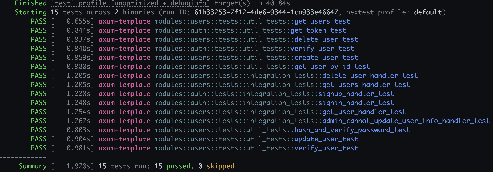

# 使用 Rust Axum 构建通用化 Web 应用模板

本文详细介绍如何使用 Axum 框架在 Rust 中构建一个通用化的 Web 应用模板，包括：

- 构建 RESTful API
- 使用 **Sqlx** 和 **Postgres** 数据库实现数据库交互
- 采用类似 **Nest.js** 的项目组织结构，以提升代码可维护性
- 包含丰富的单元测试和集成测试
- 使用 **Github Actions** 实现 CI/CD 流程

## 基础开发环境搭建

为了快速开始，可以参考我的 Rust 项目模板，点击[这里获取项目代码](https://github.com/yuxuetr/rust-template)。该模板包含基础项目结构和一些配置，帮助你迅速搭建开发环境。

## 类似 Nest.js 的项目组织方式

为了提升项目的可维护性和扩展性，本文中采用了类似 Nest.js 的项目组织结构：

```shell
├── docs                # 文档文件
├── fixtures            # 必要文件，比如公私钥，测试 SQL 脚本
├── migrations          # 数据库迁移文件，适用于 Sqlx
├── rest_client         # VS Code REST Client 测试 API 文件
├── src                 # 源代码
│   ├── common          # 公共模块，如加解密、错误处理、配置等
│   └── modules         # 业务模块
│       ├── auth        # 认证模块，包括: `handlers`, `services`, `dto`, `tests`, `middleware` 等
│       └── users       # 用户管理模块，包括: `handlers`, `services`, `dto`, `tests`, `entity` 等
```

### **业务模块**文件说明

- **`mod.rs`**：模块的导入导出，**创建当前模块的路由器**。
- **`handlers.rs`**：处理用户请求的逻辑。
- **`services.rs`**：处理业务逻辑以及与数据库的交互。
- **`entity.rs`**：定义与数据库表对应的结构体，便于结构操作。
- **`dto.rs`**：定义数据转换对象，用于请求和响应的序列化和反序列化。
- **`tests.rs`**：包含单元测试和集成测试。
- **`middleware.rs`**：定义模块的中间件，用于认证、权限控制等。
- **`src/lib.rs`**：定义项目的**路由器**，加载配置文件、初始化全局状态、错误处理等。
- **`src/main.rs`**：应用入口。

## 开发经验分享

在项目开发过程中，我积累了一些经验，分享如下，帮助大家更好地构建 Axum Web 应用：

### 1. 测试的排序和并发控制
- 测试数量多或者测试较为复杂时，可能会遇到并发导致的错误，特别是在集成测试中。可以使用 `serial_test` 来对测试进行排序，防止这些问题。

### 2. 测试数据库的创建与销毁
- 在测试时需要创建临时数据库，并在测试结束后销毁它。可以使用 `sqlx-db-tester`，并为测试初始化一个连接到测试数据库的全局状态。

### 3. 全局配置与数据库连接
- 全局状态中应包含全局配置和数据库连接，这样可以统一管理数据库操作，并将所有 `services.rs` 中的数据库操作通过全局状态来执行，方便管理。

### 4. Github Actions CI 配置
- 集成测试中，`reqwest` 默认依赖 **OpenSSL**，这在 CI 环境下可能会导致问题。因此，我们需要在 **OpenSSL** 和 **BoringSSL** 之间做出选择。由于 `jwt-simple` 依赖于 **BoringSSL**，所以应禁用掉 `reqwest` 的默认 **OpenSSL** 依赖。

### 5. 公私钥生成
- 将公私钥生成的逻辑放在 `build.rs` 中，这样每次执行 `cargo build` 或 `cargo run` 等构建操作时，都会自动生成证书文件到 `fixtures` 目录下，方便开发和部署。

### 6. 测试模块管理
- 在 Rust 中，可以将单独文件当作一个模块（`mod`）。但需要注意的是，Rust 不会自动识别 `integration_tests.rs`，但会识别 `tests.rs`。因此，我将单元测试和集成测试都写在 `tests.rs` 中，并使用 `util_tests` 和 `integration_tests` 模块分别包裹，这样可以更清晰地查看测试日志。

### 7. 代码质量检查
- 使用 **pre-commit** 执行各类代码检查工具，如 **cargo-deny**，确保代码规范和安全性，避免潜在的漏洞和错误。

### 8. Token 签名与安全性
- 选择使用 **Ed25519** 作为 Token 的签名算法。公钥用于验证签名，私钥用于生成签名。这样可以将公钥公开，用于独立的服务来验证 Token，保证安全性。

### 9. 参数验证
- 使用 `validator` crate 来验证请求参数，减少错误输入和代码量，简化开发过程。

## CI/CD 集成（Github Actions）

在本项目中，使用 **Github Actions** 进行持续集成（CI）和持续部署（CD）。你可以通过配置 `.github/workflows/ci.yml` 文件来实现每次代码推送后的自动化测试和构建，确保代码的稳定性和质量。

### 示例配置文件
```yaml
name: Rust CI

on: [push, pull_request]

jobs:
  build:
    runs-on: ubuntu-latest
    steps:
    - uses: actions/checkout@v2
    - name: Setup Rust
      uses: actions-rs/toolchain@v1
      with:
        toolchain: stable
    - name: Run tests
      run: cargo test
```

## Rust Axum Web 应用的最佳实践

为了提升代码的可维护性和扩展性，建议：

1. **模块化设计**：保持代码模块化，采用类似 **Nest.js** 的项目结构，有利于团队合作和项目扩展。
2. **自动化测试**：编写单元测试和集成测试，确保各个模块的功能和整体系统的稳定性。
3. **持续集成**：通过 Github Actions 等工具实现持续集成，保证代码的高质量。

## 链接与资源

- [Github Repo: 完整项目代码 - https://github.com/yuxuetr/axum-template](https://github.com/yuxuetr/axum-template)

## 项目展示效果

以下是单元测试和集成测试的部分运行效果展示：


