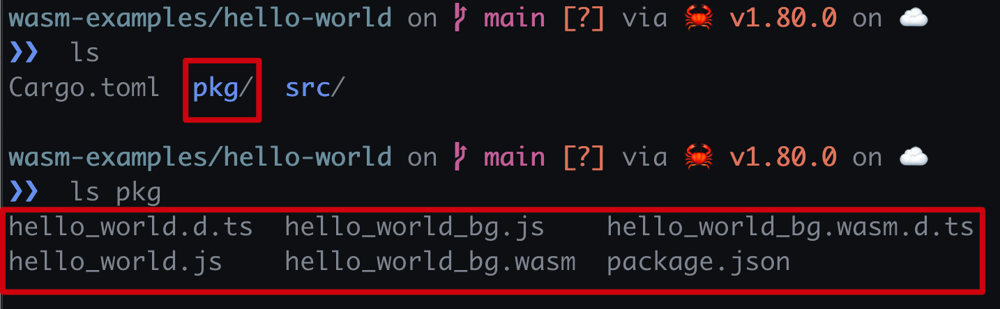
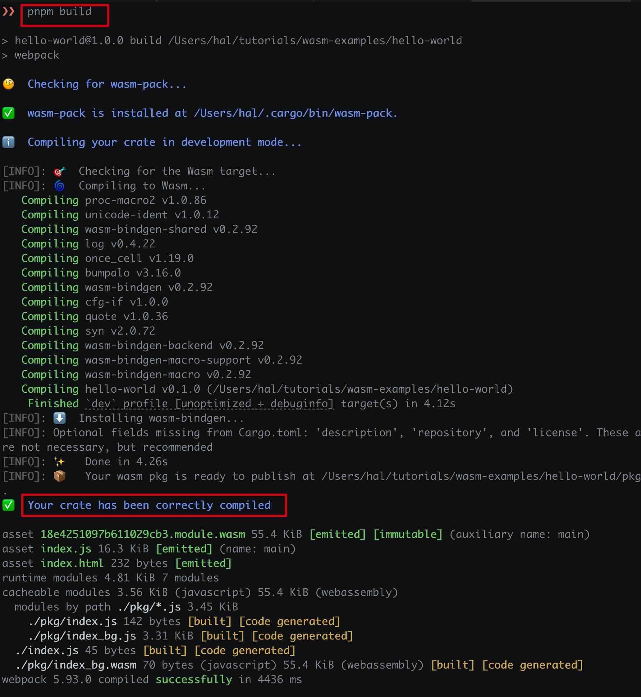
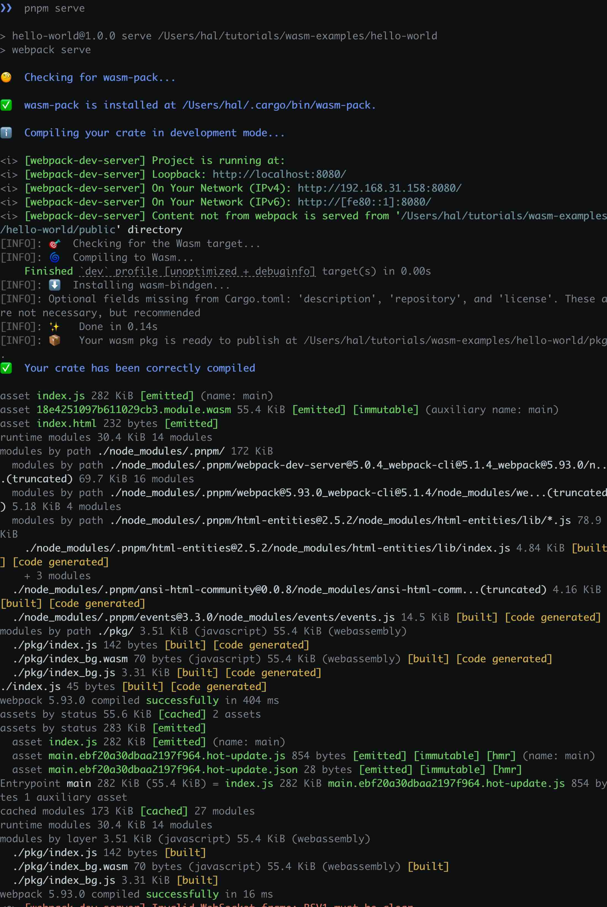
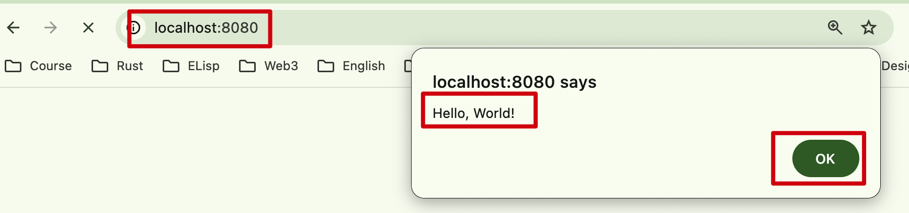
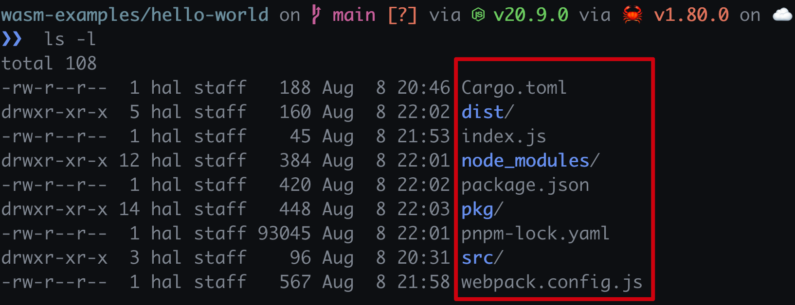

import { RedText, BlueText, GreenText, YellowText } from '@site/src/components/ColorText'

# Rust WebAssembly Hello World案例详解

这是`#[wasm_bindgen]`的"Hello, world!"示例，展示如何设置项目，
将函数导出到JS，从JS调用并在Rust中调用警报功能。

## 1. 创建项目
```bash
cargo new hello-world --lib
cd hello-world
```

## 2. 添加依赖
```bash
cargo add wasm-bindgen
```

## 3. `Cargo.toml`
`Cargo.toml` 列出了 `wasm-bindgen` crate 作为一个依赖项。
值得注意的是，`crate-type = ["cdylib"]`，这在当今主要用于 wasm 最终工件。

```toml
[package]
name = "hello-world"
version = "0.1.0"
edition = "2021"

[lib]
crate-type = ["cdylib"]

[dependencies]
wasm-bindgen = "0.2.92"
```

:::note
`[lib]` 部分指定了库的类型为 `cdylib`，这意味着它**将被编译为共享库**，

适合与其他语言（如 JavaScript）进行交互，特别是在 WebAssembly 的上下文中。

在 Rust 的 `Cargo.toml` 文件中，`crate-type` 可以指定以下几种类型：

- `lib`: 默认类型，生成一个库文件（`.rlib`），用于其他 Rust 代码的依赖。
- `cdylib`: 生成一个动态库，适合与其他语言（如 C、JavaScript）进行交互，通常用于 WebAssembly 项目。
- `rlib`: 生成一个 Rust 静态库，供其他 Rust crate 使用。
- `dylib`: 生成一个动态库，主要用于 Rust 生态内部的共享。
- `staticlib`: 生成一个静态库，通常用于与 C/C++ 代码的交互。

你可以根据项目的需求选择合适的 `crate-type`
:::

## 4. 编写`src/lib.rs`

`src/lib.rs` 文件包含了一个简单的函数，该函数使用 `#[wasm_bindgen]` 属性导出到 JavaScript。

```rust
use wasm_bindgen::prelude::*;

#[wasm_bindgen]
extern "C" {
  fn alert(s: &str);
}

#[wasm_bindgen]
pub fn greet(name: &str) {
  alert(&format!("Hello, {}!", name));
}
```

上述代码中，`greet` 函数使用 `#[wasm_bindgen]` 属性导出到 JavaScript。

`alert` 函数是一个外部函数，它在 JavaScript 中实现。使用 `extern "C"` 来声明它，
然后可以在Rust代码中调用从JavaScript导入的函数。

## 5. 编译为WebAssembly

```bash
wasm-pack build --target web
```

上述命令将生成一个 `pkg` 目录，其中包含了编译好的 WebAssembly 模块和 TypeScript(JavaScript) 包装器。
使用 `wasm-pack build --target web` 来生成一个可以在浏览器中运行的包，
是一个完整的 npm 包，直接按照包的方式直接导入到 JavaScript 项目中。

如果是`wasm-pack build`，则可以构建一个可以在 Node.js 中运行的包。



## 6. 在JavaScript中调用

```javascript title="index.js"
// /path/to/hello-world/index.js

import { greet } from './pkg';

greet('World');
```

## 7. 创建npm包

```bash
pnpm init
# 或
npm init
```

会在当前目录下生成一个`package.json`文件，此文件是npm包的配置文件

## 8. 添加依赖

```bash
pnpm add webpack webpack-cli webpack-dev-server html-webpack-plugin -D
# 或
npm install webpack webpack-cli webpack-dev-server html-webpack-plugin -D
```

上述几个包的作用是：

1. `webpack`
Webpack 是一个模块打包工具，主要用于将多个模块（如 JavaScript、CSS、图片等）打包成一个或多个文件。它可以处理依赖关系，优化资源，并支持各种加载器和插件，以满足不同的构建需求。
2. `webpack-cli`
webpack-cli 是 Webpack 的命令行接口，允许用户通过命令行执行 Webpack 的构建任务。它提供了一些命令和选项，使得用户可以更方便地配置和运行 Webpack，而不需要直接在代码中进行设置。
3. `webpack-dev-server`
`webpack-dev-server` 是一个用于开发的服务器，提供了热模块替换（HMR）功能，可以在代码更改时自动刷新浏览器。它使得开发过程更加高效，能够快速查看修改后的效果，而无需手动刷新页面。
4. `html-webpack-plugin`
`html-webpack-plugin` 是一个 Webpack 插件，用于生成 HTML 文件。它可以自动将打包后的 JavaScript 和 CSS 文件插入到生成的 HTML 文件中，从而简化了手动管理 HTML 的过程。它还支持模板引擎，可以根据需要自定义生成的 HTML。

## 9. 创建`webpack.config.js`

```javascript title="webpack.config.js"
// /path/to/hello-world/webpack.config.js
const path = require('path');
const HtmlWebpackPlugin = require('html-webpack-plugin');
const webpack = require('webpack');
const WasmPackPlugin = require("@wasm-tool/wasm-pack-plugin");

module.exports = {
    entry: './index.js',
    output: {
        path: path.resolve(__dirname, 'dist'),
        filename: 'index.js',
    },
    plugins: [
        new HtmlWebpackPlugin(),
        new WasmPackPlugin({
            crateDirectory: path.resolve(__dirname, ".")
        }),
    ],
    mode: 'development',
    experiments: {
        asyncWebAssembly: true
   }
};
```

上述代码的作用是：

- 引入 Node.js 内置的 `path` 模块，方便处理文件路径。
- 引入 `HtmlWebpackPlugin`，用于生成 HTML 文件。
- 引入 `webpack`，虽然在这个配置中没有直接使用，但通常用于访问 Webpack 的功能。
- 引入 `WasmPackPlugin`，用于处理 Rust 编写的 WebAssembly 模块
- `entry`: 指定应用程序的入口文件，这里是 `index.js`。即这里是我们在第6步中创建的文件。
- `output`: 指定输出文件的配置：
- `path`: 输出目录，使用 `path.resolve` 来确保路径正确，输出到 `dist` 文件夹。
- `filename`: 输出的文件名，这里是 `index.js`。
- `plugins`: 配置使用的插件：
- `HtmlWebpackPlugin`: 自动生成 HTML 文件，包含打包后的 JavaScript 代码。
- `WasmPackPlugin`: 配置 WasmPack 插件，`crateDirectory` 指定 Rust crate 的路径，这里是当前目录。
- `mode`: 设置为 `development`，表示当前环境是开发模式，启用一些开发时的功能（如更好的错误信息）。
- `experiments`: 启用 Webpack 的实验功能，这里开启了 `asyncWebAssembly`，允许使用异步加载 WebAssembly 模块。

## 10. 配置webpack服务

```json
{
  "name": "hello-world",
  "version": "1.0.0",
  "description": "",
  "main": "index.js",
  "scripts": {
    "build": "webpack",
    "serve": "webpack serve"
  },
  "keywords": [],
  "author": "",
  "license": "ISC",
  "devDependencies": {
    "@wasm-tool/wasm-pack-plugin": "^1.7.0",
    "html-webpack-plugin": "^5.6.0",
    "webpack": "^5.93.0",
    "webpack-cli": "^5.1.4",
    "webpack-dev-server": "^5.0.4"
  }
}
```
配置`package.json`文件，添加`build`和`serve`脚本，用于构建和启动服务。

## 11. 编译

```bash
pnpm run build
# 或
npm run build
```


## 12. 运行

```bash
pnpm run server
# 或
npm run server
```



打开浏览器，访问 `http://localhost:8080`，在控制台中可以看到输出 `Hello, World!`。
webpack默认的服务端口是8080，如果端口被占用，可以在`webpack.config.js`中配置。




## 整个项目代码结构



## 链接
- [Github Repo: https://github.com/yuxuetr/wasm-examples/tree/main/hello-world](https://github.com/yuxuetr/wasm-examples/tree/main/hello-world)


## 可能会遇到的问题

1. `wasm-pack build` 时，可能会遇到以下错误：

```bash
wasm-pack build
[INFO]: 🎯  Checking for the Wasm target...
[INFO]: 🌀  Compiling to Wasm...
   Compiling syn v2.0.72
   Compiling wasm-bindgen-backend v0.2.92
   Compiling wasm-bindgen-macro-support v0.2.92
   Compiling wasm-bindgen-macro v0.2.92
   Compiling wasm-bindgen v0.2.92
   Compiling hello-world v0.1.0 (/Users/hal/tutorials/wasm-examples/hello-world)
    Finished `release` profile [optimized] target(s) in 54.81s
[INFO]: ⬇️  Installing wasm-bindgen...
[INFO]: found wasm-opt at "/Users/hal/bin/binaryen/bin/wasm-opt"
[INFO]: Optimizing wasm binaries with `wasm-opt`...
dyld[46869]: Symbol not found: __ZTVN4wasm10PassRunnerE
  Referenced from: <7458E7FE-3DC2-3048-B182-5DF54E45F6D4> /Users/hal/bin/binaryen/bin/wasm-opt
  Expected in:     <F032F917-10CC-3569-8C1E-2299E90E789F> /usr/local/lib/libbinaryen.dylib
Error: failed to execute `wasm-opt`: exited with signal: 6 (SIGABRT)
  full command: "/Users/hal/bin/binaryen/bin/wasm-opt" "/Users/hal/tutorials/wasm-examples/hello-world/pkg/hello_world_bg.wasm" "-o" "/Users/hal/tutorials/wasm-examples/hello-world/pkg/hello_world_bg.wasm-opt.wasm" "-O"
To disable `wasm-opt`, add `wasm-opt = false` to your package metadata in your `Cargo.toml`.
Caused by: failed to execute `wasm-opt`: exited with signal: 6 (SIGABRT)
  full command: "/Users/hal/bin/binaryen/bin/wasm-opt" "/Users/hal/tutorials/wasm-examples/hello-world/pkg/hello_world_bg.wasm" "-o" "/Users/hal/tutorials/wasm-examples/hello-world/pkg/hello_world_bg.wasm-opt.wasm" "-O"
To disable `wasm-opt`, add `wasm-opt = false` to your package metadata in your `Cargo.toml`
```

+ 解决方法1：

在 `Cargo.toml` 中添加 `wasm-opt = false`。 禁用 `wasm-opt`。

```toml
[package]
name = "hello-world"
version = "0.1.0"
edition = "2021"

[lib]
crate-type = ["cdylib"]

[dependencies]
wasm-bindgen = "0.2.92"

[package.metadata.wasm-pack]
wasm-opt = false
```

+ 解决方法2：

安装 `binaryen`，并且将 `binaryen` 库的路径添加到动态库的环境变量中，`DYLD_LIBRARY_PATH`。

```bash
brew install binaryen
```

在Mac系统上是这样，Linux系统上可能是 `LD_LIBRARY_PATH`。而且这里是使用Homebrew安装的，如果是其他方式安装的，可能路径不一样。
```bash
export DYLD_LIBRARY_PATH="/opt/homebrew/lib:$DYLD_LIBRARY_PATH"
```
