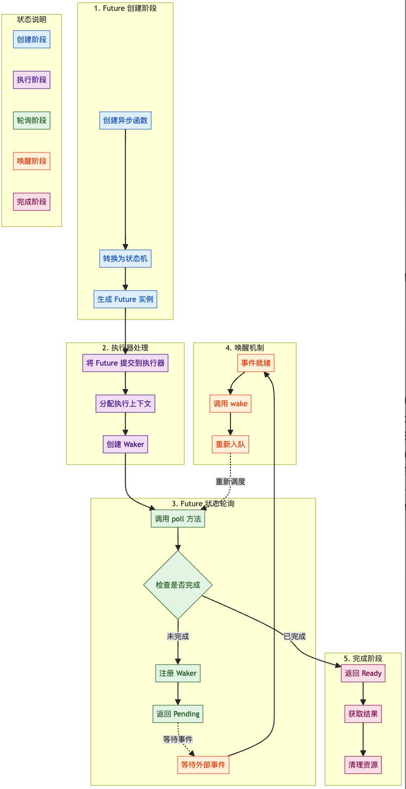

import { RedText, BlueText, GreenText, YellowText } from '@site/src/components/ColorText'

# Rust中异步编程的最佳实践01：Futures



## 目录

1. 引言
2. Futures概述
   - 什么是Futures
   - Futures的基本组成
3. 代码示例解析
   - foo函数的异步实现
   - foo函数的同步实现
4. JoinAll的实现
5. 自定义Sleep实现
6. 唤醒机制（Wake）
7. 主函数的实现
8. Pin、取消与递归
9. 总结

## 引言

```rust
use futures::future;
use std::time::Duration;

async fn foo(n: u64) {
    println!("start {n}");
    tokio::time::sleep(Duration::from_secs(1)).await;
    println!("end {n}");
}

#[tokio::main]
async fn main() {
    let mut futures = Vec::new();
    for n in 1..=10 {
        futures.push(foo(n));
    }
    let joined_future = future::join_all(futures);
    joined_future.await;
}
```

在引言部分，我们展示了一个异步Rust的示例代码，但并未解释其内部工作原理。

这留下了几个疑问：什么是异步函数及其返回的“futures”？
`join_all`函数的作用是什么？ `tokio::time::sleep`与`std::thread::sleep`有何不同？

为了回答这些问题，我们将把这些异步组件转换为普通的、非异步的Rust代码。

我们会发现，复制`foo`和`join_all`并不困难，但编写自定义的`sleep`函数则更为复杂。

让我们开始吧。

## Futures概述

### 什么是Futures

<BlueText text="在Rust的异步编程中，Future是一个核心概念"/>。

<YellowText text="一个Future代表了一个可能尚未完成的计算，类似于一个占位符，未来某个时刻会产生一个结果"/>。

通过`async`和`await`语法，<YellowText text="Rust允许我们以同步的方式编写异步代码，极大地简化了异步编程的复杂性"/>。

### Futures的基本组成

**一个Future主要由以下几个部分组成**：

- `Pin`：一种指针包装器，<YellowText text="用于确保内存中某个位置的数据不会被移动"/>。对于某些需要**自引用的`Future`**来说，`Pin`是必需的。
- `Context`：上下文信息，包含一个`Waker`
- `Waker`：用于在`Future`<YellowText text="需要被重新调度时唤醒它"/>。
- `Poll`：`Future`的`poll`方法返回一个`Poll`枚举，指示`Future`是已完成（`Ready`）还是尚未完成（`Pending`）。

下面我们通过具体的代码示例来深入理解这些概念。

### 代码示例解析

#### `foo`函数的异步实现

首先，我们来看一个异步函数`foo`的示例：

```rust
async fn foo(n: u64) {
    println!("start {n}");
    tokio::time::sleep(Duration::from_secs(1)).await;
    println!("end {n}");
}
```

这个函数做了以下几件事：

1. 打印开始信息。
2. 异步等待1秒钟。
3. 打印结束信息。

通过`async`关键字，**这个函数返回一个`Future`**，<RedText text="而不是立即执行"/>。

<YellowText text="调用者可以选择等待这个`Future`完成"/>。

#### `foo`函数的同步实现

为了更好地理解异步函数的工作原理，我们将`foo`函数转换为一个同步的、非异步的版本：

```rust
use std::pin::Pin;
use std::future::Future;
use std::task::{Context, Poll};
use std::time::Duration;

fn foo(n: u64) -> Foo {
    let started = false;
    let duration = Duration::from_secs(1);
    let sleep = Box::pin(tokio::time::sleep(duration));
    Foo { n, started, sleep }
}

struct Foo {
    n: u64,
    started: bool,
    sleep: Pin<Box<tokio::time::Sleep>>,
}

impl Future for Foo {
    type Output = ();

    fn poll(mut self: Pin<&mut Self>, context: &mut Context) -> Poll<()> {
        if !self.started {
            println!("start {}", self.n);
            self.started = true;
        }
        if self.sleep.as_mut().poll(context).is_pending() {
            return Poll::Pending;
        }
        println!("end {}", self.n);
        Poll::Ready(())
    }
}
```

解析：

1.  函数定义：
   - `foo`函数现在返回一个`Foo`结构体，而不是一个`Future`。
   - `Foo`结构体包含：
      - 一个计数器`n`。
      - 一个标志`started`，用于跟踪是否已经开始执行。
      - 一个被`Pin`包装的`sleep` future。
2.  `Future`实现：
   - Foo实现了`Future` trait。
   - 在`poll`方法中：
      - 如果尚未开始，打印开始信息并设置`started`为`true`。
      - 调用`sleep`的`poll`方法。
         - 如果`sleep`还未完成，返回`Poll::Pending`。
         - 如果`sleep`完成，打印结束信息并返回`Poll::Ready(())`。

通过这种方式，我们手动实现了一个简单的`Future`，它模拟了异步函数的行为。

### JoinAll的实现

接下来，我们来看`join_all`函数的实现。`join_all`用于等待一组`Future`全部完成。

#### 异步实现

在异步代码中，使用`join_all`如下：

```rust
async fn main() {
    let futures = vec![foo(1), foo(2), foo(3)];
    futures::future::join_all(futures).await;
}
```

#### 同步实现

我们将`join_all`转换为同步的、非异步的版本：

```rust
fn join_all<F: Future>(futures: Vec<F>) -> JoinAll<F> {
    JoinAll {
        futures: futures.into_iter().map(Box::pin).collect(),
    }
}

struct JoinAll<F> {
    futures: Vec<Pin<Box<F>>>,
}

impl<F: Future> Future for JoinAll<F> {
    type Output = ();

    fn poll(mut self: Pin<&mut Self>, context: &mut Context) -> Poll<()> {
        let is_pending = |future: &mut Pin<Box<F>>| {
            future.as_mut().poll(context).is_pending()
        };
        self.futures.retain_mut(is_pending);
        if self.futures.is_empty() {
            Poll::Ready(())
        } else {
            Poll::Pending
        }
    }
}
```

解析：

1. 函数定义：
   - `join_all`函数接收一个`Future`的向量，并返回一个`JoinAll`结构体。
2. 结构体定义：
   - `JoinAll`结构体包含一个`Future`的`Vec`，每个`Future`被`Box::pin`包装，以确保它们在内存中的位置固定。
3. Future实现：
   - 在`poll`方法中：
      - 使用`retain_mut`方法保留所有尚未完成的`Future`。
      - 如果所有`Future`都完成了，返回`Poll::Ready(())`。
      - 否则，返回`Poll::Pending`。

通过这种方式，我们手动实现了一个能够等待多个`Future`完成的`Future`。

### 自定义Sleep实现

现在，让我们尝试实现自己的`sleep`函数。我们希望它能够异步地等待指定的时间。

#### 异步实现

在异步代码中，使用`sleep`如下：

```rust
async fn foo(n: u64) {
    println!("start {n}");
    tokio::time::sleep(Duration::from_secs(1)).await;
    println!("end {n}");
}
```

#### 同步实现

我们将`sleep`函数转换为同步的、非异步的版本：

```rust
fn sleep(duration: Duration) -> Sleep {
    let wake_time = Instant::now() + duration;
    Sleep { wake_time }
}

struct Sleep {
    wake_time: Instant,
}

impl Future for Sleep {
    type Output = ();

    fn poll(self: Pin<&mut Self>, _: &mut Context) -> Poll<()> {
        if Instant::now() >= self.wake_time {
            Poll::Ready(())
        } else {
            Poll::Pending
        }
    }
}
```

问题：

尽管代码逻辑看起来正确，运行时发现`sleep`函数无法正确唤醒，导致程序挂起。

这是因为`Future::poll`方法在返回`Poll::Pending`时需要安排一次唤醒，而当前的实现并未完成这一点。

## 唤醒机制（Wake）

为了让`sleep`函数能够在指定时间后正确唤醒，我们需要实现**唤醒机制**。这涉及到`Context`和`Waker`的使用。

### 理解`Context`和`Waker`

- `Context`：包含一个`Waker`，用于在`Future`需要被重新调度时唤醒它。
- `Waker`：用于通知执行器，`Future`已经准备好被再次`poll`。

#### 修改Sleep实现

我们需要在`sleep`函数的`poll`方法中安排唤醒：

```rust
use std::sync::{Mutex, Arc};
use std::collections::BTreeMap;
use std::task::Waker;

static WAKE_TIMES: Mutex<BTreeMap<Instant, Vec<Waker>>> =
    Mutex::new(BTreeMap::new());

impl Future for Sleep {
    type Output = ();

    fn poll(self: Pin<&mut Self>, context: &mut Context) -> Poll<()> {
        if Instant::now() >= self.wake_time {
            Poll::Ready(())
        } else {
            let mut wake_times = WAKE_TIMES.lock().unwrap();
            let wakers_vec = wake_times.entry(self.wake_time).or_default();
            wakers_vec.push(context.waker().clone());
            Poll::Pending
        }
    }
}
```

解析：

1. 全局唤醒时间表：
   - 使用`BTreeMap`按时间排序存储唤醒时间和对应的`Waker`。
2. 在`poll`中注册`Waker`：
   - 如果当前时间未到唤醒时间，将`Waker`添加到`WAKE_TIMES`中对应的时间点。
3. 主循环的实现：
   - 主函数会监视`WAKE_TIMES`，并在到达唤醒时间时调用相应的`Waker`，从而重新`poll`相关的`Future`。

## 主函数的实现

接下来，我们实现一个主函数，负责调度和执行所有的`Future`：

```rust
fn main() {
    let mut futures = Vec::new();
    for n in 1..=10 {
        futures.push(foo(n));
    }
    let mut joined_future = Box::pin(join_all(futures));
    let waker = futures::task::noop_waker();
    let mut context = Context::from_waker(&waker);
    while joined_future.as_mut().poll(&mut context).is_pending() {
        // 获取下一个唤醒时间
        let mut wake_times = WAKE_TIMES.lock().unwrap();
        let next_wake = wake_times.keys().next().expect("sleep forever?");
        thread::sleep(next_wake.saturating_duration_since(Instant::now()));
        // 唤醒所有到期的Waker
        while let Some(entry) = wake_times.first_entry() {
            if *entry.key() <= Instant::now() {
                entry.remove().into_iter().for_each(Waker::wake);
            } else {
                break;
            }
        }
    }
}
```

解析：

1. 初始化`Future`：
   - 创建多个foo函数的Future实例，并将它们传递给`join_all`函数，得到一个聚合的`Future`。
2.  创建`Context`：
   - 使用`noop_waker`创建一个空的`Waker`，并构建`Context`。
3.  轮询`Future`：
   - 在循环中不断`poll`聚合的`Future`。
   - 获取下一个唤醒时间，并让主线程休眠到该时间。
   - 唤醒所有到期的`Waker`，以重新调度相应的`Future`。

结果：

这样，我们实现了一个简单的异步运行时，能够正确地调度和执行多个`Future`，并解决了之前的“忙循环”问题。

## `Pin`、`Cancellation`与`Recursion`

### `Pin`

`Pin`**是Rust中的一个关键类型，用于确保某个数据在内存中的位置固定，防止其被移动**。

对于**自引用的`Future`**来说，`Pin`是必需的。

### 示例：

```rust
struct Foo {
    n: u64,
    n_ref: &u64,
    started: bool,
    sleep: Pin<Box<tokio::time::Sleep>>,
}
```
在这种情况下，`Pin`确保Foo结构体在内存中的位置固定，避免`n_ref`被移动。

### 取消（Cancellation）

- **异步函数**具有**取消的能力**。当我们不再需要某个`Future`时，可以通过不再`poll`它来取消它。
- tokio提供了`tokio::time::timeout`等工具来**实现超时取消**。

#### 示例：
```rust
struct Timeout<F> {
    sleep: Pin<Box<tokio::time::Sleep>>,
    inner: Pin<Box<F>>,
}

impl<F: Future> Future for Timeout<F> {
    type Output = Option<F::Output>;

    fn poll(
        mut self: Pin<&mut Self>,
        context: &mut Context,
    ) -> Poll<Self::Output> {
        if let Poll::Ready(output) = self.inner.as_mut().poll(context) {
            return Poll::Ready(Some(output));
        }
        if self.sleep.as_mut().poll(context).is_ready() {
            return Poll::Ready(None);
        }
        Poll::Pending
    }
}

fn timeout<F: Future>(duration: Duration, inner: F) -> Timeout<F> {
    Timeout {
        sleep: Box::pin(tokio::time::sleep(duration)),
        inner: Box::pin(inner),
    }
}
```

### 递归（Recursion）

- 异步函数不支持直接递归调用，因为这会导致无限大小的`Future`
- 解决方法是通过`Box::pin`进行堆分配：

```rust
async fn factorial(n: u64) -> u64 {
    if n == 0 {
        1
    } else {
        let recurse = Box::pin(factorial(n - 1));
        n * recurse.await
    }
}
```

<YellowText text="这样可以避免无限大小的问题，但需要堆分配，可能带来性能开销"/>。

## Rust中Future的生命周期流程分析

以下是对Rust中Future生命周期的流程中每个阶段的详细分析(如顶部图片所示)：

1. **Future 创建阶段**

步骤：
- 创建异步函数
- 编译器将异步函数转换为状态机
- 生成 `Future` 实例

Rust中的异步函数（`async fn`）在编译时会被转换为一个状态机。
这种转换使得异步函数能够在执行过程中保存其状态，以便在未来的某个时间点继续执行。
编译器生成的状态机实现了`Future` trait，从而生成一个`Future`实例。

2. **执行器处理阶段**

步骤：
- `Future` 提交到执行器
- 分配执行上下文
- 创建 Waker 对象

`Future`实例一旦创建，就需要被**执行器**（如tokio或async-std）管理。
执行器负责调度和驱动`Future`的执行。
**执行器**会为每个`Future`分配一个执行上下文（`Context`），并创建一个`Waker`对象，用于在Future需要被重新调度时唤醒它。

3. **Future 状态轮询阶段**

步骤：
- 调用 `poll` 方法
- 检查完成状态
- 未完成则注册 `Waker`
- 返回 `Pending` 状态

执行器通过调用`Future`的`poll`方法来推进其执行。`poll`方法会检查`Future`是否已经完成：
- 如果`Future`已经完成，返回`Poll::Ready`。
- 如果`Future`尚未完成，返回`Poll::Pending`，并注册`Waker`，以便在未来某个时间点唤醒执行器重新调度该`Future`。

4. **唤醒机制阶段**

步骤：
- 等待外部事件
- 事件就绪时触发
- 调用 `wake()` 方法
- `Future` 重新入队等待执行

当`Future`处于`Poll::Pending`状态时，它通常会等待某个外部事件（如I/O操作完成或定时器到期）。

一旦事件就绪，相关的`Waker`会被调用，通知执行器重新调度该`Future`进行下一步的`poll`操作。

5. **完成阶段**

步骤：
- 返回 `Ready` 状态
- 获取执行结果
- 清理相关资源

当`Future`完成其任务后，`poll`方法会返回`Poll::Ready`，
执行器随后可以获取`Future`的执行结果，并进行必要的资源清理工作。

### 以下是对整个流程的总结：

1. **创建阶段**：
   - 定义异步函数，编译器将其转换为状态机，生成`Future`实例。
2. **执行器处理阶段**：
   - 将`Future`提交给执行器，分配执行上下文，创建`Waker`对象。
3. **状态轮询阶段**：
   - 执行器调用`poll`方法，检查`Future`是否完成，未完成则注册`Waker`并返回`Pending`。
4. **唤醒机制阶段**：
   - 外部事件就绪时，`Waker`被调用，`Future`重新入队等待执行。
5. **完成阶段**：
   - `Future`返回`Ready`状态，执行器获取结果并清理资源。

但为了更全面地理解Future的生命周期，以下几点也值得注意：
- 执行器的具体实现：
   - 不同的执行器（如`tokio`、`async-std`）在具体的调度和任务管理上可能有所不同，但总体流程相似。
- 多任务调度：
   - 执行器通常会同时管理多个`Future`，通过异步事件驱动机制高效地调度它们。
- 错误处理：
   - 在实际应用中，`Future`可能会因为各种原因失败，执行器需要能够处理这些错误。
- 资源管理：
   - `Future`的生命周期结束后，相关的资源（如内存、文件句柄）需要被正确释放，以防止资源泄漏。

通过理解和掌握这些流程和细节，开发者可以更高效地编写和优化Rust中的异步代码，充分利用Rust在并发和异步编程中的强大优势。

## 总结

在Rust中，`Future`是异步编程的核心。

通过理解`Future`的工作原理、如何手动实现它们，以及如何构建一个简单的异步运行时，我们可以更深入地掌握Rust的异步机制。

虽然Rust的`async/await`语法极大地简化了异步编程，但了解底层机制对于编写高效、可靠的异步代码至关重要。

## 关键要点

- `Future`的基本概念：`Future`代表一个可能尚未完成的计算，通过`poll`方法驱动其完成。
- 手动实现`Future`：通过实现`Future` trait，可以深入理解异步编程的内部机制。
- 唤醒机制：`Waker`用于通知执行器，`Future`已经准备好被重新`poll`。
- 构建异步运行时：了解如何手动驱动`Future`的执行，有助于理解像tokio这样的异步运行时的工作原理。
- 额外概念：`Pin`、`Cancellation`与`Recursion`等高级概念，进一步增强对异步编程的掌握。

通过本文的学习，相信您对Rust的异步编程有了更深入的理解。

在接下来的篇章中，我们将继续探讨异步任务（Tasks）和异步IO（IO）的相关内容，进一步完善您的异步编程知识体系。

## 参考资料

- [Rust 异步编程文档](https://rust-lang.github.io/async-book/)
- [Tokio 文档](https://tokio.rs/tokio/tutorial)
- [Future 特征文档](https://doc.rust-lang.org/std/future/trait.Future.html)
- [Pin 与 Unpin](https://doc.rust-lang.org/std/pin/index.html)
- [Async Rust, Part One: Futures](https://jacko.io/async_futures.html)
