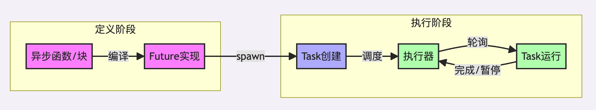
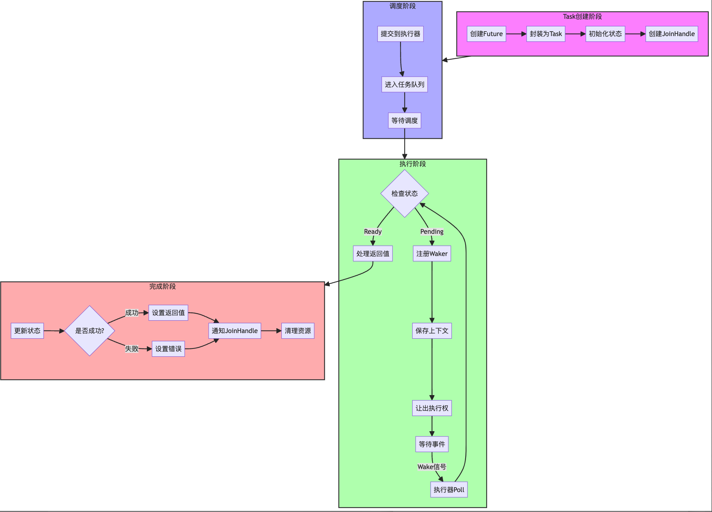

import { RedText, BlueText, GreenText, YellowText } from '@site/src/components/ColorText'


# Rust异步编程的最佳实践02:Tasks

## 目录
- [引言](#引言)
- [任务Tasks基础](#任务基础)
- [任务的核心组件](#任务的核心组件)
- [实践示例](#实践示例)
- [最佳实践与性能优化](#最佳实践与性能优化)
- [参考资料](#参考资料)

## 引言

### 上下文回顾
在上一篇文章中，我们深入探讨了 Rust 中 `Future` 的概念和实现原理。
我们了解到 `Future` 是异步编程的基础抽象，它代表了一个可能在未来完成的值。

## 任务基础

### 关键概念速览

在深入细节之前，让我们先快速了解本文将要讨论的核心概念：

| 概念 | 描述 | 主要作用 |
|------|------|---------|
| `Future` | 代表未来可能的值 | 定义异步操作 |
| `Task` | `Future` 的运行时实例 | 管理异步操作的执行 |
| `Spawn` | 任务创建机制 | 提交任务到执行器 |
| `JoinHandle` | 任务控制句柄 | 等待和管理任务结果 |
| `Waker` | 任务唤醒机制 | 通知执行器任务可继续执行 |

### 快速上手示例

```rust
use tokio;
use std::time::Duration;

#[tokio::main]
async fn main() {
    // 1. 创建一个简单的异步任务
    let handle = tokio::spawn(async {
        println!("Task started");
        tokio::time::sleep(Duration::from_secs(1)).await;
        println!("Task completed");
        "Task result"
    });

    // 2. 等待任务完成
    let result = handle.await.unwrap();
    println!("Got result: {}", result);
}
```

### 任务的定义与作用
任务（`Task`）是异步运行时中的最小执行单位，它封装了一个 `Future` 实例及其执行上下文。

每个任务代表一个独立的异步操作流程。

1. **`Future` 的定义**
```rust
// 当你定义一个异步函数或块时，实际上是定义了一个 Future
async fn my_async_function() -> Result<String, Error> {
    // 这个函数会返回一个实现了 Future trait 的类型
    // 而不是直接返回 Result<String, Error>
}

// 或者使用 async 块
let future = async {
    // 这里的代码定义了 Future 的行为
};
```

2. **Task 的创建**
```rust
// 当你使用 spawn 或类似的方法来执行 Future 时，运行时会将 Future 封装为 Task
tokio::spawn(my_async_function());  // Future 被转换为 Task 并提交给执行器
```

让我用一个类比来说明：

1. **Future 就像是一个"食谱"**：
   - 描述了"要做什么"
   - 包含了所有必要的步骤
   - 但还没有真正开始执行

2. **Task 就像是"正在烹饪的过程"**：
   - 是 `Future` 的运行时实例
   - 包含了实际执行的状态
   - 有自己的资源和上下文

3. 任务与 Future 的关系
任务是 `Future` 的运行时表示：
- `Future` 定义了异步操作的逻辑
- `Task` 负责管理 `Future` 的执行状态
- `Task` 处理与执行器的交互

让我画个简单的图来说明这个关系：



### 关键区别：

1. **Future（特征/定义）**
   - **是一个特征**（`trait`）
   - **定义了异步计算的逻辑**
   - **是静态的定义**
   - **可以被多次执行**
   - **不包含执行状态**

2. **Task（运行时实例）**
   - **是 `Future` 的运行时表示**
   - **包含执行状态和上下文**
   - **是动态的实例**
   - **有自己的生命周期**
   - **包含调度信息**

#### 实际使用示例：
```rust
// 1. 定义 Future
async fn fetch_data(url: String) -> Result<String, Error> {
    // 异步操作的定义
    let response = reqwest::get(&url).await?;
    let text = response.text().await?;
    Ok(text)
}

// 2. 创建多个 Task
async fn main() {
    // 同一个 Future 定义可以创建多个不同的 Task
    let task1 = tokio::spawn(fetch_data("url1".to_string()));
    let task2 = tokio::spawn(fetch_data("url2".to_string()));
    
    // 等待所有 Task 完成
    let (result1, result2) = join!(task1, task2);
}
```

这种设计的优点：
1. **灵活性**：同一个 `Future` 可以被多次执行
2. **资源管理**：`Task` 可以独立管理资源
3. **并发控制**：执行器可以有效调度多个 `Task`
4. **状态隔离**：每个 `Task` 有自己的执行状态

理解这个关系对于编写高效的异步代码很重要，因为它帮助我们：
- 更好地组织异步代码结构
- 理解执行流程
- 处理并发和资源管理
- 优化性能

### 任务的生命周期
任务从创建到完成经历以下阶段：



1. **创建阶段**：任务被构造并初始化
2. **调度阶段**：任务被提交到执行器
3. **执行阶段**：任务被轮询（`poll`）执行
4. **等待阶段**：任务等待资源或事件
5. **完成阶段**：任务执行完成或失败

## 任务的核心组件

### 动态分发（`Dyn`）

#### 为什么需要动态分发
在异步运行时中，我们需要管理不同类型的 `Future`。

动态分发允许我们用统一的方式处理这些 `Future`。

```rust
// 动态 Future 类型定义
type DynFuture = Pin<Box<dyn Future<Output = ()> + Send>>;

// 使用示例
fn store_future<F>(future: F) 
where 
    F: Future<Output = ()> + Send + 'static 
{
    let boxed: DynFuture = Box::pin(future);
    // 存储或处理 boxed future
}
```

#### 性能考虑
动态分发虽然提供了灵活性，但也带来了一些开销：
- 额外的内存分配（`Box`）
- 虚表查找的开销
- 潜在的缓存未命中

### Spawn 机制

#### 基本概念
`spawn` 是向执行器提交任务的标准方式：

```rust
pub fn spawn<F>(future: F) -> JoinHandle<F::Output>
where
    F: Future + Send + 'static,
    F::Output: Send + 'static,
{
    // 创建任务并返回句柄
    let (handle, task) = create_task(future);
    
    // 提交任务到执行器
    EXECUTOR.submit(task);
    
    handle
}
```

#### 实现细节
高效的任务生成机制需要考虑：
- 任务状态管理
- 资源分配策略
- 错误处理机制

### `JoinHandle`

#### 设计思想
`JoinHandle` 提供了等待任务完成的机制：

```rust
pub struct JoinHandle<T> {
    state: Arc<Mutex<JoinState<T>>>,
}

enum JoinState<T> {
    Running(Waker),
    Completed(T),
    Failed(Error),
}

impl<T> Future for JoinHandle<T> {
    type Output = Result<T, Error>;

    fn poll(self: Pin<&mut Self>, cx: &mut Context<'_>) -> Poll<Self::Output> {
        let mut state = self.state.lock().unwrap();
        match &*state {
            JoinState::Completed(value) => Poll::Ready(Ok(value.clone())),
            JoinState::Failed(error) => Poll::Ready(Err(error.clone())),
            JoinState::Running(_) => {
                *state = JoinState::Running(cx.waker().clone());
                Poll::Pending
            }
        }
    }
}
```

### 唤醒机制

#### `Waker` 的作用
`Waker` 负责在任务可继续执行时通知执行器：

```rust
pub struct CustomWaker {
    task_id: TaskId,
    task_queue: Arc<Mutex<TaskQueue>>,
}

impl Wake for CustomWaker {
    fn wake(self: Arc<Self>) {
        let mut queue = self.task_queue.lock().unwrap();
        queue.push(self.task_id);
    }
}
```

## 实践示例

### 基础使用模式

```rust
#[tokio::main]
async fn main() {
    // 创建多个任务
    let mut handles = Vec::new();
    
    for i in 0..5 {
        let handle = tokio::spawn(async move {
            println!("Task {} started", i);
            tokio::time::sleep(Duration::from_secs(1)).await;
            println!("Task {} completed", i);
            i
        });
        handles.push(handle);
    }
    
    // 等待所有任务完成
    for handle in handles {
        let result = handle.await.unwrap();
        println!("Got result: {}", result);
    }
}
```

### 高级应用场景

#### 任务取消
```rust
async fn cancellable_task(cancel: CancellationToken) -> Result<(), Error> {
    loop {
        tokio::select! {
            _ = cancel.cancelled() => {
                println!("Task cancelled");
                return Ok(());
            }
            _ = async_operation() => {
                println!("Operation completed");
            }
        }
    }
}
```

## 最佳实践与性能优化

### 任务粒度
- 避免过细的任务粒度
- 合理批处理小任务
- 控制任务数量

### 批处理优化示例
```rust
use futures::stream::{self, StreamExt};
use tokio::task;

async fn process_items_batched(items: Vec<i32>) -> Result<(), Error> {
    // 将items分批处理
    let batch_size = 100;
    let mut batches = stream::iter(items)
        .chunks(batch_size)
        .map(|chunk| {
            task::spawn(async move {
                for item in chunk {
                    process_single_item(item).await?;
                }
                Ok::<_, Error>(())
            })
        })
        .buffer_unwind(10); // 控制并发数量

    while let Some(result) = batches.next().await {
        result??; // 处理错误
    }

    Ok(())
}

// 对比：细粒度任务版本
async fn process_items_fine_grained(items: Vec<i32>) -> Result<(), Error> {
    let handles: Vec<_> = items
        .into_iter()
        .map(|item| {
            task::spawn(async move {
                process_single_item(item).await
            })
        })
        .collect();

    for handle in handles {
        handle.await??;
    }

    Ok(())
}
```

### 资源管理
- 使用资源池
- 实现超时机制
- 处理任务泄漏

### 资源限制
```rust
use tokio::sync::Semaphore;

async fn with_limit<F, T>(
    sem: Arc<Semaphore>,
    task: F
) -> Result<T, Error>
where
    F: Future<Output = Result<T, Error>>,
{
    let _permit = sem.acquire().await?;
    task.await
}
```

### 连接池管理
```rust
use bb8::Pool;

async fn create_pool() -> Pool<MyConnectionManager> {
    let manager = MyConnectionManager::new("connection_string");
    Pool::builder()
        .max_size(15)
        .min_idle(Some(5))
        .build(manager)
        .await
        .unwrap()
}
```
### 超时控制
```rust
async fn with_timeout<F, T>(future: F, duration: Duration) -> Result<T, TimeoutError>
where
    F: Future<Output = T>,
{
    timeout(duration, future).await
}
```

### 错误处理
- 实现优雅降级
- 添加重试机制
- 日志记录

### 健壮的错误处理模式

```rust
use tokio::time::timeout;
use backoff::{ExponentialBackoff, backoff::Backoff};

async fn robust_task() -> Result<(), Error> {
    // 1. 超时处理
    let operation_result = timeout(
        Duration::from_secs(5),
        async {
            // 你的异步操作
            Ok::<_, Error>(())
        }
    ).await??;

    // 2. 重试机制
    let mut backoff = ExponentialBackoff::default();
    let retry_result = async {
        loop {
            match async_operation().await {
                Ok(value) => break Ok(value),
                Err(e) => {
                    if let Some(duration) = backoff.next_backoff() {
                        tokio::time::sleep(duration).await;
                        continue;
                    }
                    break Err(e);
                }
            }
        }
    }.await?;

    // 3. 资源清理
    struct CleanupGuard<T>(T);
    impl<T> Drop for CleanupGuard<T> {
        fn drop(&mut self) {
            // 清理资源
        }
    }
    
    let _guard = CleanupGuard(resource);

    Ok(())
}
```

### 任务粒度优化
以下是不同任务粒度的性能对比：

|策略|	优点|	缺点|	适用场景|
|----|-----|----|--------|
|细粒度|	更好的响应性|	更高的调度开销|	IO密集型，需要快速响应|
|批处理|	更低的开销|	延迟可能增加|	CPU密集型，吞吐量优先|
|混合模式|	平衡的性能|	实现复杂|	复杂业务场景|

## 参考资料

1. [Rust 异步编程文档：async-book](https://rust-lang.github.io/async-book/)
2. [Tokio 文档：tokio.rs]](https://tokio.rs/)
3. [Rust RFC 2592：futures-api-v0.3](https://rust-lang.github.io/rfcs/2592-futures-api-v0.3.html)
