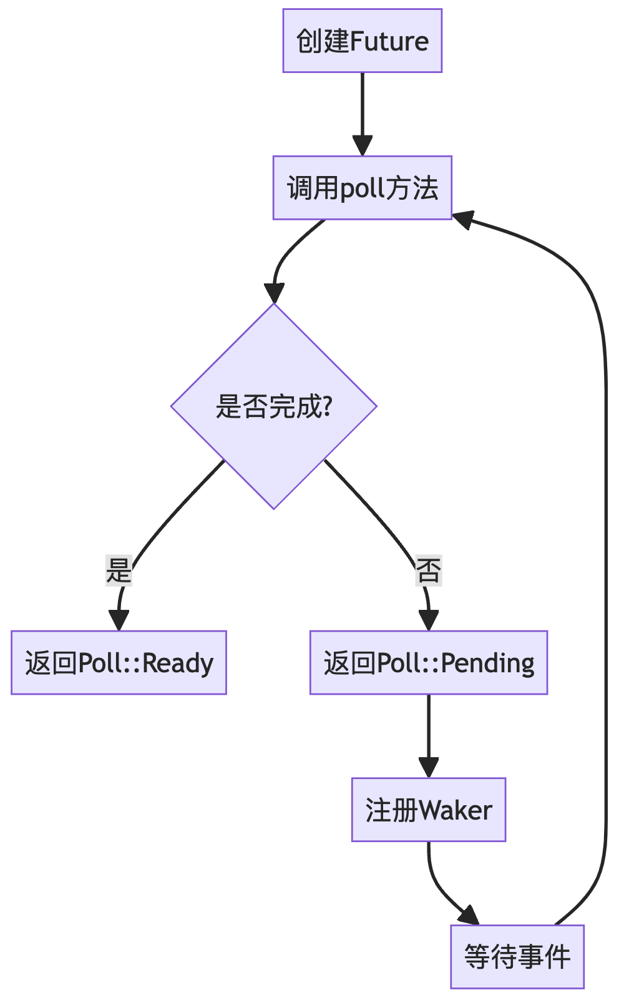
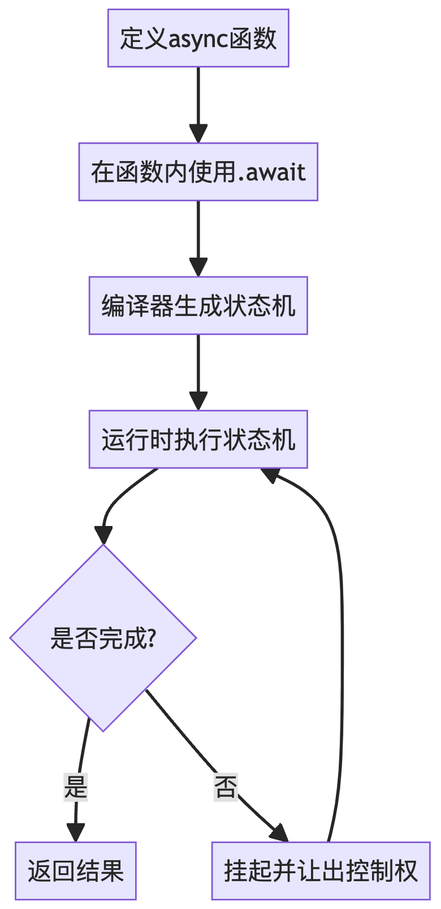
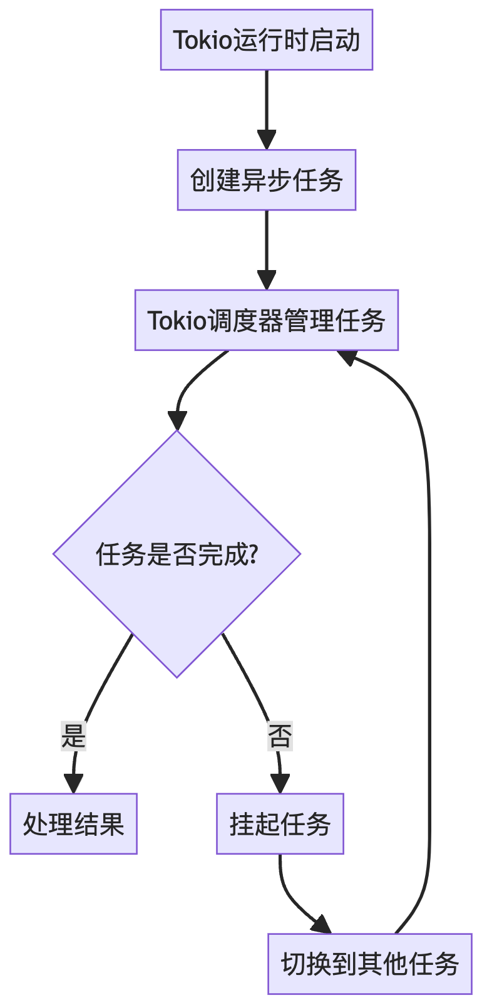
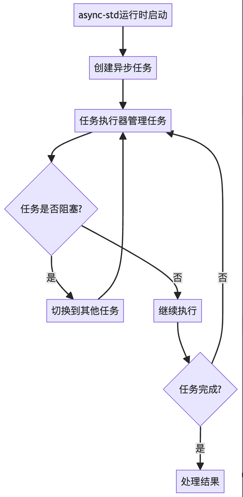
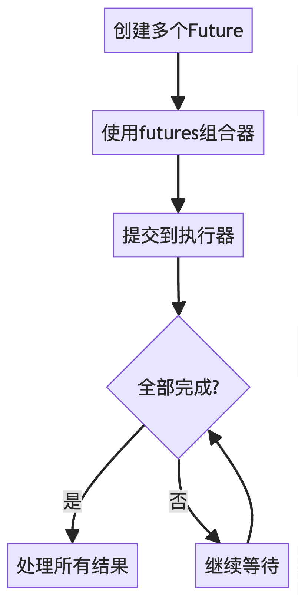
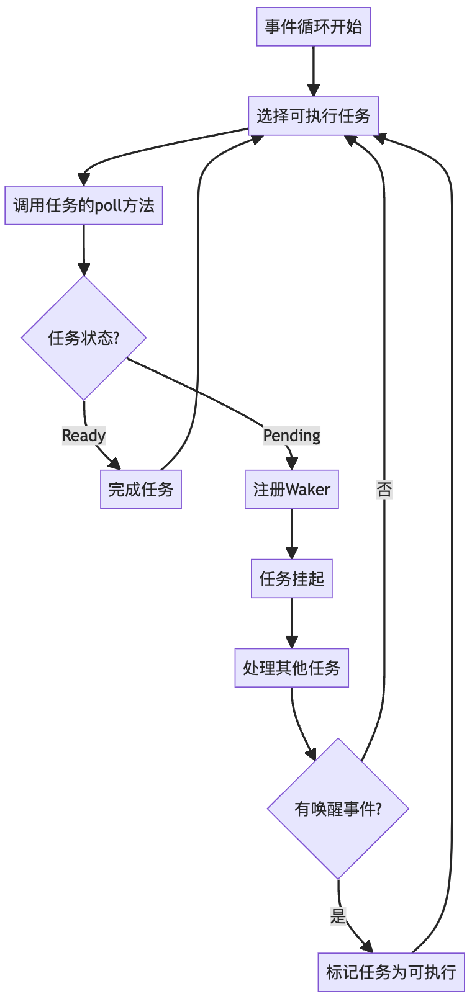

import { RedText, BlueText, GreenText, YellowText } from '@site/src/components/ColorText'

# Rust中实现异步的方式有哪些？

在现代编程中，异步编程已经成为提高程序性能和资源利用率的重要手段。
Rust作为一门系统级编程语言，提供了多种实现异步的方式。

本文将从概念入手，逐步深入探讨Rust中实现异步的各种方法，从标准库到第三方库，
全面介绍Rust的异步编程生态。

## 1. 异步编程的概念

异步编程是一种允许多个任务并发执行而不需要多线程的编程范式。

它特别适用于I/O密集型任务，可以在等待I/O操作完成时执行其他任务，从而提高程序的整体效率。

在Rust中，异步编程主要围绕`Future`特征（trait）展开。
`Future`代表一个可能还未完成的异步操作，它定义了异步任务的行为。

## 2. 使用标准库实现异步

### 2.1 手动实现Future特征

最基本的异步实现方式是手动实现`Future`特征。
这种方法虽然较为底层，但能让我们深入理解Rust异步的工作原理。

```rust
use std::future::Future;
use std::pin::Pin;
use std::task::{Context, Poll};
use std::time::{Duration, Instant};

struct Delay {
    when: Instant,
}

impl Future for Delay {
    type Output = &'static str;

    fn poll(self: Pin<&mut Self>, cx: &mut Context<'_>) -> Poll<Self::Output> {
        if Instant::now() >= self.when {
            println!("Future completed");
            Poll::Ready("done")
        } else {
            println!("Future not ready yet");
            cx.waker().wake_by_ref();
            Poll::Pending
        }
    }
}

#[tokio::main]
async fn main() {
    let future = Delay {
        when: Instant::now() + Duration::from_secs(2),
    };
    
    println!("Waiting...");
    let out = future.await;
    println!("Future returned: {}", out);
}
```

#### 适用场景
- 需要对异步操作有精细控制的场景
- 实现自定义的复杂异步原语
- 学习和理解Rust异步机制的底层原理



### 2.2 使用`async/await`语法

Rust提供了`async/await`语法糖，使得编写异步代码变得更加简单和直观。

```rust
use tokio::time::{sleep, Duration};

async fn fetch_data(id: u32) -> String {
    sleep(Duration::from_millis(100)).await;
    format!("Data for id {}", id)
}

#[tokio::main]
async fn main() {
    let data1 = fetch_data(1).await;
    println!("Fetched: {}", data1);

    let results = tokio::join!(
        fetch_data(2),
        fetch_data(3),
        fetch_data(4)
    );

    println!("Fetched: {:?}", results);
}
```

#### 适用场景
- 大多数异步编程场景
- 需要简洁、易读的异步代码
- 处理复杂的异步流程，如并发操作



## 3. 使用第三方库实现异步

### 3.1 Tokio

Tokio是Rust最流行的异步运行时之一，它提供了全面的异步编程支持。

```rust
use tokio::net::TcpListener;
use tokio::io::{AsyncReadExt, AsyncWriteExt};

#[tokio::main]
async fn main() -> Result<(), Box<dyn std::error::Error>> {
    let listener = TcpListener::bind("127.0.0.1:8080").await?;
    println!("Server listening on port 8080");

    loop {
        let (mut socket, _) = listener.accept().await?;

        tokio::spawn(async move {
            let mut buf = [0; 1024];

            loop {
                let n = match socket.read(&mut buf).await {
                    Ok(n) if n == 0 => return,
                    Ok(n) => n,
                    Err(_) => return,
                };

                if let Err(e) = socket.write_all(&buf[0..n]).await {
                    eprintln!("failed to write to socket; err = {:?}", e);
                    return;
                }
            }
        });
    }
}
```

#### 适用场景
- 构建高性能的网络应用
- 需要完整的异步生态系统支持
- 大型项目，需要丰富的异步工具和抽象



### 3.2 async-std

async-std是另一个流行的异步运行时，它的API设计更接近Rust标准库。

```rust
use async_std::net::TcpListener;
use async_std::prelude::*;
use async_std::task;
use futures::stream::StreamExt;

async fn handle_client(mut stream: async_std::net::TcpStream) -> std::io::Result<()> {
    println!("Accepted connection from: {}", stream.peer_addr()?);
    let mut buffer = [0; 1024];
    while let Ok(n) = stream.read(&mut buffer).await {
        if n == 0 { return Ok(()) }
        stream.write_all(&buffer[0..n]).await?;
    }
    Ok(())
}

#[async_std::main]
async fn main() -> std::io::Result<()> {
    let listener = TcpListener::bind("127.0.0.1:8080").await?;
    println!("Server listening on port 8080");

    listener
        .incoming()
        .for_each_concurrent(None, |stream| async move {
            let stream = stream.unwrap();
            task::spawn(handle_client(stream));
        })
        .await;

    Ok(())
}
```

#### 适用场景
- 需要与标准库API相似的异步接口
- 中小型项目，追求简洁性
- 学习异步编程，过渡到异步代码



## 4. 高级异步模式

### 4.1 使用futures库

futures库提供了更多用于组合和操作Future的工具。

```rust
use futures::future::{join_all, FutureExt};
use reqwest;
use std::time::Instant;

async fn fetch_url(url: &str) -> Result<(String, String), reqwest::Error> {
    let resp = reqwest::get(url).await?;
    let body = resp.text().await?;
    Ok((url.to_string(), body))
}

#[tokio::main]
async fn main() -> Result<(), Box<dyn std::error::Error>> {
    let urls = vec![
        "https://www.rust-lang.org",
        "https://github.com/rust-lang/rust",
        "https://crates.io",
    ];

    let start = Instant::now();
    let futures = urls.into_iter().map(|url| fetch_url(url).boxed());
    let results = join_all(futures).await;

    for result in results {
        match result {
            Ok((url, body)) => println!("URL: {}, length: {} bytes", url, body.len()),
            Err(e) => eprintln!("Error: {}", e),
        }
    }

    println!("Total time: {:?}", start.elapsed());

    Ok(())
}
```

#### 适用场景
- 需要复杂的Future组合和操作
- 处理大量并发异步任务
- 实现自定义的异步控制流



## 5. 深入理解：事件循环的工作原理

在讨论了各种异步实现方式后，让我们深入了解Rust异步系统的核心：事件循环。

事件循环是异步运行时（如Tokio或async-std）的核心组件，它负责管理和执行异步任务。
理解事件循环的工作原理对于掌握Rust的异步编程至关重要。

### 事件循环的基本流程

1. **调用 `poll`**：事件循环会反复调用每个`Future`的`poll`方法，以检查其状态。
如果任务能够推进，`poll`会执行一部分操作，但如果任务需要等待外部事件（例如 I/O 完成），它就会返回`Pending`状态。
2. **挂起等待（`sleep`）**：当`poll`返回`Pending`时，任务会挂起，并不会占用 CPU。
这时，事件循环可以继续处理其他任务，而挂起的任务会注册一个`Waker`。
3. **唤醒（`wake`）**：一旦外部事件完成，`Waker`会被触发，唤醒等待的任务，将其标记为"可执行"状态。
然后，事件循环会重新调度该任务。
4. **继续 `poll`**：被唤醒的任务将再次由事件循环调用其`poll`方法，从挂起的位置继续执行。
这种机制会一直进行，直到任务完成或再次需要等待其他事件。

这个过程的核心是事件循环不断调用 `poll`，在适当时机挂起任务和唤醒任务。
Rust 的异步系统基于这种高效的任务调度，可以在单线程上处理大量并发任务，同时节省资源。



### 深入解析

1. **高效的资源利用**：
   - 当一个任务在等待I/O或其他外部事件时，它不会阻塞整个线程。
   - 事件循环可以继续执行其他准备就绪的任务，从而最大化CPU利用率。

2. **非阻塞I/O**：
   - Rust的异步模型依赖于非阻塞I/O操作。
   - 当I/O操作无法立即完成时，任务会返回Pending状态，而不是阻塞线程。

3. **Waker机制**：
   - Waker是Rust异步模型的关键创新。
   - 它允许任务在准备好继续执行时通知事件循环，而无需持续轮询。

4. **零成本抽象**：
   - Rust的异步模型被设计为"零成本抽象"，意味着你只为你使用的功能付出代价。
   - 编译器会将async/await语法转换为状态机，无需额外的运行时开销。

5. **可组合性**：
   - Futures可以轻松组合，创建复杂的异步流程。
   - 这种组合性使得构建复杂的异步系统变得更加简单和直观。

### 实际应用示例

让我们通过一个简单的例子来说明事件循环的工作原理：

```rust
use tokio::time::{sleep, Duration};

async fn task1() {
    println!("Task 1 starting");
    sleep(Duration::from_secs(2)).await;
    println!("Task 1 completed");
}

async fn task2() {
    println!("Task 2 starting");
    sleep(Duration::from_secs(1)).await;
    println!("Task 2 completed");
}

#[tokio::main]
async fn main() {
    tokio::join!(task1(), task2());
}
```

在这个例子中：

1. 事件循环首先调用`task1`的`poll`方法。`task1`开始执行，打印开始消息，然后遇到`sleep`操作。
2. `task1`返回`Pending`状态，事件循环转而执行`task2`。
3. `task2`同样开始执行，打印开始消息，然后也遇到`sleep`操作。
4. 此时两个任务都处于挂起状态，事件循环等待。
5. 1秒后，`task2`的定时器触发，唤醒`task2`。
6. 事件循环再次`poll` `task2`，它完成执行并打印完成消息。
7. 又过1秒后，`task1`的定时器触发，唤醒`task1`。
8. 事件循环`poll` `task1`，它完成执行并打印完成消息。

这个过程展示了事件循环如何有效地管理多个异步任务，即使在单线程环境中也能实现并发执行。

理解事件循环的工作原理是掌握Rust异步编程的关键。
它不仅帮助我们更好地理解异步代码的行为，还能指导我们编写更高效、更可靠的异步程序。
无论是使用标准库的Future，还是借助Tokio或async-std这样的异步运行时，核心原理都是一致的。
通过合理利用这些机制，我们可以充分发挥Rust在并发和异步编程方面的强大能力。

## 总结

Rust提供了丰富的异步编程选项，从底层的`Future`实现到高级的异步运行时和工具库。

通过这些例子和流程图，我们可以看到：

1. 手动实现`Future`让我们深入理解了异步操作的本质，适合需要精细控制的场景。
2. `async/await`语法大大简化了异步代码的编写，适合大多数日常异步编程任务。
3. Tokio和async-std等运行时提供了强大的异步I/O支持，适合构建高性能的网络应用。
4. futures库提供了更多高级的异步操作工具，适合复杂的异步流程控制。

选择合适的异步方式取决于你的具体需求：

- 对于简单的异步任务，使用`async/await`语法就足够了。
- 对于需要更细粒度控制的场景，可以考虑手动实现`Future`。
- 对于大型项目或需要全面异步支持的场景，Tokio或async-std这样的异步运行时是很好的选择。
- 对于特定的并发模式或复杂的异步流程，futures库提供了强大的工具。

无论选择哪种方式，Rust的类型系统和所有权模型都能确保异步代码的安全性和高效性。

随着对异步编程的深入理解和实践，你将能够充分利用Rust强大的异步能力，编写出高性能、可靠的异步程序。