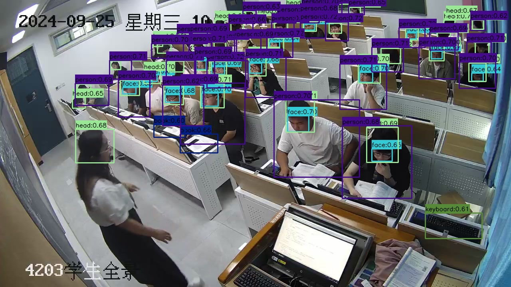

# 使用ONNXRuntime实现高效目标检测：全面教程与代码示例

在计算机视觉领域，目标检测是一个关键任务，广泛应用于安防监控、自动驾驶、智能零售等多个场景。
随着深度学习的发展，许多高效的目标检测模型如YOLOv8被广泛使用。
为了在生产环境中高效部署这些模型，ONNXRuntime作为一种跨平台的高性能推理引擎，成为了理想的选择。
本文将详细介绍如何使用ONNXRuntime进行目标检测，并通过代码示例展示整个流程。

## 目录
1. [什么是ONNXRuntime？](#what-is-onnxruntime)
2. [为什么选择ONNXRuntime进行目标检测？](#why-choose-onnxruntime-for-object-detection)
3. [环境准备](#environment-setup)
4. [代码详解](#code-explanation)
   - [导入必要的库](#importing-necessary-libraries)
   - [定义类别与颜色映射](#defining-categories-and-color-mapping)
   - [辅助函数](#auxiliary-functions)
   - [加载ONNX模型](#loading-onnx-model)
   - [图像预处理](#image-preprocessing)
   - [推理过程](#inference-process)
   - [后处理与非极大值抑制（NMS）](#post-processing-and-non-maximum-suppression-nms)
   - [可视化检测结果](#visualization-of-detection-results)
   - [整体预测流程](#overall-prediction-process)
5. [完整代码示例](#complete-code-example)
6. [性能优化与调优](#performance-optimization-and-tuning)
7. [结论](#conclusion)

---

## 什么是ONNXRuntime？{#what-is-onnxruntime}

[ONNXRuntime](https://onnxruntime.ai/) 是由微软开发的一个高性能推理引擎，支持多种硬件加速器和操作系统。
它兼容[ONNX（Open Neural Network Exchange）](https://onnx.ai/)格式，这是一种开放的深度学习模型交换格式，
使模型在不同框架之间的迁移变得更加容易。

## 为什么选择ONNXRuntime进行目标检测？{#why-choose-onnxruntime-for-object-detection}

1. **高性能**：ONNXRuntime经过高度优化，能够充分利用CPU和GPU的性能，加快推理速度。
2. **跨平台**：支持Windows、Linux、macOS等多种操作系统，且兼容多种编程语言如Python、C++等。
3. **易于集成**：ONNX格式的模型可以轻松集成到各种应用中，无需担心框架依赖。
4. **支持多种硬件加速器**：如NVIDIA的TensorRT、Intel的OpenVINO等，进一步提升推理效率。

## 环境准备{#environment-setup}

在开始之前，确保您的系统已安装以下软件：

- **Python 3.7+**
- **ONNXRuntime**
- **OpenCV**
- **NumPy**

您可以使用以下命令安装所需的Python库：

```bash
pip install onnxruntime opencv-python numpy
```

## 代码详解{#code-explanation}

下面我们将逐步解析实现目标检测的完整代码。

### 导入必要的库{#importing-necessary-libraries}

首先，导入所有需要的Python库：

```python
import cv2
import numpy as np
import onnxruntime as ort
import hashlib
```

- `cv2`：用于图像处理。
- `numpy`：用于数值计算。
- `onnxruntime`：用于加载和运行ONNX模型。
- `hashlib`：用于生成颜色映射。

### 定义类别与颜色映射{#defining-categories-and-color-mapping}

定义检测模型的类别，并为每个类别生成唯一的颜色，便于在图像上可视化。

```python
# 定义您的12个类别
CLASSES = [
    'book', 'bottle', 'cellphone', 'drink', 'eat', 'face',
    'food', 'head', 'keyboard', 'mask', 'person', 'talk'
]

def name_to_color(name):
    """根据类名生成固定的颜色。"""
    hash_str = hashlib.md5(name.encode('utf-8')).hexdigest()
    r = int(hash_str[0:2], 16)
    g = int(hash_str[2:4], 16)
    b = int(hash_str[4:6], 16)
    return (r, g, b)  # OpenCV使用BGR格式
```

- `CLASSES`：包含12个目标类别。
- `name_to_color`：通过哈希算法为每个类别生成唯一颜色，确保不同类别在图像中具有不同颜色的边框。

### 辅助函数{#auxiliary-functions}

定义一些辅助函数，包括激活函数、坐标转换和IoU计算。

```python
def sigmoid(x):
    """Sigmoid激活函数。"""
    return 1 / (1 + np.exp(-x))

def xywh2xyxy(x):
    """
    将 (x, y, w, h) 转换为 (x1, y1, x2, y2)
    """
    y = np.copy(x)
    y[..., 0] = x[..., 0] - x[..., 2] / 2  # x1
    y[..., 1] = x[..., 1] - x[..., 3] / 2  # y1
    y[..., 2] = x[..., 0] + x[..., 2] / 2  # x2
    y[..., 3] = x[..., 1] + x[..., 3] / 2  # y2
    return y

def compute_iou(box, boxes):
    """
    计算单个box与多个boxes的IoU
    box: (4,) -> (x1, y1, x2, y2)
    boxes: (N, 4)
    """
    xmin = np.maximum(box[0], boxes[:, 0])
    ymin = np.maximum(box[1], boxes[:, 1])
    xmax = np.minimum(box[2], boxes[:, 2])
    ymax = np.minimum(box[3], boxes[:, 3])

    inter_w = np.maximum(0, xmax - xmin)
    inter_h = np.maximum(0, ymax - ymin)
    intersection = inter_w * inter_h

    box_area = (box[2] - box[0]) * (box[3] - box[1])
    boxes_area = (boxes[:,2] - boxes[:,0]) * (boxes[:,3] - boxes[:,1])

    union = box_area + boxes_area - intersection
    iou = intersection / union
    return iou
```

- `sigmoid`：用于将模型输出的类别分数映射到0到1之间。
- `xywh2xyxy`：将中心坐标和宽高格式的框转换为左上角和右下角坐标格式。
- `compute_iou`：计算两个框的交并比（IoU），用于非极大值抑制（NMS）。

### 加载ONNX模型{#loading-onnx-model}

加载ONNX格式的目标检测模型，并获取模型的输入输出信息。

```python
def load_model(model_path, providers=['CPUExecutionProvider']):
    """
    加载ONNX模型
    """
    session = ort.InferenceSession(model_path, providers=providers)
    input_names = [inp.name for inp in session.get_inputs()]
    output_names = [out.name for out in session.get_outputs()]
    input_shape = session.get_inputs()[0].shape  # 通常为 [batch, channel, height, width]
    return session, input_names, output_names, input_shape
```

- `load_model`：加载指定路径的ONNX模型，返回会话对象、输入输出名称及输入形状。

### 图像预处理{#image-preprocessing}

将输入图像读取并预处理为模型所需的格式。

```python
def preprocess_image(image_path, input_width, input_height):
    """
    读取并预处理图像
    """
    image = cv2.imread(image_path)
    if image is None:
        raise FileNotFoundError(f"图像未找到: {image_path}")
    original_height, original_width = image.shape[:2]
    image_rgb = cv2.cvtColor(image, cv2.COLOR_BGR2RGB)
    resized = cv2.resize(image_rgb, (input_width, input_height))
    input_image = resized.astype(np.float32) / 255.0  # 归一化
    input_image = input_image.transpose(2, 0, 1)  # [H, W, C] -> [C, H, W]
    input_tensor = np.expand_dims(input_image, axis=0)  # [1, C, H, W]
    return image, input_tensor, original_width, original_height
```

- `preprocess_image`：读取图像，调整尺寸，归一化，并转换为模型输入所需的张量格式。

### 推理过程{#inference-process}

使用ONNXRuntime进行模型推理，获取输出结果。

```python
def predict(model_path, image_path, output_image_file, conf_threshold=0.6, iou_threshold=0.5):

    # 加载模型
    session, input_names, output_names, input_shape = load_model(model_path, providers=['CPUExecutionProvider'])
    _, _, input_height, input_width = input_shape

    # 预处理图像
    image, input_tensor, original_width, original_height = preprocess_image(image_path, input_width, input_height)

    # 推理
    outputs = session.run(output_names, {input_names[0]: input_tensor})

    # 后处理
    boxes, confidences, class_ids = postprocess(
        outputs,
        original_width=original_width,
        original_height=original_height,
        input_width=input_width,
        input_height=input_height,
        conf_threshold=conf_threshold,  # 置信度阈值
        iou_threshold=iou_threshold     # IoU 阈值
    )

    if len(boxes) == 0:
        print("未检测到任何目标。")
        return

    # 可视化结果
    visualize(image, boxes, confidences, class_ids, output_path=output_image_file)
```

- `predict`：主函数，加载模型，预处理图像，执行推理，后处理结果，并可视化检测结果。

### 后处理与非极大值抑制（NMS）{#post-processing-and-non-maximum-suppression-nms}

对模型输出进行后处理，包括应用阈值和NMS以去除冗余框。

```python
def postprocess(outputs, original_width, original_height, input_width, input_height, conf_threshold=0.7, iou_threshold=0.5):
    """
    后处理步骤，按类别应用NMS
    """
    # 假设只有一个输出，形状为 [1, 16, 8400]
    output = outputs[0]  # shape: (1,16,8400)
    predictions = np.squeeze(output, axis=0).T  # shape: (8400,16)

    print(f"总预测数量: {predictions.shape[0]}")

    # 前4列为 (x, y, w, h)
    boxes = predictions[:, :4]

    # 后12列为类别分数（需应用sigmoid）
    class_scores = sigmoid(predictions[:, 4:])

    # 找到每个预测的最大类别概率及其对应的类别ID
    class_ids = np.argmax(class_scores, axis=1)
    confidences = np.max(class_scores, axis=1)

    # 应用置信度阈值
    mask = confidences > conf_threshold
    boxes = boxes[mask]
    confidences = confidences[mask]
    class_ids = class_ids[mask]

    print(f"应用置信度阈值后: {boxes.shape[0]} 个框")
    print(f"置信度分布: 最小={confidences.min():.4f}, 最大={confidences.max():.4f}, 平均={confidences.mean():.4f}")

    if len(boxes) == 0:
        return [], [], []

    # 将 (x, y, w, h) 转换为 (x1, y1, x2, y2)
    boxes_xyxy = xywh2xyxy(boxes)

    # 映射回原始图像尺寸
    scale_w = original_width / input_width
    scale_h = original_height / input_height
    boxes_xyxy[:, [0, 2]] *= scale_w
    boxes_xyxy[:, [1, 3]] *= scale_h
    boxes_xyxy = boxes_xyxy.astype(np.int32)

    # 准备 NMS 所需的输入
    boxes_list = boxes_xyxy.tolist()
    scores_list = confidences.tolist()

    # 使用 OpenCV 的 NMS 函数，按类别分开处理
    final_boxes = []
    final_confidences = []
    final_class_ids = []

    unique_classes = np.unique(class_ids)
    for cls in unique_classes:
        cls_mask = class_ids == cls
        cls_boxes = [boxes_list[i] for i in range(len(class_ids)) if cls_mask[i]]
        cls_scores = [scores_list[i] for i in range(len(class_ids)) if cls_mask[i]]

        if len(cls_boxes) == 0:
            continue

        # OpenCV 的 NMSBoxes 需要以 [x, y, w, h] 的格式
        # 这里我们需要将 (x1, y1, x2, y2) 转换为 (x, y, w, h)
        cls_boxes_xywh = []
        for box in cls_boxes:
            x1, y1, x2, y2 = box
            cls_boxes_xywh.append([x1, y1, x2 - x1, y2 - y1])

        # 执行NMS
        indices = cv2.dnn.NMSBoxes(cls_boxes_xywh, cls_scores, conf_threshold, iou_threshold)

        if len(indices) > 0:
            for i in indices.flatten():
                final_boxes.append(cls_boxes[i])
                final_confidences.append(cls_scores[i])
                final_class_ids.append(cls)

    print(f"应用NMS后: {len(final_boxes)} 个框")

    return final_boxes, final_confidences, final_class_ids
```

- **步骤解析**：
  1. **模型输出解析**：假设模型输出形状为 `[1, 16, 8400]`，即1个批次、16(4个坐标值+12个类别)、8400个预测框。
  2. **Sigmoid激活**：将类别分数通过Sigmoid函数映射到0到1之间。
  3. **置信度筛选**：只保留置信度高于阈值的预测框。
  4. **坐标转换**：将中心坐标和宽高转换为左上角和右下角坐标，并映射回原始图像尺寸。
  5. **非极大值抑制（NMS）**：按类别对预测框进行NMS，去除冗余框。

### 可视化检测结果{#visualization-of-detection-results}

在原始图像上绘制检测到的目标框及其类别标签。

```python
def visualize(image, boxes, confidences, class_ids, output_path='result.jpg'):
    """
    在图像上绘制检测结果
    """
    image_draw = image.copy()
    for (bbox, score, cls_id) in zip(boxes, confidences, class_ids):
        x1, y1, x2, y2 = bbox
        cls_name = CLASSES[cls_id]
        label = f"{cls_name}:{score:.2f}"
        color = name_to_color(cls_name)  # 绿色框
        cv2.rectangle(image_draw, (x1, y1), (x2, y2), color, 2)
        # 绘制标签背景
        (label_width, label_height), _ = cv2.getTextSize(label, cv2.FONT_HERSHEY_SIMPLEX, 0.5, 1)
        cv2.rectangle(image_draw, (x1, y1 - label_height - 10), (x1 + label_width, y1), color, -1)
        # 绘制标签文字
        cv2.putText(image_draw, label, (x1, y1 - 5),
                    cv2.FONT_HERSHEY_SIMPLEX, 0.5, (0,0,0), 1, cv2.LINE_AA)
    cv2.imwrite(output_path, image_draw)
    print(f"推理完成，结果已保存为 {output_path}")
```

- **功能**：
  - 遍历所有检测到的目标，绘制矩形框。
  - 在框的上方显示类别名称和置信度。
  - 使用预先生成的颜色区分不同类别。

### 整体预测流程{#overall-prediction-process}

将以上步骤整合在一起，实现完整的目标检测流程。

```python
def predict(model_path, image_path, output_image_file, conf_threshold=0.6, iou_threshold=0.5):

    # 加载模型
    session, input_names, output_names, input_shape = load_model(model_path, providers=['CPUExecutionProvider'])
    _, _, input_height, input_width = input_shape

    # 预处理图像
    image, input_tensor, original_width, original_height = preprocess_image(image_path, input_width, input_height)

    # 推理
    outputs = session.run(output_names, {input_names[0]: input_tensor})

    # 后处理
    boxes, confidences, class_ids = postprocess(
        outputs,
        original_width=original_width,
        original_height=original_height,
        input_width=input_width,
        input_height=input_height,
        conf_threshold=conf_threshold,  # 置信度阈值
        iou_threshold=iou_threshold     # IoU 阈值
    )

    if len(boxes) == 0:
        print("未检测到任何目标。")
        return

    # 可视化结果
    visualize(image, boxes, confidences, class_ids, output_path=output_image_file)
```

- **流程步骤**：
  1. 加载模型。
  2. 预处理输入图像。
  3. 进行推理，获取模型输出。
  4. 对输出进行后处理，筛选有效框。
  5. 在图像上绘制检测结果并保存。

## 完整代码示例{#complete-code-example}

以下是完整的目标检测代码，结合了上述所有部分：

```python
import cv2
import numpy as np
import onnxruntime as ort
import yaml
import hashlib

def name_to_color(name):
    """根据类名生成固定的颜色。"""
    hash_str = hashlib.md5(name.encode('utf-8')).hexdigest()
    r = int(hash_str[0:2], 16)
    g = int(hash_str[2:4], 16)
    b = int(hash_str[4:6], 16)
    return (r, g, b)  # OpenCV使用BGR格式

# 定义您的12个类别
CLASSES = [
    'book', 'bottle', 'cellphone', 'drink', 'eat', 'face',
    'food', 'head', 'keyboard', 'mask', 'person', 'talk'
]

def sigmoid(x):
    """Sigmoid激活函数。"""
    return 1 / (1 + np.exp(-x))

def xywh2xyxy(x):
    """
    将 (x, y, w, h) 转换为 (x1, y1, x2, y2)
    """
    y = np.copy(x)
    y[..., 0] = x[..., 0] - x[..., 2] / 2  # x1
    y[..., 1] = x[..., 1] - x[..., 3] / 2  # y1
    y[..., 2] = x[..., 0] + x[..., 2] / 2  # x2
    y[..., 3] = x[..., 1] + x[..., 3] / 2  # y2
    return y

def compute_iou(box, boxes):
    """
    计算单个box与多个boxes的IoU
    box: (4,) -> (x1, y1, x2, y2)
    boxes: (N, 4)
    """
    xmin = np.maximum(box[0], boxes[:, 0])
    ymin = np.maximum(box[1], boxes[:, 1])
    xmax = np.minimum(box[2], boxes[:, 2])
    ymax = np.minimum(box[3], boxes[:, 3])

    inter_w = np.maximum(0, xmax - xmin)
    inter_h = np.maximum(0, ymax - ymin)
    intersection = inter_w * inter_h

    box_area = (box[2] - box[0]) * (box[3] - box[1])
    boxes_area = (boxes[:,2] - boxes[:,0]) * (boxes[:,3] - boxes[:,1])

    union = box_area + boxes_area - intersection
    iou = intersection / union
    return iou

def load_model(model_path, providers=['CPUExecutionProvider']):
    """
    加载ONNX模型
    """
    session = ort.InferenceSession(model_path, providers=providers)
    input_names = [inp.name for inp in session.get_inputs()]
    output_names = [out.name for out in session.get_outputs()]
    input_shape = session.get_inputs()[0].shape  # 通常为 [batch, channel, height, width]
    return session, input_names, output_names, input_shape

def preprocess_image(image_path, input_width, input_height):
    """
    读取并预处理图像
    """
    image = cv2.imread(image_path)
    if image is None:
        raise FileNotFoundError(f"图像未找到: {image_path}")
    original_height, original_width = image.shape[:2]
    image_rgb = cv2.cvtColor(image, cv2.COLOR_BGR2RGB)
    resized = cv2.resize(image_rgb, (input_width, input_height))
    input_image = resized.astype(np.float32) / 255.0  # 归一化
    input_image = input_image.transpose(2, 0, 1)  # [H, W, C] -> [C, H, W]
    input_tensor = np.expand_dims(input_image, axis=0)  # [1, C, H, W]
    return image, input_tensor, original_width, original_height

def postprocess(outputs, original_width, original_height, input_width, input_height, conf_threshold=0.7, iou_threshold=0.5):
    """
    后处理步骤，按类别应用NMS
    """
    # 假设只有一个输出，形状为 [1, 16, 8400]
    output = outputs[0]  # shape: (1,16,8400)
    predictions = np.squeeze(output, axis=0).T  # shape: (8400,16)

    print(f"总预测数量: {predictions.shape[0]}")

    # 前4列为 (x, y, w, h)
    boxes = predictions[:, :4]

    # 后12列为类别分数（需应用sigmoid）
    class_scores = sigmoid(predictions[:, 4:])

    # 找到每个预测的最大类别概率及其对应的类别ID
    class_ids = np.argmax(class_scores, axis=1)
    confidences = np.max(class_scores, axis=1)

    # 应用置信度阈值
    mask = confidences > conf_threshold
    boxes = boxes[mask]
    confidences = confidences[mask]
    class_ids = class_ids[mask]

    print(f"应用置信度阈值后: {boxes.shape[0]} 个框")
    print(f"置信度分布: 最小={confidences.min():.4f}, 最大={confidences.max():.4f}, 平均={confidences.mean():.4f}")

    if len(boxes) == 0:
        return [], [], []

    # 将 (x, y, w, h) 转换为 (x1, y1, x2, y2)
    boxes_xyxy = xywh2xyxy(boxes)

    # 映射回原始图像尺寸
    scale_w = original_width / input_width
    scale_h = original_height / input_height
    boxes_xyxy[:, [0, 2]] *= scale_w
    boxes_xyxy[:, [1, 3]] *= scale_h
    boxes_xyxy = boxes_xyxy.astype(np.int32)

    # 准备 NMS 所需的输入
    boxes_list = boxes_xyxy.tolist()
    scores_list = confidences.tolist()

    # 使用 OpenCV 的 NMS 函数，按类别分开处理
    final_boxes = []
    final_confidences = []
    final_class_ids = []

    unique_classes = np.unique(class_ids)
    for cls in unique_classes:
        cls_mask = class_ids == cls
        cls_boxes = [boxes_list[i] for i in range(len(class_ids)) if cls_mask[i]]
        cls_scores = [scores_list[i] for i in range(len(class_ids)) if cls_mask[i]]

        if len(cls_boxes) == 0:
            continue

        # OpenCV 的 NMSBoxes 需要以 [x, y, w, h] 的格式
        # 这里我们需要将 (x1, y1, x2, y2) 转换为 (x, y, w, h)
        cls_boxes_xywh = []
        for box in cls_boxes:
            x1, y1, x2, y2 = box
            cls_boxes_xywh.append([x1, y1, x2 - x1, y2 - y1])

        # 执行NMS
        indices = cv2.dnn.NMSBoxes(cls_boxes_xywh, cls_scores, conf_threshold, iou_threshold)

        if len(indices) > 0:
            for i in indices.flatten():
                final_boxes.append(cls_boxes[i])
                final_confidences.append(cls_scores[i])
                final_class_ids.append(cls)

    print(f"应用NMS后: {len(final_boxes)} 个框")

    return final_boxes, final_confidences, final_class_ids

def visualize(image, boxes, confidences, class_ids, output_path='result.jpg'):
    """
    在图像上绘制检测结果
    """
    image_draw = image.copy()
    for (bbox, score, cls_id) in zip(boxes, confidences, class_ids):
        x1, y1, x2, y2 = bbox
        cls_name = CLASSES[cls_id]
        label = f"{cls_name}:{score:.2f}"
        color = name_to_color(cls_name)  # 类别颜色
        cv2.rectangle(image_draw, (x1, y1), (x2, y2), color, 2)
        # 绘制标签背景
        (label_width, label_height), _ = cv2.getTextSize(label, cv2.FONT_HERSHEY_SIMPLEX, 0.5, 1)
        cv2.rectangle(image_draw, (x1, y1 - label_height - 10), (x1 + label_width, y1), color, -1)
        # 绘制标签文字
        cv2.putText(image_draw, label, (x1, y1 - 5),
                    cv2.FONT_HERSHEY_SIMPLEX, 0.5, (0,0,0), 1, cv2.LINE_AA)
    cv2.imwrite(output_path, image_draw)
    print(f"推理完成，结果已保存为 {output_path}")

def predict(model_path, image_path, output_image_file, conf_threshold=0.6, iou_threshold=0.5):

    # 加载模型
    session, input_names, output_names, input_shape = load_model(model_path, providers=['CPUExecutionProvider'])
    _, _, input_height, input_width = input_shape

    # 预处理图像
    image, input_tensor, original_width, original_height = preprocess_image(image_path, input_width, input_height)

    # 推理
    outputs = session.run(output_names, {input_names[0]: input_tensor})

    # 后处理
    boxes, confidences, class_ids = postprocess(
        outputs,
        original_width=original_width,
        original_height=original_height,
        input_width=input_width,
        input_height=input_height,
        conf_threshold=conf_threshold,  # 置信度阈值
        iou_threshold=iou_threshold     # IoU 阈值
    )

    if len(boxes) == 0:
        print("未检测到任何目标。")
        return

    # 可视化结果
    visualize(image, boxes, confidences, class_ids, output_path=output_image_file)

if __name__ == "__main__":
    model_path = 'classroom_obd.onnx'
    image_path = '002899.jpg'
    output_image_file = "onnxruntime_result.jpg"
    predict(model_path, image_path, output_image_file)
```

### 代码运行示例{#code-running-example}

运行上述代码后，您将获得一张带有检测框和类别标签的图像。例如：

```
总预测数量: 8400
应用置信度阈值后: 599 个框
置信度分布: 最小=0.7012, 最大=0.9987, 平均=0.8564
应用NMS后: 98 个框
推理完成，结果已保存为 result.jpg
```



## 性能优化与调优{#performance-optimization-and-tuning}

为了提升目标检测的推理性能，您可以考虑以下优化方法：

1. **硬件加速**：ONNXRuntime支持多种硬件加速器，如CPU、GPU。通过配置`providers`参数，可以利用GPU加速推理。
   
   ```python
   session, input_names, output_names, input_shape = load_model(model_path, providers=['CUDAExecutionProvider'])
   ```

2. **模型量化**：通过量化模型（如INT8量化），可以减少模型大小和加快推理速度，同时保持较高的准确性。

3. **批处理推理**：如果处理多张图像，可以批量输入，提高推理效率。

4. **优化图像预处理**：使用更高效的图像处理库或方法，加快预处理速度。

5. **模型剪枝**：通过剪枝技术减少模型参数，提升推理速度。

## 结论{#conclusion}

本文详细介绍了如何使用ONNXRuntime进行目标检测，从模型加载、图像预处理、推理到后处理和结果可视化。
ONNXRuntime凭借其高性能和灵活性，是部署深度学习模型的理想选择。
通过本文提供的代码示例，您可以轻松实现高效的目标检测系统，并根据具体需求进行性能优化。


