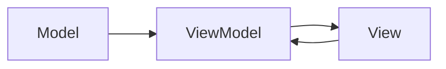

# SwiftUI 全面指南：视图、修饰符、组件与MVVM架构

SwiftUI 是 Apple 推出的声明式框架，用于构建用户界面（UI）。
自2019年首次发布以来，SwiftUI 已成为 iOS、macOS、watchOS 和 tvOS 应用开发的重要工具。
本文将深入介绍 SwiftUI 的基本概念，包括视图(View)、修饰符(Modifiers)、内置修饰符、如何自定义视图、
组件化开发以及 MVVM 架构在 SwiftUI 中的应用。无论你是刚开始学习 SwiftUI，还是希望巩固基础，这篇指南都将为你提供有价值的知识。

{/* truncate */}

## 目录

1. [什么是 SwiftUI](#what-is-swiftui)
2. [什么是视图(View)](#what-is-view)
3. [什么是修饰符(Modifiers)](#what-is-modifiers)
4. [什么是内置修饰符](#what-is-built-in-modifiers)
5. [如何自定义视图](#how-to-custom-view)
6. [视图与组件化开发](#view-and-component-development)
7. [MVVM 架构简介](#mvvm-architecture-introduction)
8. [SwiftUI 中的 MVVM 实现](#mvvm-implementation-in-swiftui)
9. [MVVM 架构关系图](#mvvm-architecture-relationship-diagram)
10. [基于SwiftUI的项目如何设置MVVM](#how-to-set-up-mvvm-in-swiftui-projects)
11. [SwiftUI 术语汇总](#swiftui-terminology-summary)
12. [总结](#summary)

## 什么是 SwiftUI{#what-is-swiftui}

SwiftUI 是 Apple 推出的用于构建用户界面的框架，采用声明式语法，使开发者能够更简洁、高效地创建复杂的界面。与传统的 UIKit 不同，SwiftUI 允许开发者通过声明视图的状态和布局来自动管理 UI 更新，从而减少了大量的样板代码。

### SwiftUI 的优势

- **声明式语法**：通过描述界面的状态，SwiftUI 自动处理界面的更新。
- **跨平台支持**：适用于 iOS、macOS、watchOS 和 tvOS。
- **实时预览**：Xcode 提供的 Canvas 允许开发者实时预览和调试 UI。
- **高效开发**：减少样板代码，提高开发效率。
- **响应式编程**：SwiftUI 内置支持响应式编程范式，简化数据与UI的绑定。

## 什么是视图(View){#what-is-view}

在 SwiftUI 中，**视图(View)** 是构建用户界面的基本单元。每一个视图都代表 UI 的一个部分，例如文本、按钮、图像等。视图可以嵌套和组合，以创建复杂的界面。

### 常见的 SwiftUI 视图

- `Text`：显示文本内容。
- `Image`：显示图片。
- `Button`：交互式按钮。
- `VStack` 和 `HStack`：垂直和水平堆叠视图。
- `List`：显示可滚动的列表。
- `ScrollView`：实现可滚动的内容视图。
- `Spacer`：在堆叠视图中添加弹性空间。
- `NavigationView`：实现导航功能。

### 示例：创建一个简单的文本视图

```swift
import SwiftUI

struct ContentView: View {
    var body: some View {
        Text("Hello, SwiftUI!")
    }
}
```

在上述示例中，`Text` 视图用于显示一段文本。

## 什么是修饰符(Modifiers){#what-is-modifiers}

**修饰符(Modifiers)** 是 SwiftUI 中用于修改视图属性的方法。通过链式调用修饰符，开发者可以轻松地调整视图的外观和行为，例如颜色、字体、边距等。

### 使用修饰符的示例

```swift
Text("Hello, SwiftUI!")
    .font(.title)
    .foregroundColor(.blue)
    .padding()
```

在这个例子中，`Text` 视图被应用了三个修饰符：`font` 修改字体大小，`foregroundColor` 修改文本颜色，`padding` 添加内边距。

## 什么是内置修饰符{#what-is-built-in-modifiers}

SwiftUI 提供了丰富的**内置修饰符**，开发者可以直接使用这些修饰符来调整视图的各种属性。以下是一些常用的内置修饰符：

- `font(_:)`：设置字体和字体大小。
- `foregroundColor(_:)`：设置前景色（如文本颜色）。
- `background(_:)`：设置视图的背景颜色或视图。
- `padding(_:)`：设置视图的内边距。
- `frame(width:height:)`：设置视图的宽度和高度。
- `cornerRadius(_:)`：设置视图的圆角半径。
- `shadow(color:radius:x:y:)`：添加阴影效果。
- `opacity(_:)`：设置视图的不透明度。
- `rotationEffect(_:)`：旋转视图。
- `scaleEffect(_:)`：缩放视图。

### 示例：使用多个内置修饰符

```swift
Text("Welcome to SwiftUI")
    .font(.largeTitle)
    .foregroundColor(.white)
    .padding()
    .background(Color.blue)
    .cornerRadius(10)
    .shadow(color: .gray, radius: 5, x: 0, y: 5)
```

在这个例子中，`Text` 视图应用了多个内置修饰符，改变了字体、颜色、背景、圆角和阴影效果。

## 如何自定义视图{#how-to-custom-view}

除了使用内置视图和修饰符，SwiftUI 允许开发者创建**自定义视图**。通过组合多个视图和修饰符，可以创建可重用且模块化的 UI 组件。

### 创建自定义视图的步骤

1. **定义新的视图结构**：创建一个遵循 `View` 协议的结构体。
2. **实现 `body` 属性**：在 `body` 中定义视图的内容和布局。
3. **组合视图和修饰符**：使用内置视图和修饰符来设计自定义视图。

### 示例：创建一个自定义按钮视图

```swift
import SwiftUI

struct CustomButton: View {
    var title: String
    var backgroundColor: Color

    var body: some View {
        Text(title)
            .font(.headline)
            .foregroundColor(.white)
            .padding()
            .background(backgroundColor)
            .cornerRadius(8)
            .shadow(radius: 5)
    }
}

struct ContentView: View {
    var body: some View {
        CustomButton(title: "Click Me", backgroundColor: .green)
    }
}
```

在这个示例中，`CustomButton` 是一个自定义视图，通过组合 `Text` 视图和多个修饰符，创建了一个带有背景色、圆角和阴影效果的按钮。

## 视图与组件化开发{#view-and-component-development}

**组件化开发** 是现代软件开发中的一种最佳实践，通过将 UI 分解为可重用的组件，提升代码的可维护性和可扩展性。在 SwiftUI 中，视图本身就是组件的基本形式，开发者可以通过创建自定义视图来实现组件化开发。

### 组件化的优势

- **可重用性**：相同的组件可以在不同的地方重复使用，减少代码冗余。
- **可维护性**：组件独立，便于管理和更新。
- **可测试性**：独立的组件更容易进行单元测试。

### 示例：创建多个自定义组件

```swift
struct HeaderView: View {
    var title: String

    var body: some View {
        Text(title)
            .font(.largeTitle)
            .padding()
            .background(Color.orange)
            .foregroundColor(.white)
    }
}

struct FooterView: View {
    var body: some View {
        Text("© 2025 Your Company")
            .font(.footnote)
            .padding()
            .background(Color.gray.opacity(0.2))
    }
}

struct ContentView: View {
    var body: some View {
        VStack {
            HeaderView(title: "Welcome to My App")
            Spacer()
            FooterView()
        }
    }
}
```

在这个示例中，`HeaderView` 和 `FooterView` 是两个独立的自定义组件，通过组合它们构建了一个完整的界面。

## MVVM 架构简介{#mvvm-architecture-introduction}

**MVVM（Model-View-ViewModel）** 是一种软件架构模式，旨在将应用程序的业务逻辑与用户界面分离。MVVM 提供了一种清晰的方式来组织代码，使其更易于维护、测试和扩展。

### MVVM 的组成部分

- **Model（模型）**：表示应用程序的数据和业务逻辑。通常与数据存储和网络请求相关。
- **View（视图）**：负责显示数据和处理用户交互。SwiftUI 中的视图如 `Text`、`Image` 等。
- **ViewModel（视图模型）**：充当 Model 和 View 之间的中介。它处理业务逻辑，将 Model 中的数据转换为 View 可以直接使用的格式，并响应用户交互。

### MVVM 的优势

- **分离关注点**：将 UI 与业务逻辑分离，提升代码的可维护性。
- **可测试性**：ViewModel 可以独立于 View 进行单元测试。
- **可重用性**：ViewModel 可以在多个 View 中复用。

## SwiftUI 中的 MVVM 实现{#mvvm-implementation-in-swiftui}

在 SwiftUI 中，MVVM 架构通过结合 SwiftUI 的声明式语法和数据绑定机制，实现了 Model、View 和 ViewModel 的分离与协作。

### 关键概念

- **@State**：用于在 View 中存储和管理局部状态。
- **@ObservableObject**：用于声明一个可观察的对象，通常在 ViewModel 中使用。
- **@Published**：用于在 ObservableObject 中标记可以被观察的属性。
- **@StateObject** 和 **@ObservedObject**：用于在 View 中引用 ViewModel。

### 示例：使用 MVVM 架构的简单计数器应用

#### Model

```swift
struct CounterModel {
    var count: Int = 0
}
```

#### ViewModel

```swift
import Combine

class CounterViewModel: ObservableObject {
    @Published var counter: CounterModel

    init(counter: CounterModel = CounterModel()) {
        self.counter = counter
    }

    func increment() {
        counter.count += 1
    }

    func decrement() {
        counter.count -= 1
    }
}
```

#### View

```swift
import SwiftUI

struct CounterView: View {
    @StateObject private var viewModel = CounterViewModel()

    var body: some View {
        VStack(spacing: 20) {
            Text("Count: \(viewModel.counter.count)")
                .font(.largeTitle)
            HStack(spacing: 40) {
                Button(action: {
                    viewModel.decrement()
                }) {
                    Text("-")
                        .font(.title)
                        .frame(width: 60, height: 60)
                        .background(Color.red)
                        .foregroundColor(.white)
                        .clipShape(Circle())
                }
                Button(action: {
                    viewModel.increment()
                }) {
                    Text("+")
                        .font(.title)
                        .frame(width: 60, height: 60)
                        .background(Color.green)
                        .foregroundColor(.white)
                        .clipShape(Circle())
                }
            }
        }
        .padding()
    }
}
```

在这个示例中：

- **Model**：`CounterModel` 包含一个 `count` 属性，表示当前计数值。
- **ViewModel**：`CounterViewModel` 作为 `ObservableObject`，管理 `CounterModel` 的实例，并提供 `increment` 和 `decrement` 方法来修改计数值。
- **View**：`CounterView` 使用 `@StateObject` 引用 `CounterViewModel`，并通过数据绑定 (`viewModel.counter.count`) 显示计数值，同时通过按钮调用 ViewModel 的方法来修改计数。

## MVVM 架构关系图{#mvvm-architecture-relationship-diagram}

以下图示展示了 MVVM 架构在 SwiftUI 中的关系：



- **Model**：提供数据和业务逻辑。
- **ViewModel**：持有 Model 的实例，处理业务逻辑，并通过 `@Published` 属性将数据暴露给 View。
- **View**：通过 `@StateObject` 或 `@ObservedObject` 引用 ViewModel，使用数据绑定显示数据，并通过用户交互调用 ViewModel 的方法。

## 基于SwiftUI的项目如何设置MVVM{#how-to-set-up-mvvm-in-swiftui-projects}

在 SwiftUI 项目中应用 MVVM 架构，可以按照以下步骤进行设置：

### 1. 创建 Model

首先，定义应用程序的数据结构和业务逻辑。例如，一个简单的用户模型：

```swift
struct User: Identifiable {
    let id: UUID
    let name: String
    let email: String
}
```

### 2. 创建 ViewModel

创建一个 `ObservableObject` 类来管理 Model 的数据和业务逻辑：

```swift
import Combine

class UserViewModel: ObservableObject {
    @Published var users: [User] = []

    func fetchUsers() {
        // 模拟网络请求或数据获取
        users = [
            User(id: UUID(), name: "Alice", email: "alice@example.com"),
            User(id: UUID(), name: "Bob", email: "bob@example.com")
        ]
    }

    func addUser(name: String, email: String) {
        let newUser = User(id: UUID(), name: name, email: email)
        users.append(newUser)
    }

    func removeUser(at offsets: IndexSet) {
        users.remove(atOffsets: offsets)
    }
}
```

### 3. 创建 View

在 View 中引用 ViewModel 并使用数据绑定展示和操作数据：

```swift
import SwiftUI

struct UserListView: View {
    @StateObject private var viewModel = UserViewModel()

    var body: some View {
        NavigationView {
            List {
                ForEach(viewModel.users) { user in
                    VStack(alignment: .leading) {
                        Text(user.name)
                            .font(.headline)
                        Text(user.email)
                            .font(.subheadline)
                            .foregroundColor(.gray)
                    }
                }
                .onDelete(perform: viewModel.removeUser)
            }
            .navigationTitle("用户列表")
            .navigationBarItems(trailing: Button(action: {
                viewModel.addUser(name: "新用户", email: "newuser@example.com")
            }) {
                Image(systemName: "plus")
            })
            .onAppear {
                viewModel.fetchUsers()
            }
        }
    }
}
```

### 4. 组织项目结构

为了更好地组织代码，建议按照 MVVM 的结构将项目分为不同的文件夹：

```
YourProject/
├── Models/
│   └── User.swift
├── ViewModels/
│   └── UserViewModel.swift
├── Views/
│   └── UserListView.swift
└── YourProjectApp.swift
```

### 5. 使用依赖注入（可选）

为了提高代码的可测试性和可扩展性，可以使用依赖注入将 ViewModel 注入到 View 中。例如：

```swift
struct UserListView: View {
    @ObservedObject var viewModel: UserViewModel

    var body: some View {
        // 与之前相同
    }
}

// 在入口处注入 ViewModel
struct YourProjectApp: App {
    var body: some Scene {
        WindowGroup {
            UserListView(viewModel: UserViewModel())
        }
    }
}
```

### 6. 添加更多功能

随着项目的发展，可以在 ViewModel 中添加更多的方法和属性，处理更复杂的业务逻辑，同时保持 View 的简洁和专注于展示。

## SwiftUI 术语汇总{#swiftui-terminology-summary}

为了更好地理解 SwiftUI，以下是一些常见的术语及其解释：

- **声明式编程（Declarative Programming）**：一种编程范式，开发者描述 UI 应该是什么样子，系统负责管理其状态和更新。
- **视图（View）**：SwiftUI 中的基本构建块，用于构建用户界面。
- **修饰符（Modifier）**：用于修改视图属性的方法，采用链式调用方式。
- **布局容器（Layout Containers）**：用于组织和布局视图的容器，如 `VStack`、`HStack`、`ZStack`。
- **状态（State）**：视图的数据源，影响视图的显示和行为。
- **绑定（Binding）**：一种双向数据流机制，使视图与其数据源保持同步。
- **环境（Environment）**：提供全局数据和配置，视图可以从环境中读取或写入数据。
- **预览（Preview）**：Xcode 提供的实时预览功能，允许开发者在编写代码时即时查看 UI 的变化。
- **`ObservableObject`**：一种可以被多个视图观察的对象，当其中的 `@Published` 属性发生变化时，视图会自动更新。
- **`@State`**：用于在视图内部存储和管理局部状态。
- **`@ObservedObject`**：用于在视图中观察外部的 `ObservableObject`，视图会在对象变化时自动更新。
- **`@EnvironmentObject`**：用于在多个视图中共享一个 `ObservableObject`，无需手动传递。

## 总结{#summary}

SwiftUI 以其声明式语法和强大的功能，正在迅速改变 iOS 和其他 Apple 平台的应用开发方式。理解 SwiftUI 的核心概念，如视图(View)、修饰符(Modifiers)、内置修饰符、如何自定义视图和组件化开发，是掌握这一框架的关键。通过引入 MVVM 架构，开发者可以进一步提升代码的可维护性和可测试性，构建出高效、可扩展的应用。

本文介绍了 SwiftUI 的基本概念和术语，展示了如何创建和使用自定义视图，并深入探讨了 MVVM 架构在 SwiftUI 中的实现方式。掌握这些知识后，你将能够在 SwiftUI 项目中应用最佳实践，打造出优雅且高效的用户界面。

继续深入学习 SwiftUI 的高级功能，如动画、数据绑定和自定义控件，将进一步提升你的开发技能，帮助你打造出更具吸引力和互动性的应用。
