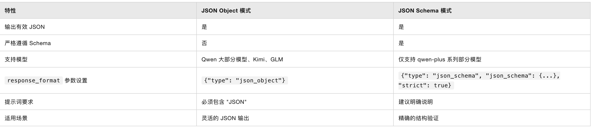

# 拒绝“玩具化”：用 Rust + JSON Schema 构建工业级 LLM 智能体

> **摘要**：从 Python 的 Pydantic 到 Rust 的 Serde+Schemars，本文探讨如何在生产环境中，利用 Rust 的类型系统强制约束 LLM 的输出，实现从“概率性文本”到“确定性数据”的完美转换。

---

## 一、 背景：智能体开发的“最后一公里”危机

过去一年是 AI Agent（智能体）概念的爆发期。Coze、Dify 等低代码平台的出现，极大地降低了 Demo 的构建门槛，让非开发者也能通过拖拽工作流（Workflow）快速验证想法。

然而，当我们将视角从 **Demo 演示** 转向 **企业级生产环境** 时，立刻会撞上“天花板”：

1. **黑盒集成的痛苦**：低代码平台难以无缝嵌入现有的复杂业务后端（如遗留的 Java/Go 微服务）。
2. **复杂逻辑的泥潭**：可视化的连线在处理多重循环、状态回滚、分布式事务时，维护成本呈指数级上升。
3. **性能与成本的瓶颈**：这是最致命的。生产环境对 **延迟 (Latency)** 和 **吞吐量 (Throughput)** 极其敏感，Python 的解释器开销在高并发场景下往往显得力不从心。

## 二、 为什么是 Rust？超越 Python 的工程化极限

Python 无疑是 AI 领域的“第一公民”。其生态中的 **Pydantic** 堪称神器，集类型定义、Schema 生成、数据验证于一身。

除了复杂智能体需要特定的编排方式，其余基本都算是后端开发的范畴，在高性能服务中Python
始终是不占太多优势的。原因不仅在于性能，更在于**安全性**：

* **编译期这一关**：Python 的 Type Hint 只是提示，而 Rust 的类型系统是法律。
* **零成本抽象**：Rust 允许我们在不牺牲性能的前提下，构建极高层级的抽象。
* **并发模型**：Tokio 的异步运行时能够以极低的资源消耗处理海量 I/O，非常适合高频调用 LLM API 的网关层。

我们要在 Rust 中复刻甚至超越 Pydantic 的体验：**不依赖臃肿的框架（如 LangChain），通过原生组合拳实现极致可控的结构化输出。**

## 三、 核心挑战：非结构化智能 vs 结构化系统

智能体在内部思考时可以是发散的（Chain of Thought），但在**对外交互**时必须是严谨的。
有了规范的输出后续的处理中才不至于出错，或者说出错了不知道从哪里找，有了这种不稳定性和不确定性，
那么智能体服务就会很难维护。

智能体前面的节点的确定输出是后面智能体节点输出正确结果的保障。



目前主流的 JSON 输出控制有两种模式：

1. **JSON Object 模式**：保证输出是合法的 JSON，但字段结构需要通过 Prompt 约束。
2. **JSON Schema 模式**：严格遵循 Schema，但目前仅部分模型支持（如 qwen-plus），且配置较为繁琐。

**本文采用一种更通用、兼容性更强的“组合拳”策略**：
利用 Rust 的类型系统自动生成 Schema，注入到 System Prompt 中，并配合 `json_object` 模式。这既保证了灵活性，又能适配绝大多数支持 JSON Mode 的模型（OpenAI, Qwen, DeepSeek 等）。

### 技术栈映射表

| 核心能力 | Python 生态 (Reference) | Rust 生产级方案 | 优势 |
| --- | --- | --- | --- |
| **数据定义** | `class Model(BaseModel)` | **`struct` + `serde**` | 内存布局紧凑，无运行时开销 |
| **Schema 生成** | `.model_json_schema()` | **`schemars`** | 编译期自动派生，SSOT (Single Source of Truth) |
| **网络层** | `requests` / `httpx` | **`reqwest`** | 极致的异步性能 |
| **解析验证** | `.model_validate_json()` | **`serde_json`** | 严格的反序列化，失败即 panic/err，绝不处理脏数据 |


> **💡 兼容性提示**
> 虽然 OpenAI, Claude, Gemini 以及 Qwen-plus 等模型明确支持严格的 Schema 模式，但许多优秀的开源模型或 API（如 DeepSeek, GLM, MiniMax, MoonShot）目前主要支持 `json_object` 模式。
> **本方案通过 Prompt 注入 Schema + JSON Mode 兜底，最大程度地兼容了这两种生态。**

## 四、 实战代码：构建类型安全的提取器

假设我们需要一个智能体，从非结构化的技术需求文档中提取**元数据**，供下游的大数据 Pipeline（如 Spark/Flink）使用。

### 1. 极简依赖配置 (`Cargo.toml`)

拒绝过度封装，回归 HTTP 本质。

```toml
[dependencies]
tokio = { version = "1", features = ["full"] }
serde = { version = "1.0", features = ["derive"] }
serde_json = "1.0"
schemars = { version = "0.8", features = ["derive"] } # 核心：将 Struct 转换为 JSON Schema
reqwest = { version = "0.11", features = ["json"] }

```

### 2. 定义“真理之源” (Single Source of Truth)

在 Rust 中，`struct` 就是契约。注意 `#[schemars(description = "...")]`，这不仅仅是注释，它会被编译成 JSON Schema 注入给 LLM，实际上起到了 **Prompt Engineering** 的作用。

```rust
use serde::{Deserialize, Serialize};
use schemars::{schema_for, JsonSchema};

/// 数据流水线配置
/// Derive 宏解析：
/// - Serialize/Deserialize: 处理网络传输
/// - JsonSchema: 为 LLM 生成"说明书"
#[derive(Debug, Serialize, Deserialize, JsonSchema)]
struct DataPipelineConfig {
    #[schemars(description = "数据处理任务的唯一标识名称，建议使用蛇形命名法")]
    job_name: String,

    #[schemars(description = "任务优先级，1 为最高，10 为最低")]
    priority: u8,

    #[schemars(description = "数据源列表 (例如: s3://bucket/data)")]
    sources: Vec<String>,

    #[schemars(description = "集群资源配置详情")]
    cluster_config: ClusterConfig,
}

#[derive(Debug, Serialize, Deserialize, JsonSchema)]
struct ClusterConfig {
    #[schemars(description = "所需的 Worker 节点数量")]
    worker_count: u32,
    
    #[schemars(description = "每个节点的内存大小 (GB)")]
    memory_gb: u32,
}

```

### 3. 核心逻辑：Schema 注入与运行时验证

```rust
use serde_json::json;
use std::error::Error;

#[tokio::main]
async fn main() -> Result<(), Box<dyn Error>> {
    // === 1. 动态生成 Schema ===
    // 这里的精髓在于：你只需要修改 Rust struct，Prompt 就会自动更新。
    // 永远不会出现“代码改了，Prompt 没改”导致的幻觉问题。
    let schema = schema_for!(DataPipelineConfig);
    let schema_string = serde_json::to_string(&schema)?;

    // === 2. 构建 System Prompt ===
    // 我们将 Schema 作为“上下文”的一部分注入，明确要求 LLM 依此行事。
    let system_prompt = format!(
        "You are a system architect. \
         Analyze the user requirement and output a strict JSON configuration. \
         Do NOT include markdown formatting or explanations. \
         The JSON must strictly adhere to this schema: {}",
        schema_string
    );

    // === 3. 模拟用户模糊输入 ===
    let user_input = "I need a high priority job named 'LogAnalyzer' to process logs from s3://logs/app-a. \
                      We need a beefy cluster with 10 nodes and 64GB memory each.";

    // === 4. 发起 HTTP 请求 ===
    let client = reqwest::Client::new();
    let api_key = std::env::var("OPENAI_API_KEY").expect("API Key not set");

    let response = client
        .post("https://api.openai.com/v1/chat/completions") // 或兼容 OpenAI 协议的 URL
        .header("Authorization", format!("Bearer {}", api_key))
        .json(&json!({
            "model": "gpt-4-turbo", // 或 qwen-plus 等
            "messages": [
                { "role": "system", "content": system_prompt },
                { "role": "user", "content": user_input }
            ],
            // 关键点：启用 JSON 模式，强制模型输出合法的 JSON 语法
            "response_format": { "type": "json_object" }, 
            "temperature": 0.1
        }))
        .send()
        .await?;

    // === 5. 解析与验证 (The Moment of Truth) ===
    let response_body: serde_json::Value = response.json().await?;
    
    // 提取 content 
    let content = response_body["choices"][0]["message"]["content"]
        .as_str()
        .ok_or("No content in response")?;

    // Serde 自动验证：
    // 如果 LLM 返回的字段类型错误（比如 priority 给了 "high" 字符串而不是数字），
    // 这里会直接抛出 Err，保护下游系统不被污染。
    let config: DataPipelineConfig = serde_json::from_str(content)?;

    println!("=== ✅ 配置解析成功 ===");
    println!("Job Name: {}", config.job_name);
    println!("Workers:  {}", config.cluster_config.worker_count);
    println!("Memory:   {} GB/Node", config.cluster_config.memory_gb);

    // 此时 config 已是内存中安全的 Rust 对象，可直接传递给 Spark/Flink SDK
    Ok(())
}

```

## 五、 为什么这对生产环境至关重要？

1. **单源真理 (Single Source of Truth)**：
代码即文档，文档即 Prompt。修改一处 `struct` 定义，你的业务逻辑、API 文档、以及发给 LLM 的指令全部自动同步。
2. **防御性编程**：
在 Python 中，类型转换往往是隐式的。而在 Rust 中，`u8` 就是 `u8`。如果 LLM 产生了幻觉返回了 `256`（超出 `u8` 范围），Serde 会在数据进入业务逻辑层之前立即拦截。这种**“Fail Fast”**机制对于金融交易或大数据处理等零容错场景是无价的。
3. **可预测的性能**：
使用 `reqwest` + `serde`，你完全掌控了内存分配和网络行为。没有 Python GIL 的锁竞争，没有复杂的动态类型推断开销。

## 六、 总结

随着 AI 应用逐渐从“玩具”走向“工业品”，我们对系统的**确定性**要求越来越高。

虽然 Python 生态在实验阶段不可替代，但在追求极致性能、类型安全和系统稳定性的后端架构中，**Rust + Serde + Schemars** 方案展示了一条更硬核、更可靠的道路。这不仅仅是编程语言的选择，更是一种对数据严谨性绝不妥协的工程态度。


## 七、 后续

后续还会一直在Github上更新各个模型的适配方案。
---

## 链接
> **GitHub**: [https://github.com/yuxuetr/rust-llm-output-json-format](https://github.com/yuxuetr/rust-llm-output-json-format)
