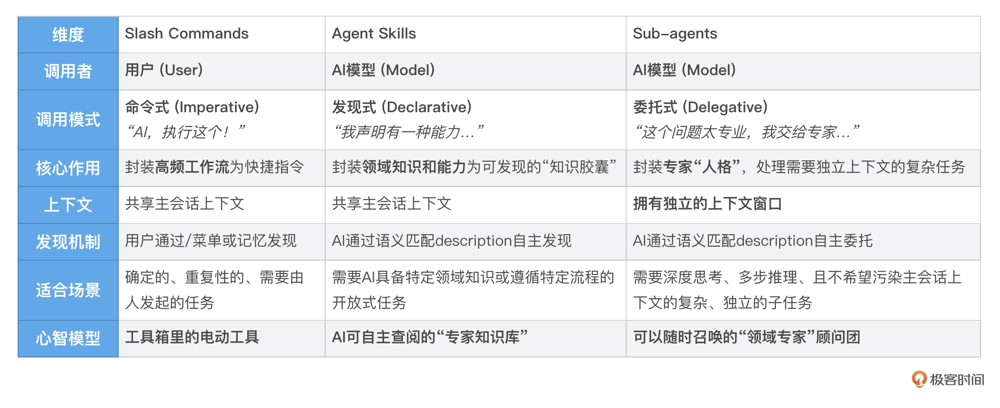
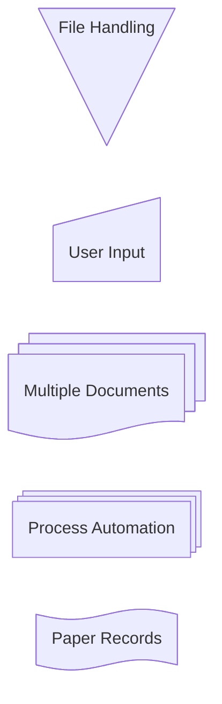
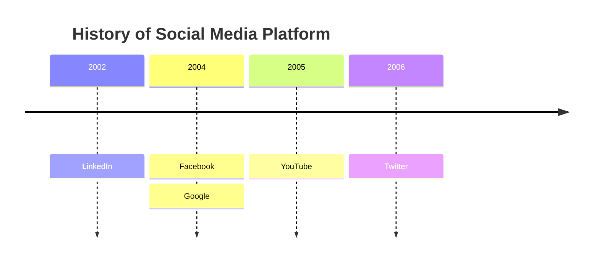

# 欢迎来到 Rust in Everything

这是 **Rust in Everything** 的第一篇示例博客文章。它位于 `assets/content/welcome.md`。

我们已经成功集成了 `@tailwindcss/typography` 插件！现在，Markdown 内容会自动应用精美的排版样式。

## 排版演示 (Typography Demo)

### 1. 文本格式 (Text Formatting)

Markdown 支持多种文本格式，例如 **加粗 (Bold)**、*斜体 (Italic)*、~~删除线 (Strikethrough)~~ 以及 `行内代码 (Inline Code)`。

> 这是一个引用块 (Blockquote)。
> 
> 它可以跨越多行。引用通常用于突出显示重要信息或引用他人的话。

### 2. 列表 (Lists)

#### 无序列表
- **高性能**：没有 GC，内存安全。
- **可靠性**：丰富的类型系统和所有权模型。
- **生产力**：优秀的文档和编译器。

#### 有序列表
1. 初始化项目：`cargo init`
2. 添加依赖：`cargo add dioxus`
3. 运行项目：`dx serve`

### 3. 代码块 (Code Blocks)

我们可以使用代码块来展示 Rust 代码：

```rust
use dioxus::prelude::*;

fn main() {
    dioxus::launch(App);
}

#[component]
fn App() -> Element {
    let count = use_signal(|| 0);

    rsx! {
        div { class: "flex flex-col items-center gap-4 p-8",
            h1 { "Hello, Dioxus!" }
            button { 
                onclick: move |_| count.set(count() + 1),
                "Count: {count}" 
            }
        }
    }
}
```

### 4. 表格 (Tables)

| 特性 | 描述 | 状态 |
| :--- | :--- | :---: |
| 内存安全 | 编译时保证 | ✅ |
| 并发 | 无数据竞争 | ✅ |
| GC | 不需要 | ❌ |

### 5. 链接与图片 (Links & Images)

访问 [Dioxus 官网](https://dioxuslabs.com) 了解更多。



---

### 提示

:::tip
Tips 提示框
:::

:::info
INFO 提示框
:::

:::note
NOTES 提示框
:::

:::warning
警告 提示框
:::

:::important
重要 提示框
:::

:::error
ERROR 提示框
:::

:::caution
CAUTION 提示框
:::
---

## 嵌入组件演示 (Component Embedding)

除了标准的 Markdown，我们还支持嵌入 Dioxus 组件 (MDX 风格)：

<PodcastCard id="1" />

<PodcastCard id="2" />

祝你编码愉快！🚀

### 6. 数学公式 (Math Support)

现在我们的博客也支持数学公式了！

行内公式：爱因斯坦的质能方程是 $E = mc^2$，欧拉公式是 $e^{i\pi} + 1 = 0$。

块级公式 (Display Math)：

$$
\frac{1}{\pi} = \frac{2\sqrt{2}}{9801} \sum_{k=0}^\infty \frac{(4k)!(1103+26390k)}{(k!)^4 396^{4k}}
$$

麦克斯韦方程组：

$$
\begin{aligned}
\nabla \cdot \mathbf{E} &= \frac{\rho}{\varepsilon_0} \\
\nabla \cdot \mathbf{B} &= 0 \\
\nabla \times \mathbf{E} &= -\frac{\partial \mathbf{B}}{\partial t} \\
\nabla \times \mathbf{B} &= \mu_0\mathbf{J} + \mu_0\varepsilon_0\frac{\partial \mathbf{E}}{\partial t}
\end{aligned}
$$


### 7. 文字样式组件 (Text Style Components)

支持 Mac Preview 风格的彩色文字和文本装饰：

- 这里有 <Yellow text="黄色重点" /> 需要注意
- 测试结果：<Green text="全部通过" />，零失败
- 更多详情请参考 <Blue text="官方文档" />
- <Pink text="性能警告" />：请避免在热路径中使用
- 这是一个 <Purple text="实验性功能" />，API 可能变化
- 这段内容非常 <Underline text="重要" />，请务必阅读
- 该接口已 <Strikethrough text="废弃" />，请使用新版本

组合使用：Rust 的 <Green text="内存安全" /> 和 <Blue text="零成本抽象" /> 是其 <Yellow text="核心优势" />。

### 8. Mermaid 图表支持 (Mermaid Diagrams)
我们还支持 Mermaid 图表了！

以下是一个流程图示例：


时间线图：


### 9. 视频嵌入 (Video Embedding)

我们还可以嵌入 YouTube 视频：

<YouTube id="PdSHny0_6VY" />

### 10. Bilibili 视频嵌入

B站视频演示：

<Bilibili id="BV1fDSoBEEXb" />
